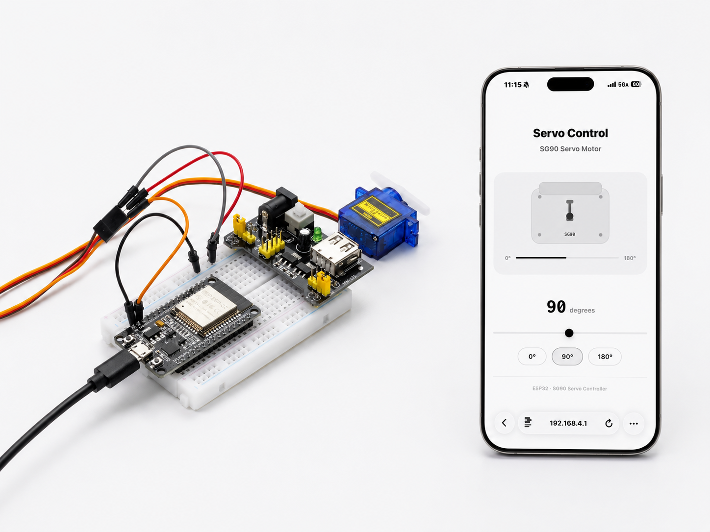

Advanced Experiments
====================

.. image:: _static/project/IOT/1.WEB.png
   :width: 800
   :align: center

.. raw:: html

   

While foundational experiments taught you the basics of hands-on hardware interaction, this chapter introduces you to network connectivity. Centered on the Internet of Things (IoT), we will guide you in equipping your development board with Wi-Fi capabilities and implementing remote control via a web interface. Covering everything from TCP/IP fundamentals and HTTP request parsing to HTML page design and real-time status feedback, you will build a complete web-based control system—enabling your sensors and actuators to transcend physical distance and advance to a new level of smart connectivity.

----

1. TEMP And HUMI Meter
----------------------

This experiment is a core project in our introductory practical course on the Internet of Things (IoT). It aims to teach you how to set up an ESP32 as a Wi-Fi hotspot (AP mode) and build an embedded web server to display sensor data in real time on a webpage. You will master the following key skills:

 - DHT11 Temperature and Humidity Sensor Driver and Data Reading.

 - ESP32 Soft-AP Mode Configuration: Direct Device Connection Without Router.

 - WebServer Library for HTTP Server Construction and GET Request Handling.

 - JSON Data Assembly and Parsing for Front-End and Back-End Data Interaction.

 - AJAX Asynchronous Refresh Technology **(fetch + setInterval)** : Automatic Webpage Data Updates Without Manual Page Refresh.

 - Front-End UI Design: Responsive Card-Style Dashboard Adapted for Mobile and Desktop Screens.

**Materials Needed:**

 - ESP32 Development Board
 - DHT11
 - Breadboard and Jumper Wires

**Wiring Diagram:**

.. image:: _static/project/IOT/1.DHT11.png
   :width: 600
   :align: center

.. raw:: html

   

**Wiring Table**

.. list-table:: 
   :header-rows: 1
   :widths: 10 20 20 25

   * - No.
     - Component
     - Pin
     - Connect to
   * - 1
     - DHT11 Sensor
     - VCC
     - 3.3V
   * - 1
     - DHT11 Sensor
     - GND
     - GND
   * - 1
     - DHT11 Sensor
     - DATA
     - GPIO 15

**Example code:**

.. raw:: html

   

   

.. code-block:: cpp

 #include <WiFi.h>
 #include <WebServer.h>
 #include <DHT.h>
 #define DHTPIN 15
 #define DHTTYPE DHT11

 DHT dht(DHTPIN, DHTTYPE);

 const char* ap_ssid = "ESP32-DHT11";

 WebServer server(80);

 String getHTML()
 {
     String html = R"rawliteral(

 <!DOCTYPE html>
 <html lang="en">

 <head>

 <meta charset="UTF-8">

 <meta name="viewport"
 content="width=device-width, initial-scale=1.0">

 <title>ESP32 Climate Monitor</title>

 

 </head>

 <body>

 

 

 

 

 ESP32 Monitor
 

 

 Real-time Climate Dashboard
 

 

 

 

 

 

 🌡 Temperature
 

 

 --
 °C
 

 

 

 

 💧 Humidity
 

 

 --
 %
 

 

 

 ESP32 DHT11 Web Monitor
 

 

 
 </body>
 </html>

 )rawliteral";

     return html;
 }

 // Main page
 void handleRoot()
 {
     server.send(200, "text/html", getHTML());
 }

 // Sensor data API
 void handleData()
 {
     float humidity = dht.readHumidity();

     float temperature = dht.readTemperature();

     if (isnan(humidity) || isnan(temperature))
     {
         server.send(
             200,
             "application/json",
             "{\"temperature\":\"--\",\"humidity\":\"--\"}"
         );

         return;
     }

     String json = "{";

     json += "\"temperature\":\"" +
             String(temperature,1) + "\",";

     json += "\"humidity\":\"" +
             String(humidity,1) + "\"";

     json += "}";

     server.send(200, "application/json", json);
 }

 void setup()
 {
     Serial.begin(115200);

     dht.begin();

     // Start WiFi hotspot
     WiFi.softAP(ap_ssid);

     IPAddress IP = WiFi.softAPIP();

     Serial.println();
     Serial.println("ESP32 Hotspot Started");

     Serial.print("SSID: ");
     Serial.println(ap_ssid);

     Serial.print("IP Address: ");
     Serial.println(IP);

     // Web routes
     server.on("/", handleRoot);

     server.on("/data", handleData);

     // Start web server
     server.begin();

     Serial.println("Web Server Started");
 }

 void loop()
 {
     server.handleClient();
 }

.. raw:: html

   

   

     <button id="expand-btn-dht" onclick="toggleCode('code-container-dht', 'expand-btn-dht')" style="flex: 1; padding: 10px 16px; background: #2980B9; color: white; border: none; border-radius: 4px; cursor: pointer; font-weight: bold;">▼ Expand All Code</button>
   

   

   

   

.. raw:: html

   

**Display Effect:**

.. image:: _static/project/IOT/1.dht112.png
   :width: 600
   :align: center

.. raw:: html

   

- The system will automatically create a Wi-Fi hotspot named **ESP32-DHT11**. 

- After connecting to this Wi-Fi network using your mobile phone or computer, enter the IP address **192.168.4.1** in your browser 

- To open a beautifully designed temperature and humidity monitoring panel to view real-time temperature and humidity data.

----

2. Ultrasonic Distance Meter
----------------------------

This experiment is an advanced project for IoT sensor applications, aiming to learn how to combine an ultrasonic ranging module (HC-SR04) with an ESP32 web server to build a real-time wireless ranging and monitoring system. You will master the following key skills:

- Driving principle and ranging implementation of the HC-SR04 ultrasonic sensor ( **pulseIn()** for precise echo time measurement) .

- Temperature-compensated ranging algorithm: Calculates the actual distance using the speed of sound (0.0343 cm/μs) and handles invalid data (out of range, no echo, etc.)

- Timed sampling mechanism: Uses a **millis()** non-blocking timer to collect data at fixed intervals (100ms) to maintain smooth system response

- Web server and JSON API design: Returns structured data through the /data interface, achieving complete separation of front-end and back-end

- AJAX real-time data refresh: The front-end automatically requests the latest data every 300ms, updating the page without page refresh

- Responsive UI design and visual feedback: Distance value animation, status prompts, threshold alarms (buzzer trigger + page warning for <20cm)

- Buzzer linkage control: The buzzer automatically sounds an alarm when an object gets too close, achieving a closed loop of "perception-judgment-execution".

**Materials Needed:**

 - ESP32 Development Board
 - HC-SR04 Ultrasonic Sensor
 - Active Buzzer
 - Breadboard and Jumper Wires

**Wiring Diagram:**

.. image:: _static/project/IOT/2.hcsr04.png
   :width: 600
   :align: center

.. raw:: html

   

**Wiring Table**

.. list-table:: 
   :header-rows: 1
   :widths: 10 20 20 25

   * - No.
     - Component
     - Pin
     - Connect to
   * - 1
     - HC-SR04 Ultrasonic
     - VCC
     - 5V
   * - 1
     - HC-SR04 Ultrasonic
     - GND
     - GND
   * - 1
     - HC-SR04 Ultrasonic
     - TRIG
     - GPIO 5
   * - 1
     - HC-SR04 Ultrasonic
     - ECHO
     - GPIO 18
   * - 2
     - Buzzer
     - Positive (+)
     - GPIO 4
   * - 2
     - Buzzer
     - Negative (-)
     - GND

**Example code:**

.. raw:: html

   

   

.. code-block:: cpp

 #include <WiFi.h>
 #include <WebServer.h>

 // WiFi hotspot
 const char* ssid = "ESP32-Distance-Meter";

 // Ultrasonic pins
 #define TRIG_PIN 5
 #define ECHO_PIN 18

 // Buzzer pin
 #define BUZZER_PIN 4

 WebServer server(80);

 // Distance variables
 float distance_cm = 0.0;

 unsigned long lastMeasurement = 0;

 const unsigned long MEASURE_INTERVAL = 100;

 bool measurementError = false;

 // Measure distance
 float measureDistance()
 {
     digitalWrite(TRIG_PIN, LOW);
     delayMicroseconds(2);

     digitalWrite(TRIG_PIN, HIGH);
     delayMicroseconds(10);

     digitalWrite(TRIG_PIN, LOW);

     unsigned long duration =
     pulseIn(ECHO_PIN, HIGH, 30000);

     if(duration == 0)
     {
         return -1.0;
     }

     float distance =
     duration * 0.0343 / 2;

     if(distance > 400.0 || distance < 2.0)
     {
         return -1.0;
     }

     return distance;
 }

 // HTML page
 const char* htmlPage = R"rawliteral(

 <!DOCTYPE html>
 <html lang="en">

 <head>

 <meta charset="UTF-8">

 <meta name="viewport"
 content="width=device-width, initial-scale=1.0">

 <title>Distance Meter</title>

 

 </head>

 <body>

 

 

 ESP32 DISTANCE METER
 

 

 0.0

 cm

 

 

 Monitoring...
 

 

 Real-time Ultrasonic Measurement
 

 

 
 </body>
 </html>

 )rawliteral";

 // Main page
 void handleRoot()
 {
     server.send(200,
     "text/html",
     htmlPage);
 }

 // JSON API
 void handleData()
 {
     String json = "{";

     if(measurementError || distance_cm < 0)
     {
         json += "\"error\":\"Out of range\"";
         json += ",\"distance\":0";
     }
     else
     {
         json += "\"error\":null";

         json += ",\"distance\":" +
         String(distance_cm, 2);
     }

     json += "}";

     server.send(200,
     "application/json",
     json);
 }

 // 404
 void handleNotFound()
 {
     server.send(404,
     "text/plain",
     "404: Not Found");
 }

 void setup()
 {
     Serial.begin(115200);

     // Pin setup
     pinMode(TRIG_PIN, OUTPUT);

     pinMode(ECHO_PIN, INPUT);

     pinMode(BUZZER_PIN, OUTPUT);

     digitalWrite(TRIG_PIN, LOW);

     digitalWrite(BUZZER_PIN, LOW);

     // AP mode
     WiFi.mode(WIFI_AP);

     IPAddress local_ip(192,168,4,1);

     IPAddress gateway(192,168,4,1);

     IPAddress subnet(255,255,255,0);

     WiFi.softAPConfig(
         local_ip,
         gateway,
         subnet
     );

     // Start hotspot
     WiFi.softAP(ssid);

     Serial.println();
     Serial.println("ESP32 Hotspot Started");

     Serial.print("SSID: ");
     Serial.println(ssid);

     Serial.print("IP Address: ");
     Serial.println(WiFi.softAPIP());

     // Web routes
     server.on("/", handleRoot);

     server.on("/data", handleData);

     server.onNotFound(handleNotFound);

     // Start server
     server.begin();

     Serial.println("Web Server Started");
 }

 void loop()
 {
     server.handleClient();

     unsigned long currentMillis =
     millis();

     if(currentMillis - lastMeasurement
        >= MEASURE_INTERVAL)
     {
         float measuredDistance =
         measureDistance();

         if(measuredDistance > 0)
         {
             distance_cm =
             measuredDistance;

             measurementError = false;

             // Buzzer alert
             if(distance_cm < 20)
             {
                 digitalWrite(BUZZER_PIN, HIGH);
             }
             else
             {
                 digitalWrite(BUZZER_PIN, LOW);
             }
         }
         else
         {
             measurementError = true;

             digitalWrite(BUZZER_PIN, LOW);
         }

         lastMeasurement =
         currentMillis;
     }

     delay(10);
 }

.. raw:: html

   

   

     <button id="expand-btn-hcsr04" onclick="toggleCode('code-container-hcsr04', 'expand-btn-hcsr04')" style="flex: 1; padding: 10px 16px; background: #2980B9; color: white; border: none; border-radius: 4px; cursor: pointer; font-weight: bold;">▼ Expand All Code</button>
   

   

   

   

.. raw:: html

   

**Display Effect:**

.. image:: _static/project/IOT/2.hcsr042.png
   :width: 500
   :align: center

.. raw:: html

   

- After flashing the program, the ESP32 will automatically create a Wi-Fi hotspot named **ESP32-Distance-Meter** .

- After connecting to this Wi-Fi network using your mobile phone or computer, enter **192.168.4.1** in your browser to open a minimalist real-time distance measurement dashboard:

- The buzzer will sound an alarm when the distance is less than 20cm, and a notification will be displayed on the page.

----

3. Web-Control Servo
---------------------

This experiment is a comprehensive project integrating IoT remote control and servo driving, designed to teach you how to remotely control the rotation of an SG90 servo motor via an ESP32 using a web interface. You will master the following core skills:

- ESP32Servo Library Usage: Learn the principles of driving servos via PWM signals and master key functions such as `attach()` and `write()`. 

- RESTful API Design: Implement state setting and querying through endpoints like `/set?angle=xx` and `/status`, while understanding the communication architecture of frontend-backend separation. 

- Frontend Development (HTML/CSS/JavaScript): Design a responsive interactive interface featuring a slider, angle display, synchronized 3D servo visualization, and input debouncing. 

- Real-time Visual Feedback: Synchronize the rotation of the frontend servo visualization with the actual angle and implement two-way binding between the slider and the numerical display to enhance the user experience. 

- JSON Data Interaction: Use the `fetch()` API for asynchronous requests to retrieve the current angle status, ensuring synchronization during page initialization.

**Materials Needed:**

 - ESP32 Development Board
 - SG90 Servo
 - Power Supply 
 - Breadboard and Jumper Wires

**Wiring Diagram:**

.. image:: _static/project/IOT/3.SG90.png
   :width: 600
   :align: center

.. raw:: html

   

**Wiring Table**

.. list-table:: 
   :header-rows: 1
   :widths: 10 20 20 25

   * - No.
     - Component
     - Pin
     - Connect to
   * - 1
     - SG90 Servo
     - Red (VCC)
     - 5V
   * - 1
     - SG90 Servo
     - Brown (GND)
     - GND
   * - 1
     - SG90 Servo
     - Orange (Signal)
     - GPIO 13

.. note::

    The servo requires a 5V power supply for stable operation; therefore, a breadboard power supply module used in conjunction with a battery is needed to provide a stable 5V supply.

**Example code:**

.. raw:: html

   

   

.. code-block:: cpp

 #include <WiFi.h>
 #include <WebServer.h>
 #include <ESP32Servo.h>

 // ========== WiFi AP Configuration ==========
 const char* ap_ssid = "ESP32_Servo_Control";
 const char* ap_password = NULL;               

 // ========== Pin Definition ==========
 const int servoPin = 13;    // Servo signal pin (GPIO13)

 // ========== Web Server ==========
 WebServer server(80);

 // ========== Servo Object ==========
 Servo myServo;

 // ========== Current State ==========
 int currentAngle = 90;      // Starting at 90 degrees (center)

 // ========== HTML Page - Minimalist White Style ==========
 const char index_html[] PROGMEM = R"rawliteral(
 <!DOCTYPE html>
 <html lang="en">
 <head>
     <meta charset="UTF-8">
     <meta name="viewport" content="width=device-width, initial-scale=1.0, user-scalable=yes">
     <title>Servo Control</title>
     
     
 </head>
 <body>
     

         <h1>Servo Control</h1>
         
SG90 Servo Motor

         
         <!-- Servo Model -->
         

             

                 

                 

                     

                     

                 

                 

                 

                 

                 

                 
SG90

             

             
             

                 0°
                 

                     

                 

                 180°
             

         

         
         <!-- Angle Display -->
         

             90
             degrees
         

         
         <!-- Slider -->
         

             <input type="range" id="angleSlider" min="0" max="180" value="90">
         

         
         <!-- Buttons -->
         

             <button class="btn" onclick="setMinAngle()">0°</button>
             <button class="btn" onclick="resetAngle()">90°</button>
             <button class="btn" onclick="setMaxAngle()">180°</button>
         

         
         

         
ESP32 · SG90 Servo Controller

     

 </body>
 </html>
 )rawliteral";

 // ========== Servo Control Functions ==========
 void setServoAngle(int angle) {
     angle = constrain(angle, 0, 180);
     currentAngle = angle;
     myServo.write(currentAngle);
     Serial.print("Servo angle: ");
     Serial.print(currentAngle);
     Serial.println("°");
 }

 // ========== Web Request Handlers ==========
 void handleRoot() {
     server.send(200, "text/html", index_html);
 }

 void handleSet() {
     if (server.hasArg("angle")) {
         int newAngle = server.arg("angle").toInt();
         setServoAngle(newAngle);
         server.send(200, "text/plain", "OK");
     } else {
         server.send(400, "text/plain", "Bad Request");
     }
 }

 void handleStatus() {
     String json = "{\"angle\":" + String(currentAngle) + "}";
     server.send(200, "application/json", json);
 }

 void handleNotFound() {
     server.send(404, "text/plain", "404: Not Found");
 }

 // ========== Setup ==========
 void setup() {
     Serial.begin(115200);
     delay(100);
     
     myServo.attach(servoPin);
     myServo.write(currentAngle);
     
     Serial.println();
     Serial.println("=== ESP32 SG90 Servo Controller ===");
     Serial.print("Initial angle: ");
     Serial.print(currentAngle);
     Serial.println("°");
     
     Serial.print("Starting AP: ");
     Serial.println(ap_ssid);
     
     WiFi.softAP(ap_ssid, ap_password);
     
     IPAddress apIP = WiFi.softAPIP();
     Serial.print("AP IP: ");
     Serial.println(apIP);
     
     server.on("/", handleRoot);
     server.on("/set", handleSet);
     server.on("/status", handleStatus);
     server.onNotFound(handleNotFound);
     
     server.begin();
     Serial.println("Server started");
     Serial.print("Connect to: ");
     Serial.println(ap_ssid);
     Serial.print("Then visit: http://");
     Serial.println(apIP);
     Serial.println("====================================");
 }

 void loop() {
     server.handleClient();
     delay(10);
 }

.. raw:: html

   

   

     <button id="expand-btn-servo" onclick="toggleCode('code-container-servo', 'expand-btn-SG90')" style="flex: 1; padding: 10px 16px; background: #2980B9; color: white; border: none; border-radius: 4px; cursor: pointer; font-weight: bold;">▼ Expand All Code</button>
   

   

   

   

.. raw:: html

   

**Display Effect:**

.. raw:: html

   

The ESP32 creates a Wi-Fi hotspot named **ESP32_Servo_Control**.

- After connecting to this Wi-Fi network via a smartphone or computer, accessing the address **192.168.4.1** opens a control page. This page features a 3D visualization of the servo, an angle display, a slider, and quick-action buttons (0°, 90°, and 180°).

- Dragging the slider or clicking the quick-action buttons causes the servo to immediately rotate to the specified angle; simultaneously, the 3D visualization rotates in sync and the angle value updates in real-time, delivering a "what-you-see-is-what-you-get" remote control experience.

----

4. Colorful RGB
---------------

This experiment is a comprehensive project on IoT-based smart lighting control. It aims to teach you how to drive WS2812B full-color RGB LED strips using an ESP32 and remotely control various dynamic lighting effects via a Wi-Fi-hosted web interface. You will master the following core skills:

- **FastLED Library Usage:** Learn the driving principles of WS2812B programmable LEDs and master key functions such as `addLeds()`, `show()`, `fadeToBlackBy()`, and `nscale8_video()`.

- **Multi-mode Lighting Algorithms:** Implement three dynamic effects—Chase, Gradient, and Flow—while gaining an understanding of the HSV color model and brightness control.

- **Custom RGB Color Mixing:** Independently adjust red, green, and blue channels via sliders to create any desired color, with support for real-time preview.

- **Hardware Button Integration:** Use GPIO buttons for physical mode switching (short-press to cycle through modes), enabling operation without a network connection.

**Materials Needed:**

 - ESP32 Development Board
 - RGB LED strip
 - Button
 - Resistor (10K)
 - Breadboard and Jumper Wires

**Wiring Diagram:**

.. image:: _static/project/BASIC/7.Thermometer.png
   :width: 700
   :align: center

.. raw:: html

   

**Wiring Table**

.. list-table:: 
   :header-rows: 1
   :widths: 10 20 20 25

   * - No.
     - Component
     - Pin
     - Connect to
   * - 1
     - WS2812B LED Strip
     - VCC
     - 5V
   * - 1
     - WS2812B LED Strip
     - GND
     - GND
   * - 1
     - WS2812B LED Strip
     - DATA
     - GPIO 5
   * - 2
     - Button
     - One pin
     - 3.3V
   * - 2
     - Button
     - Other pin
     - GPIO 4
   * - 3
     - 10kΩ Resistor
     - One pin
     - GPIO 4
   * - 3
     - 10kΩ Resistor
     - Other pin
     - GND

**Example code:**

.. raw:: html

   

   

.. code-block:: cpp

 #include <WiFi.h>
 #include <WebServer.h>
 #include <FastLED.h>

 #define LED_PIN 5
 #define NUM_LEDS 8
 #define BUTTON_PIN 4

 CRGB leds[NUM_LEDS];
 WebServer server(80);

 bool power = false;
 int mode = 0;
 bool customMode = false;
 int r = 255, g = 100, b = 150;

 int hueOffset = 0;
 int chasePos = 0;

 const char* html = R"(
 <!DOCTYPE html>
 <html>
 <head>
 <meta charset="UTF-8">
 <meta name="viewport" content="width=device-width, initial-scale=1.0">
 <title>RGB Light</title>
 
 </head>
 <body>
 

 <h1>✦ ESP32-RGB</h1>
 

Off

Mode: —

 

 <button class=btn onclick=setMode(1)>▶ Chase</button>
 <button class=btn onclick=setMode(2)>◈ Gradient</button>
 <button class=btn onclick=setMode(3)>〰 Flow</button>
 <button class="btn btn-power" id=pwr onclick=togglePower()>⏻ Power</button>
 

 

 
Color

 

Custom RGB Off

 

 
R<input type=range id=red min=0 max=255 value=255 oninput=updateRGB()>255

 
G<input type=range id=green min=0 max=255 value=100 oninput=updateRGB()>100

 
B<input type=range id=blue min=0 max=255 value=150 oninput=updateRGB()>150

 

 

<strong id=hex>#FF6496</strong> RGB(255,100,150)

 

 

 

 
 </body>
 </html>
 )";

 void chase() {
     if (!power) return;
     for (int i = 0; i < NUM_LEDS; i++) leds[i].fadeToBlackBy(20);
     CRGB color = customMode ? CRGB(r, g, b) : CHSV(hueOffset++, 200, 128);
     leds[chasePos] = color;
     chasePos = (chasePos + 1) % NUM_LEDS;
     FastLED.show();
     delay(150);
 }

 void gradient() {
     if (!power) return;
     if (customMode) {
         for (int i = 0; i < NUM_LEDS; i++) {
             float f = (float)i / NUM_LEDS;
             leds[i] = CRGB(r * (0.3 + 0.7 * (1 - f)), g * (0.3 + 0.7 * f), b * (0.3 + 0.7 * (1 - sin(f * 3.14))));
         }
     } else {
         hueOffset++;
         for (int i = 0; i < NUM_LEDS; i++) leds[i] = CHSV(hueOffset + i * 2, 200, 128);
     }
     FastLED.show();
     delay(20);
 }

 void flow() {
     if (!power) return;
     if (customMode) {
         int waveOffset = (millis() / 30) % 256;
         for (int i = 0; i < NUM_LEDS; i++) {
             leds[i] = CRGB(r, g, b);
             leds[i].nscale8_video((sin8(i * 16 + waveOffset * 2) * 128) / 255);
         }
     } else {
         hueOffset += 2;
         for (int i = 0; i < NUM_LEDS; i++) {
             leds[i] = CHSV(hueOffset + i * 4, 220, (sin8(i * 12 + hueOffset * 2) * 128) / 255);
         }
     }
     FastLED.show();
     delay(25);
 }

 void handleRoot() { server.send(200, "text/html", html); }

 void handleStatus() {
     String j = "{\"power\":" + String(power ? "true" : "false") + ",\"mode\":" + String(mode) + ",\"custom\":" + String(customMode ? "true" : "false") + ",\"r\":" + String(r) + ",\"g\":" + String(g) + ",\"b\":" + String(b) + "}";
     server.send(200, "application/json", j);
 }

 void handlePower() {
     power = !power;
     if (!power) { FastLED.clear(); FastLED.show(); mode = 0; }
     server.send(200, "text/plain", "OK");
 }

 void handleMode() {
     if (server.hasArg("mode")) { mode = server.arg("mode").toInt(); if (mode > 3) mode = 0; if (mode > 0) power = true; }
     server.send(200, "text/plain", "OK");
 }

 void handleCustom() {
     if (server.hasArg("state")) customMode = server.arg("state").toInt() == 1;
     server.send(200, "text/plain", "OK");
 }

 void handleRGB() {
     if (server.hasArg("r") && server.hasArg("g") && server.hasArg("b")) {
         r = constrain(server.arg("r").toInt(), 0, 255);
         g = constrain(server.arg("g").toInt(), 0, 255);
         b = constrain(server.arg("b").toInt(), 0, 255);
     }
     server.send(200, "text/plain", "OK");
 }

 void button() {
     static unsigned long last = 0;
     if (millis() - last < 300) return;
     last = millis();
     if (digitalRead(BUTTON_PIN) == HIGH) {
         mode = (mode + 1) % 4;
         if (mode == 0) { power = false; FastLED.clear(); FastLED.show(); } else power = true;
     }
 }

 void setup() {
     FastLED.addLeds<WS2812B, LED_PIN, GRB>(leds, NUM_LEDS);
     FastLED.clear();
     FastLED.show();
     pinMode(BUTTON_PIN, INPUT);
     WiFi.softAP("ESP32-RGB", NULL);
     server.on("/", handleRoot);
     server.on("/status", handleStatus);
     server.on("/power", HTTP_POST, handlePower);
     server.on("/mode", HTTP_POST, handleMode);
     server.on("/custom", HTTP_POST, handleCustom);
     server.on("/rgb", HTTP_POST, handleRGB);
     server.begin();
 }

 void loop() {
     server.handleClient();
     button();
     static unsigned long lastEffect = 0;
     if (millis() - lastEffect > 15) {
         lastEffect = millis();
         switch (mode) {
             case 1: chase(); break;
             case 2: gradient(); break;
             case 3: flow(); break;
         }
     }
     delay(1);
 }
.. raw:: html

   

   

     <button id="expand-btn-rgb" onclick="toggleCode('code-container-rgb', 'expand-btn-rgb')" style="flex: 1; padding: 10px 16px; background: #2980B9; color: white; border: none; border-radius: 4px; cursor: pointer; font-weight: bold;">▼ Expand All Code</button>
   

   

   

   

.. raw:: html

   

**Display Effect:**

.. image:: _static/project/BASIC/7.Thermometer.png
   :width: 700
   :align: center

.. raw:: html

   

After flashing the firmware, the ESP32 creates a Wi-Fi hotspot named **ESP32-RGB** . Once a smartphone or computer connects to this network, accessing **192.168.4.1** opens the control page, which offers comprehensive lighting controls:

Power Control: Toggle the LED strip on or off; turning it off clears all LEDs and resets the mode.

Three Dynamic Modes: Chase, Gradient (rainbow fade), and Flow (flowing halo); switching modes takes effect immediately.

Custom RGB Color Mixing: Enable custom mode via the toggle switch to independently adjust the Red, Green, and Blue channels with real-time color preview.

Physical Button: A short press of the button connected to GPIO4 cycles through the modes (Chase → Gradient → Flow → Off → Cycle).

----

