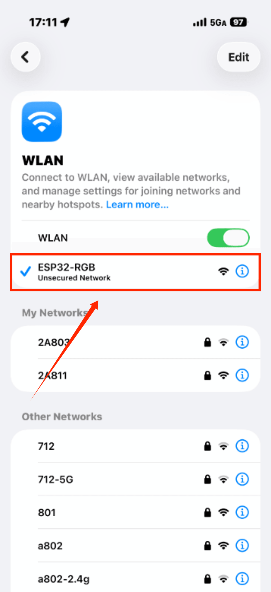
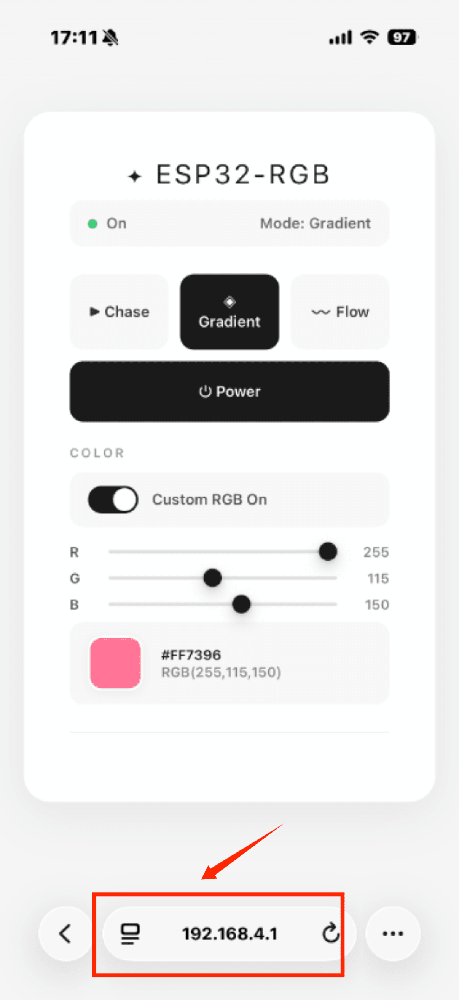
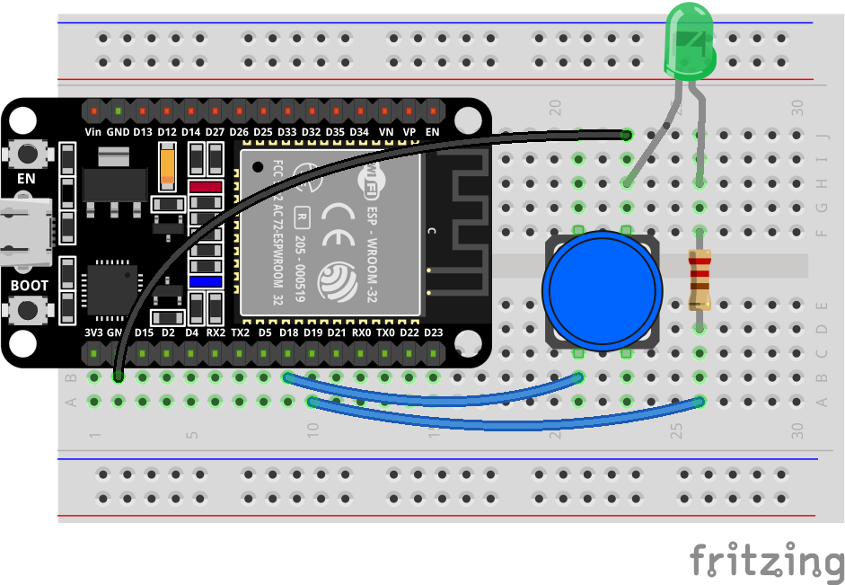
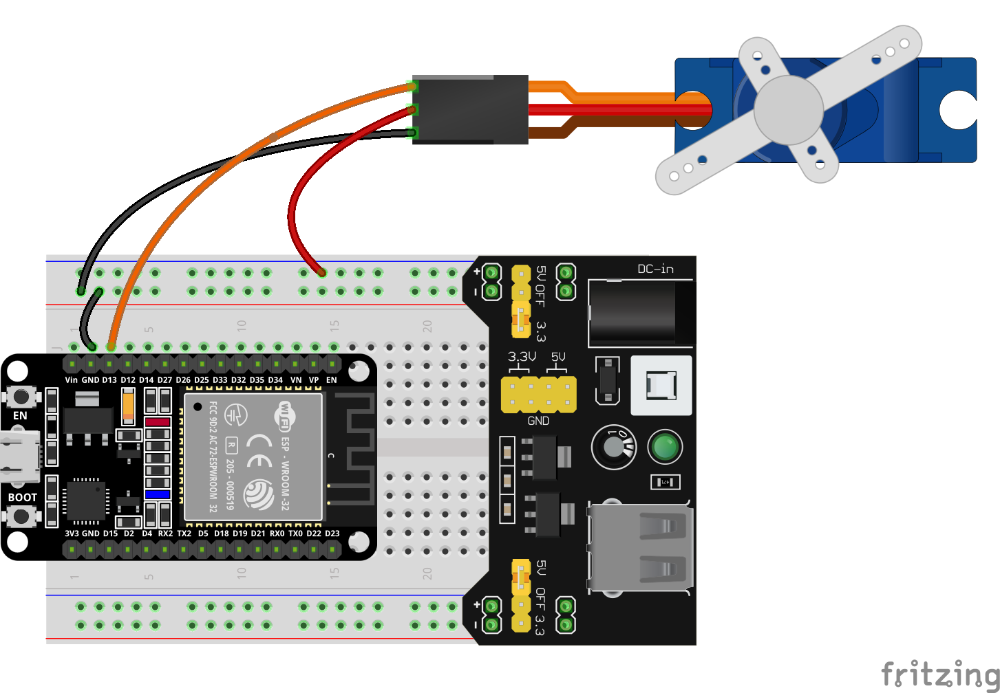
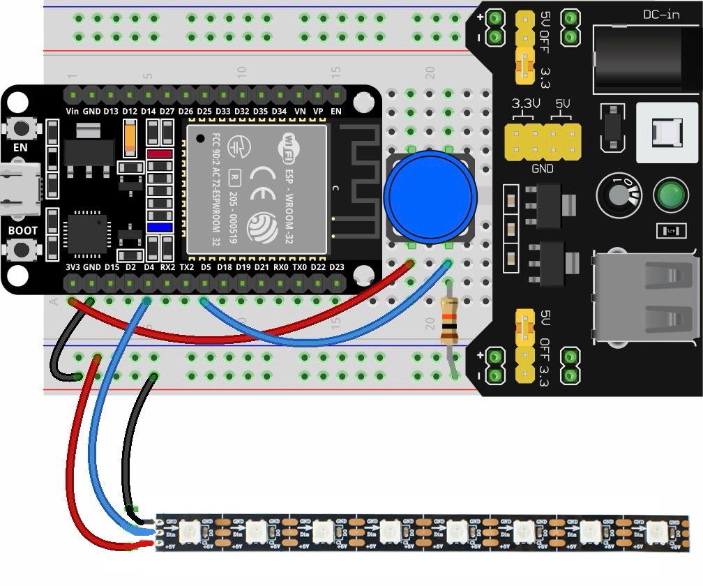
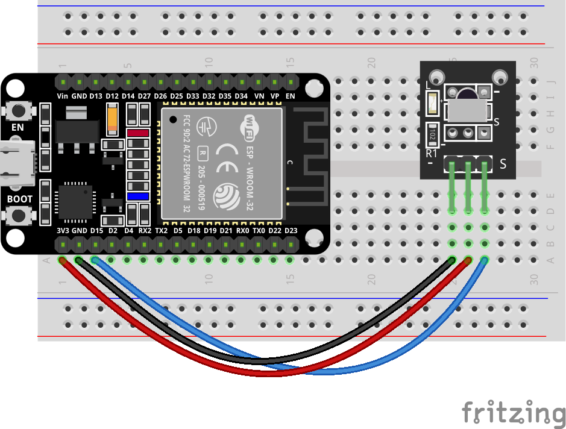
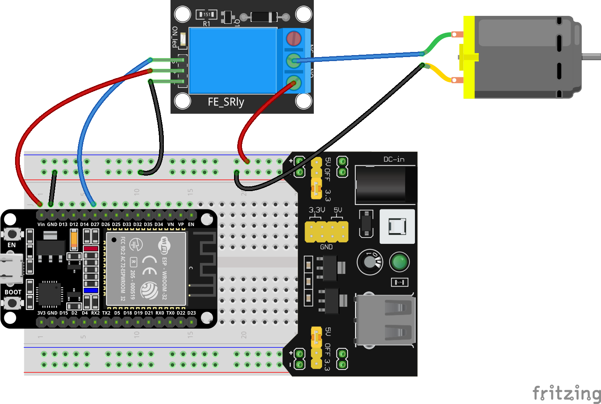
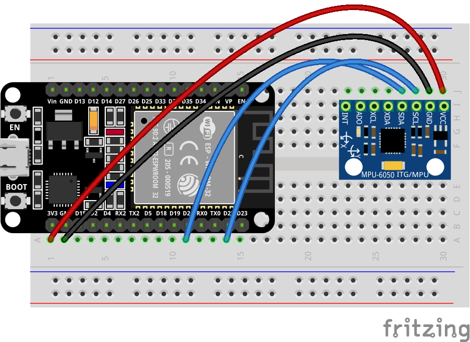
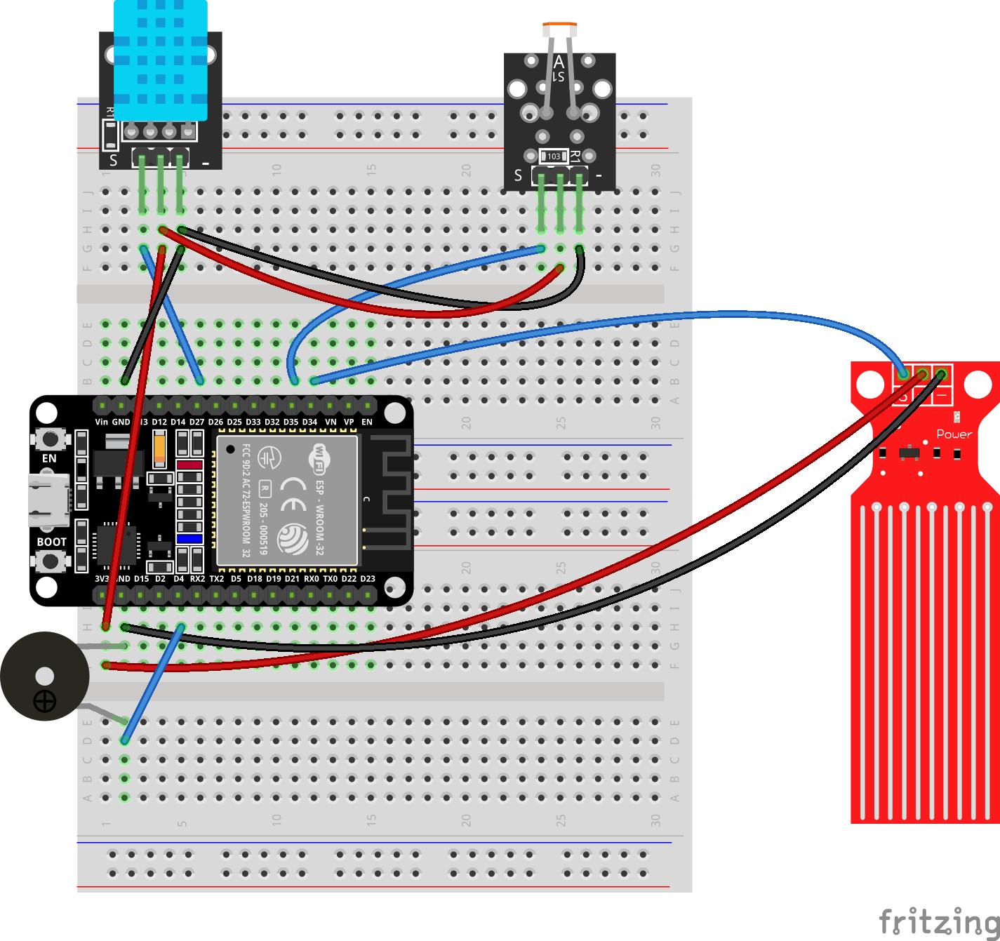

Advanced Experiments
====================

.. image:: _static/project/IOT/1.WEB.png
   :width: 800
   :align: center

.. raw:: html

   

- While foundational experiments taught you the basics of hands-on hardware interaction, this chapter introduces you to network connectivity. 

- Centered on the Internet of Things (IoT), we will guide you in equipping your development board with Wi-Fi capabilities and implementing remote control via a web interface. 

- Covering everything from TCP/IP fundamentals and HTTP request parsing to HTML page design and real-time status feedback, you will build a complete web-based control system—enabling your sensors and actuators to transcend physical distance and advance to a new level of smart connectivity.

----

How To Control Use a Mobile Phone
---------------------------------

All experimental projects in this chapter involve smartphone control; please watch the video below to learn how to use this feature:

Here is the illustrated tutorial:

A. After flashing the corresponding program, press the RST button on the development board to start the system.

B. The ESP32 development board will generate a Wi-Fi hotspot; please refer to the example program in the specific section for the hotspot name.

.. raw:: html

   

C. After connecting to the hotspot, open any web browser and enter the IP address **192.168.4.1** to access the control interface.

.. raw:: html

   

----

1. LED_Control
--------------

This experiment is a comprehensive project focusing on hybrid control and state synchronization within the Internet of Things (IoT). It aims to teach you how to control an LED simultaneously via physical buttons and a web interface, while achieving real-time state synchronization and feedback. You will master the following core skills:

 - Dual-channel control mode: The LED can be controlled by both a physical button (GPIO18) and a web-based button; these methods operate independently, enabling both local and remote control.

 - Wi-Fi AP mode application: The ESP32 functions as an open (password-free) access point, allowing a smartphone to connect directly and access the control interface.

 - RESTful API design: Implementation of endpoints such as `/toggle` (to switch the LED state) and `/state` (to query the current state), supporting frontend polling for synchronization.

 - AJAX real-time state synchronization: The frontend polls the `/state` endpoint every 500ms, ensuring that the LED icon and status text on the webpage remain synchronized with the actual hardware state in real time.

**Materials Needed:**

 - ESP32 Development Board
 - LED
 - Button
 - Resistor(220Ω)
 - Breadboard and Jumper Wires

**Wiring Diagram:**

.. raw:: html

   

**Wiring Table**

.. list-table:: 
   :header-rows: 1
   :widths: 10 20 20 25

   * - No.
     - Component
     - Pin
     - Connect to
   * - 1
     - LED
     - Anode (long leg)
     - 220Ω Resistor
   * - 1
     - LED
     - Cathode (short leg)
     - GND
   * - 2
     - 220Ω Resistor
     - One pin
     - GPIO 19
   * - 2
     - 220Ω Resistor
     - Other pin
     - LED Anode
   * - 3
     - Button 
     - One pin
     - GPIO 18
   * - 3
     - Button 
     - Other pin
     - GND

**Example code:**

.. raw:: html

   

   

.. code-block:: cpp

 #include <WiFi.h>
 #include <WebServer.h>
 #include <Preferences.h>

 // ---------- Hardware Definitions ----------
 const int ledPin = 19;       // LED pin
 const int buttonPin = 18;    // Physical button pin

 bool ledState = false;       // LED state
 bool lastButtonState = HIGH; // Last button state

 // ---------- WiFi Configuration ----------
 const char* apSSID = "ESP32_LED_Control";  // Access Point SSID (no password)
 const char* apPassword = NULL;        // No password

 // ---------- Create Web Server ----------
 WebServer server(80);

 Preferences preferences;

 // ---------- HTML Configuration Page ----------
 String configHTMLPage() {
   String html = "<!DOCTYPE html><html><head>";
   html += "<title>ESP32 WiFi Configuration</title>";
   html += "<meta name='viewport' content='width=device-width, initial-scale=1.0'>";
   html += "</head><body>";

   html += "
";
   html += "<h2>WiFi Configuration</h2>";

   html += "<form action='/configure' method='POST'>";
   html += "<input type='text' name='ssid' placeholder='WiFi SSID' required>";
   html += "<input type='password' name='password' placeholder='WiFi Password' required>";
   html += "<button type='submit'>Connect</button>";
   html += "</form>";

   html += "
</body></html>";
   return html;
 }

 // ---------- HTML Control Page (Original Design) ----------
 String controlHTMLPage() {
   String html = "<!DOCTYPE html><html><head>";
   html += "<title>ESP32 LED Control</title>";
   html += "<meta name='viewport' content='width=device-width, initial-scale=1.0'>";
   html += "</head><body>";

   html += "<h2>ESP32 LED Control</h2>";

   html += "

";
   html += "
LED Status: " + String(ledState ? "ON" : "OFF") + "
";
   html += "<button id='ledButton' class='" + String(ledState ? "on" : "off") + "' onclick='toggleLED()'>Button</button>";

   html += "";

   html += "</body></html>";
   return html;
 }

 // ---------- Setup Routes ----------
 void setupRoutes() {
   server.on("/", {
     server.send(200, "text/html", controlHTMLPage());
   });

   server.on("/toggle", {
     ledState = !ledState;
     server.send(200, "text/plain", ledState ? "1" : "0");
   });

   server.on("/state", {
     server.send(200, "text/plain", ledState ? "1" : "0");
   });
 }

 // ---------- Setup Access Point ----------
 void setupAccessPoint() {
   WiFi.softAP(apSSID, apPassword);
 }

 // ---------- Setup ----------
 void setup() {
   pinMode(ledPin, OUTPUT);
   pinMode(buttonPin, INPUT_PULLUP);

   preferences.begin("wifi-config", false);

   setupAccessPoint();

   setupRoutes();
   server.begin();
 }

 // ---------- Main Loop ----------
 void loop() {
   server.handleClient();

   bool buttonState = digitalRead(buttonPin);
   if (buttonState == LOW && lastButtonState == HIGH) {
     ledState = !ledState;
     delay(50);
   }
   lastButtonState = buttonState;

   digitalWrite(ledPin, ledState ? HIGH : LOW);
 }

.. raw:: html

   

   

     <button id="expand-btn-LED" onclick="toggleCode('code-container-LED', 'expand-btn-LED')" style="flex: 1; padding: 10px 16px; background: #2980B9; color: white; border: none; border-radius: 4px; cursor: pointer; font-weight: bold;">▼ Expand All Code</button>
   

   

   

   

.. raw:: html

   

**Display Effect:**

.. image:: _static/project/IOT/9.LED.gif
   :width: 700
   :align: center

.. raw:: html

   

After flashing the program, the ESP32 creates a password-free Wi-Fi hotspot named **ESP32_LED_Control**. Once a mobile phone or computer connects to this hotspot, access **192.168.4.1** to open the control page:

 - Web-based control: Clicking the "Button" on the page toggles the LED state, and the LED icon on the page updates synchronously (glowing green when ON, red when OFF).

 - Physical button control: Pressing the physical button connected to GPIO18 toggles the LED state, and the web page status updates automatically within 500ms.

 - Real-time status synchronization: Regardless of whether control is via the web page or the physical button, the LED state remains synchronized, ensuring consistency among the web page status, the LED icon, and the actual hardware state.

2. TEMP And HUMI Meter
----------------------

This experiment is a core project in our introductory practical course on the Internet of Things (IoT). It aims to teach you how to set up an ESP32 as a Wi-Fi hotspot (AP mode) and build an embedded web server to display sensor data in real time on a webpage. You will master the following key skills:

 - DHT11 Temperature and Humidity Sensor Driver and Data Reading.

 - ESP32 Soft-AP Mode Configuration: Direct Device Connection Without Router.

 - WebServer Library for HTTP Server Construction and GET Request Handling.

 - JSON Data Assembly and Parsing for Front-End and Back-End Data Interaction.

 - AJAX Asynchronous Refresh Technology **(fetch + setInterval)** : Automatic Webpage Data Updates Without Manual Page Refresh.

 - Front-End UI Design: Responsive Card-Style Dashboard Adapted for Mobile and Desktop Screens.

**Materials Needed:**

 - ESP32 Development Board
 - DHT11
 - Breadboard and Jumper Wires

**Wiring Diagram:**

.. image:: _static/project/IOT/1.DHT11.png
   :width: 600
   :align: center

.. raw:: html

   

**Wiring Table**

.. list-table:: 
   :header-rows: 1
   :widths: 10 20 20 25

   * - No.
     - Component
     - Pin
     - Connect to
   * - 1
     - DHT11 Sensor
     - VCC
     - 3.3V
   * - 1
     - DHT11 Sensor
     - GND
     - GND
   * - 1
     - DHT11 Sensor
     - DATA
     - GPIO 15

**Example code:**

.. raw:: html

   

   

.. code-block:: cpp

 #include <WiFi.h>
 #include <WebServer.h>
 #include <DHT.h>
 #define DHTPIN 15
 #define DHTTYPE DHT11

 DHT dht(DHTPIN, DHTTYPE);

 const char* ap_ssid = "ESP32-DHT11";

 WebServer server(80);

 String getHTML()
 {
     String html = R"rawliteral(

 <!DOCTYPE html>
 <html lang="en">

 <head>

 <meta charset="UTF-8">

 <meta name="viewport"
 content="width=device-width, initial-scale=1.0">

 <title>ESP32 Climate Monitor</title>

 

 </head>

 <body>

 

 

 

 

 ESP32 Monitor
 

 

 Real-time Climate Dashboard
 

 

 

 

 

 

 🌡 Temperature
 

 

 --
 °C
 

 

 

 

 💧 Humidity
 

 

 --
 %
 

 

 

 ESP32 DHT11 Web Monitor
 

 

 
 </body>
 </html>

 )rawliteral";

     return html;
 }

 // Main page
 void handleRoot()
 {
     server.send(200, "text/html", getHTML());
 }

 // Sensor data API
 void handleData()
 {
     float humidity = dht.readHumidity();

     float temperature = dht.readTemperature();

     if (isnan(humidity) || isnan(temperature))
     {
         server.send(
             200,
             "application/json",
             "{\"temperature\":\"--\",\"humidity\":\"--\"}"
         );

         return;
     }

     String json = "{";

     json += "\"temperature\":\"" +
             String(temperature,1) + "\",";

     json += "\"humidity\":\"" +
             String(humidity,1) + "\"";

     json += "}";

     server.send(200, "application/json", json);
 }

 void setup()
 {
     Serial.begin(115200);

     dht.begin();

     // Start WiFi hotspot
     WiFi.softAP(ap_ssid);

     IPAddress IP = WiFi.softAPIP();

     Serial.println();
     Serial.println("ESP32 Hotspot Started");

     Serial.print("SSID: ");
     Serial.println(ap_ssid);

     Serial.print("IP Address: ");
     Serial.println(IP);

     // Web routes
     server.on("/", handleRoot);

     server.on("/data", handleData);

     // Start web server
     server.begin();

     Serial.println("Web Server Started");
 }

 void loop()
 {
     server.handleClient();
 }

.. raw:: html

   

   

     <button id="expand-btn-dht" onclick="toggleCode('code-container-dht', 'expand-btn-dht')" style="flex: 1; padding: 10px 16px; background: #2980B9; color: white; border: none; border-radius: 4px; cursor: pointer; font-weight: bold;">▼ Expand All Code</button>
   

   

   

   

.. raw:: html

   

**Display Effect:**

.. image:: _static/project/IOT/1.dht112.png
   :width: 700
   :align: center

.. raw:: html

   

- The system will automatically create a Wi-Fi hotspot named **ESP32-DHT11**. 

- After connecting to this Wi-Fi network using your mobile phone or computer, enter the IP address **192.168.4.1** in your browser 

- To open a beautifully designed temperature and humidity monitoring panel to view real-time temperature and humidity data.

----

3. Ultrasonic Distance Meter
----------------------------

This experiment is an advanced project for IoT sensor applications, aiming to learn how to combine an ultrasonic ranging module (HC-SR04) with an ESP32 web server to build a real-time wireless ranging and monitoring system. You will master the following key skills:

- Driving principle and ranging implementation of the HC-SR04 ultrasonic sensor ( **pulseIn()** for precise echo time measurement) .

- Temperature-compensated ranging algorithm: Calculates the actual distance using the speed of sound (0.0343 cm/μs) and handles invalid data (out of range, no echo, etc.)

- Timed sampling mechanism: Uses a **millis()** non-blocking timer to collect data at fixed intervals (100ms) to maintain smooth system response

- Web server and JSON API design: Returns structured data through the /data interface, achieving complete separation of front-end and back-end

- AJAX real-time data refresh: The front-end automatically requests the latest data every 300ms, updating the page without page refresh

- Responsive UI design and visual feedback: Distance value animation, status prompts, threshold alarms (buzzer trigger + page warning for <20cm)

- Buzzer linkage control: The buzzer automatically sounds an alarm when an object gets too close, achieving a closed loop of "perception-judgment-execution".

**Materials Needed:**

 - ESP32 Development Board
 - HC-SR04 Ultrasonic Sensor
 - Active Buzzer
 - Breadboard and Jumper Wires

**Wiring Diagram:**

.. image:: _static/project/IOT/2.hcsr04.png
   :width: 600
   :align: center

.. raw:: html

   

**Wiring Table**

.. list-table:: 
   :header-rows: 1
   :widths: 10 20 20 25

   * - No.
     - Component
     - Pin
     - Connect to
   * - 1
     - HC-SR04 Ultrasonic
     - VCC
     - 5V
   * - 1
     - HC-SR04 Ultrasonic
     - GND
     - GND
   * - 1
     - HC-SR04 Ultrasonic
     - TRIG
     - GPIO 5
   * - 1
     - HC-SR04 Ultrasonic
     - ECHO
     - GPIO 18
   * - 2
     - Buzzer
     - Positive (+)
     - GPIO 4
   * - 2
     - Buzzer
     - Negative (-)
     - GND

**Example code:**

.. raw:: html

   

   

.. code-block:: cpp

 #include <WiFi.h>
 #include <WebServer.h>

 // WiFi hotspot
 const char* ssid = "ESP32-Distance-Meter";

 // Ultrasonic pins
 #define TRIG_PIN 5
 #define ECHO_PIN 18

 // Buzzer pin
 #define BUZZER_PIN 4

 WebServer server(80);

 // Distance variables
 float distance_cm = 0.0;

 unsigned long lastMeasurement = 0;

 const unsigned long MEASURE_INTERVAL = 100;

 bool measurementError = false;

 // Measure distance
 float measureDistance()
 {
     digitalWrite(TRIG_PIN, LOW);
     delayMicroseconds(2);

     digitalWrite(TRIG_PIN, HIGH);
     delayMicroseconds(10);

     digitalWrite(TRIG_PIN, LOW);

     unsigned long duration =
     pulseIn(ECHO_PIN, HIGH, 30000);

     if(duration == 0)
     {
         return -1.0;
     }

     float distance =
     duration * 0.0343 / 2;

     if(distance > 400.0 || distance < 2.0)
     {
         return -1.0;
     }

     return distance;
 }

 // HTML page
 const char* htmlPage = R"rawliteral(

 <!DOCTYPE html>
 <html lang="en">

 <head>

 <meta charset="UTF-8">

 <meta name="viewport"
 content="width=device-width, initial-scale=1.0">

 <title>Distance Meter</title>

 

 </head>

 <body>

 

 

 ESP32 DISTANCE METER
 

 

 0.0

 cm

 

 

 Monitoring...
 

 

 Real-time Ultrasonic Measurement
 

 

 
 </body>
 </html>

 )rawliteral";

 // Main page
 void handleRoot()
 {
     server.send(200,
     "text/html",
     htmlPage);
 }

 // JSON API
 void handleData()
 {
     String json = "{";

     if(measurementError || distance_cm < 0)
     {
         json += "\"error\":\"Out of range\"";
         json += ",\"distance\":0";
     }
     else
     {
         json += "\"error\":null";

         json += ",\"distance\":" +
         String(distance_cm, 2);
     }

     json += "}";

     server.send(200,
     "application/json",
     json);
 }

 // 404
 void handleNotFound()
 {
     server.send(404,
     "text/plain",
     "404: Not Found");
 }

 void setup()
 {
     Serial.begin(115200);

     // Pin setup
     pinMode(TRIG_PIN, OUTPUT);

     pinMode(ECHO_PIN, INPUT);

     pinMode(BUZZER_PIN, OUTPUT);

     digitalWrite(TRIG_PIN, LOW);

     digitalWrite(BUZZER_PIN, LOW);

     // AP mode
     WiFi.mode(WIFI_AP);

     IPAddress local_ip(192,168,4,1);

     IPAddress gateway(192,168,4,1);

     IPAddress subnet(255,255,255,0);

     WiFi.softAPConfig(
         local_ip,
         gateway,
         subnet
     );

     // Start hotspot
     WiFi.softAP(ssid);

     Serial.println();
     Serial.println("ESP32 Hotspot Started");

     Serial.print("SSID: ");
     Serial.println(ssid);

     Serial.print("IP Address: ");
     Serial.println(WiFi.softAPIP());

     // Web routes
     server.on("/", handleRoot);

     server.on("/data", handleData);

     server.onNotFound(handleNotFound);

     // Start server
     server.begin();

     Serial.println("Web Server Started");
 }

 void loop()
 {
     server.handleClient();

     unsigned long currentMillis =
     millis();

     if(currentMillis - lastMeasurement
        >= MEASURE_INTERVAL)
     {
         float measuredDistance =
         measureDistance();

         if(measuredDistance > 0)
         {
             distance_cm =
             measuredDistance;

             measurementError = false;

             // Buzzer alert
             if(distance_cm < 20)
             {
                 digitalWrite(BUZZER_PIN, HIGH);
             }
             else
             {
                 digitalWrite(BUZZER_PIN, LOW);
             }
         }
         else
         {
             measurementError = true;

             digitalWrite(BUZZER_PIN, LOW);
         }

         lastMeasurement =
         currentMillis;
     }

     delay(10);
 }

.. raw:: html

   

   

     <button id="expand-btn-hcsr04" onclick="toggleCode('code-container-hcsr04', 'expand-btn-hcsr04')" style="flex: 1; padding: 10px 16px; background: #2980B9; color: white; border: none; border-radius: 4px; cursor: pointer; font-weight: bold;">▼ Expand All Code</button>
   

   

   

   

.. raw:: html

   

**Display Effect:**

.. image:: _static/project/IOT/2.hcsr04.gif
   :width: 700
   :align: center

.. raw:: html

   

- After flashing the program, the ESP32 will automatically create a Wi-Fi hotspot named **ESP32-Distance-Meter** .

- After connecting to this Wi-Fi network using your mobile phone or computer, enter **192.168.4.1** in your browser to open a minimalist real-time distance measurement dashboard:

- The buzzer will sound an alarm when the distance is less than 20cm, and a notification will be displayed on the page.

----

4. Web-Control Servo
---------------------

This experiment is a comprehensive project integrating IoT remote control and servo driving, designed to teach you how to remotely control the rotation of an SG90 servo motor via an ESP32 using a web interface. You will master the following core skills:

- ESP32Servo Library Usage: Learn the principles of driving servos via PWM signals and master key functions such as `attach()` and `write()`. 

- RESTful API Design: Implement state setting and querying through endpoints like `/set?angle=xx` and `/status`, while understanding the communication architecture of frontend-backend separation. 

- Frontend Development (HTML/CSS/JavaScript): Design a responsive interactive interface featuring a slider, angle display, synchronized 3D servo visualization, and input debouncing. 

- Real-time Visual Feedback: Synchronize the rotation of the frontend servo visualization with the actual angle and implement two-way binding between the slider and the numerical display to enhance the user experience. 

- JSON Data Interaction: Use the `fetch()` API for asynchronous requests to retrieve the current angle status, ensuring synchronization during page initialization.

**Materials Needed:**

 - ESP32 Development Board
 - SG90 Servo
 - Power Supply 
 - Breadboard and Jumper Wires

**Wiring Diagram:**

.. raw:: html

   

**Wiring Table**

.. list-table:: 
   :header-rows: 1
   :widths: 10 20 20 25

   * - No.
     - Component
     - Pin
     - Connect to
   * - 1
     - SG90 Servo
     - Red (VCC)
     - 5V
   * - 1
     - SG90 Servo
     - Brown (GND)
     - GND
   * - 1
     - SG90 Servo
     - Orange (Signal)
     - GPIO 13

.. note::

    The servo requires a 5V power supply for stable operation; therefore, a breadboard power supply module used in conjunction with a battery is needed to provide a stable 5V supply.

**Example code:**

.. raw:: html

   

   

.. code-block:: cpp

 #include <WiFi.h>
 #include <WebServer.h>
 #include <ESP32Servo.h>

 // ========== WiFi AP Configuration ==========
 const char* ap_ssid = "ESP32_Servo_Control";
 const char* ap_password = NULL;               

 // ========== Pin Definition ==========
 const int servoPin = 13;    // Servo signal pin (GPIO13)

 // ========== Web Server ==========
 WebServer server(80);

 // ========== Servo Object ==========
 Servo myServo;

 // ========== Current State ==========
 int currentAngle = 90;      // Starting at 90 degrees (center)

 // ========== HTML Page - Minimalist White Style ==========
 const char index_html[] PROGMEM = R"rawliteral(
 <!DOCTYPE html>
 <html lang="en">
 <head>
     <meta charset="UTF-8">
     <meta name="viewport" content="width=device-width, initial-scale=1.0, user-scalable=yes">
     <title>Servo Control</title>
     
     
 </head>
 <body>
     

         <h1>Servo Control</h1>
         
SG90 Servo Motor

         
         <!-- Servo Model -->
         

             

                 

                 

                     

                     

                 

                 

                 

                 

                 

                 
SG90

             

             
             

                 0°
                 

                     

                 

                 180°
             

         

         
         <!-- Angle Display -->
         

             90
             degrees
         

         
         <!-- Slider -->
         

             <input type="range" id="angleSlider" min="0" max="180" value="90">
         

         
         <!-- Buttons -->
         

             <button class="btn" onclick="setMinAngle()">0°</button>
             <button class="btn" onclick="resetAngle()">90°</button>
             <button class="btn" onclick="setMaxAngle()">180°</button>
         

         
         

         
ESP32 · SG90 Servo Controller

     

 </body>
 </html>
 )rawliteral";

 // ========== Servo Control Functions ==========
 void setServoAngle(int angle) {
     angle = constrain(angle, 0, 180);
     currentAngle = angle;
     myServo.write(currentAngle);
     Serial.print("Servo angle: ");
     Serial.print(currentAngle);
     Serial.println("°");
 }

 // ========== Web Request Handlers ==========
 void handleRoot() {
     server.send(200, "text/html", index_html);
 }

 void handleSet() {
     if (server.hasArg("angle")) {
         int newAngle = server.arg("angle").toInt();
         setServoAngle(newAngle);
         server.send(200, "text/plain", "OK");
     } else {
         server.send(400, "text/plain", "Bad Request");
     }
 }

 void handleStatus() {
     String json = "{\"angle\":" + String(currentAngle) + "}";
     server.send(200, "application/json", json);
 }

 void handleNotFound() {
     server.send(404, "text/plain", "404: Not Found");
 }

 // ========== Setup ==========
 void setup() {
     Serial.begin(115200);
     delay(100);
     
     myServo.attach(servoPin);
     myServo.write(currentAngle);
     
     Serial.println();
     Serial.println("=== ESP32 SG90 Servo Controller ===");
     Serial.print("Initial angle: ");
     Serial.print(currentAngle);
     Serial.println("°");
     
     Serial.print("Starting AP: ");
     Serial.println(ap_ssid);
     
     WiFi.softAP(ap_ssid, ap_password);
     
     IPAddress apIP = WiFi.softAPIP();
     Serial.print("AP IP: ");
     Serial.println(apIP);
     
     server.on("/", handleRoot);
     server.on("/set", handleSet);
     server.on("/status", handleStatus);
     server.onNotFound(handleNotFound);
     
     server.begin();
     Serial.println("Server started");
     Serial.print("Connect to: ");
     Serial.println(ap_ssid);
     Serial.print("Then visit: http://");
     Serial.println(apIP);
     Serial.println("====================================");
 }

 void loop() {
     server.handleClient();
     delay(10);
 }

.. raw:: html

   

   

     <button id="expand-btn-servo" onclick="toggleCode('code-container-servo', 'expand-btn-SG90')" style="flex: 1; padding: 10px 16px; background: #2980B9; color: white; border: none; border-radius: 4px; cursor: pointer; font-weight: bold;">▼ Expand All Code</button>
   

   

   

   

.. raw:: html

   

**Display Effect:**

.. image:: _static/project/IOT/3.SG90.gif
   :width: 700
   :align: center

.. raw:: html

   

The ESP32 creates a Wi-Fi hotspot named **ESP32_Servo_Control**.

- After connecting to this Wi-Fi network via a smartphone or computer, accessing the address **192.168.4.1** opens a control page. This page features a 3D visualization of the servo, an angle display, a slider, and quick-action buttons (0°, 90°, and 180°).

- Dragging the slider or clicking the quick-action buttons causes the servo to immediately rotate to the specified angle; simultaneously, the 3D visualization rotates in sync and the angle value updates in real-time, delivering a "what-you-see-is-what-you-get" remote control experience.

----

5. Colorful RGB
---------------

This experiment is a comprehensive project on IoT-based smart lighting control. It aims to teach you how to drive WS2812B full-color RGB LED strips using an ESP32 and remotely control various dynamic lighting effects via a Wi-Fi-hosted web interface. You will master the following core skills:

- **FastLED Library Usage:** Learn the driving principles of WS2812B programmable LEDs and master key functions such as `addLeds()`, `show()`, `fadeToBlackBy()`, and `nscale8_video()`.

- **Multi-mode Lighting Algorithms:** Implement three dynamic effects—Chase, Gradient, and Flow—while gaining an understanding of the HSV color model and brightness control.

- **Custom RGB Color Mixing:** Independently adjust red, green, and blue channels via sliders to create any desired color, with support for real-time preview.

- **Hardware Button Integration:** Use GPIO buttons for physical mode switching (short-press to cycle through modes), enabling operation without a network connection.

**Materials Needed:**

 - ESP32 Development Board
 - RGB LED strip
 - Button
 - Resistor (10K)
 - Breadboard and Jumper Wires

**Wiring Diagram:**

.. raw:: html

   

**Wiring Table**

.. list-table:: 
   :header-rows: 1
   :widths: 10 20 20 25

   * - No.
     - Component
     - Pin
     - Connect to
   * - 1
     - WS2812B LED Strip
     - VCC
     - 5V
   * - 1
     - WS2812B LED Strip
     - GND
     - GND
   * - 1
     - WS2812B LED Strip
     - DATA
     - GPIO 4
   * - 2
     - Button
     - One pin
     - 3.3V
   * - 2
     - Button
     - Other pin
     - GPIO 5
   * - 3
     - 10kΩ Resistor
     - One pin
     - GPIO 5
   * - 3
     - 10kΩ Resistor
     - Other pin
     - GND

**Example code:**

.. raw:: html

   

   

.. code-block:: cpp

 #include <WiFi.h>
 #include <WebServer.h>
 #include <FastLED.h>

 #define LED_PIN 4
 #define NUM_LEDS 8
 #define BUTTON_PIN 5

 CRGB leds[NUM_LEDS];
 WebServer server(80);

 bool power = false;
 int mode = 0;
 bool customMode = false;
 int r = 255, g = 100, b = 150;

 int hueOffset = 0;
 int chasePos = 0;

 const char* html = R"(
 <!DOCTYPE html>
 <html>
 <head>
 <meta charset="UTF-8">
 <meta name="viewport" content="width=device-width, initial-scale=1.0">
 <title>RGB Light</title>
 
 </head>
 <body>
 

 <h1>✦ ESP32-RGB</h1>
 

Off

Mode: —

 

 <button class=btn onclick=setMode(1)>▶ Chase</button>
 <button class=btn onclick=setMode(2)>◈ Gradient</button>
 <button class=btn onclick=setMode(3)>〰 Flow</button>
 <button class="btn btn-power" id=pwr onclick=togglePower()>⏻ Power</button>
 

 

 
Color

 

Custom RGB Off

 

 
R<input type=range id=red min=0 max=255 value=255 oninput=updateRGB()>255

 
G<input type=range id=green min=0 max=255 value=100 oninput=updateRGB()>100

 
B<input type=range id=blue min=0 max=255 value=150 oninput=updateRGB()>150

 

 

<strong id=hex>#FF6496</strong> RGB(255,100,150)

 

 

 

 
 </body>
 </html>
 )";

 void chase() {
     if (!power) return;
     for (int i = 0; i < NUM_LEDS; i++) leds[i].fadeToBlackBy(20);
     CRGB color = customMode ? CRGB(r, g, b) : CHSV(hueOffset++, 200, 128);
     leds[chasePos] = color;
     chasePos = (chasePos + 1) % NUM_LEDS;
     FastLED.show();
     delay(150);
 }

 void gradient() {
     if (!power) return;
     if (customMode) {
         for (int i = 0; i < NUM_LEDS; i++) {
             float f = (float)i / NUM_LEDS;
             leds[i] = CRGB(r * (0.3 + 0.7 * (1 - f)), g * (0.3 + 0.7 * f), b * (0.3 + 0.7 * (1 - sin(f * 3.14))));
         }
     } else {
         hueOffset++;
         for (int i = 0; i < NUM_LEDS; i++) leds[i] = CHSV(hueOffset + i * 2, 200, 128);
     }
     FastLED.show();
     delay(20);
 }

 void flow() {
     if (!power) return;
     if (customMode) {
         int waveOffset = (millis() / 30) % 256;
         for (int i = 0; i < NUM_LEDS; i++) {
             leds[i] = CRGB(r, g, b);
             leds[i].nscale8_video((sin8(i * 16 + waveOffset * 2) * 128) / 255);
         }
     } else {
         hueOffset += 2;
         for (int i = 0; i < NUM_LEDS; i++) {
             leds[i] = CHSV(hueOffset + i * 4, 220, (sin8(i * 12 + hueOffset * 2) * 128) / 255);
         }
     }
     FastLED.show();
     delay(25);
 }

 void handleRoot() { server.send(200, "text/html", html); }

 void handleStatus() {
     String j = "{\"power\":" + String(power ? "true" : "false") + ",\"mode\":" + String(mode) + ",\"custom\":" + String(customMode ? "true" : "false") + ",\"r\":" + String(r) + ",\"g\":" + String(g) + ",\"b\":" + String(b) + "}";
     server.send(200, "application/json", j);
 }

 void handlePower() {
     power = !power;
     if (!power) { FastLED.clear(); FastLED.show(); mode = 0; }
     server.send(200, "text/plain", "OK");
 }

 void handleMode() {
     if (server.hasArg("mode")) { mode = server.arg("mode").toInt(); if (mode > 3) mode = 0; if (mode > 0) power = true; }
     server.send(200, "text/plain", "OK");
 }

 void handleCustom() {
     if (server.hasArg("state")) customMode = server.arg("state").toInt() == 1;
     server.send(200, "text/plain", "OK");
 }

 void handleRGB() {
     if (server.hasArg("r") && server.hasArg("g") && server.hasArg("b")) {
         r = constrain(server.arg("r").toInt(), 0, 255);
         g = constrain(server.arg("g").toInt(), 0, 255);
         b = constrain(server.arg("b").toInt(), 0, 255);
     }
     server.send(200, "text/plain", "OK");
 }

 void button() {
     static unsigned long last = 0;
     if (millis() - last < 300) return;
     last = millis();
     if (digitalRead(BUTTON_PIN) == HIGH) {
         mode = (mode + 1) % 4;
         if (mode == 0) { power = false; FastLED.clear(); FastLED.show(); } else power = true;
     }
 }

 void setup() {
     FastLED.addLeds<WS2812B, LED_PIN, GRB>(leds, NUM_LEDS);
     FastLED.clear();
     FastLED.show();
     pinMode(BUTTON_PIN, INPUT);
     WiFi.softAP("ESP32-RGB", NULL);
     server.on("/", handleRoot);
     server.on("/status", handleStatus);
     server.on("/power", HTTP_POST, handlePower);
     server.on("/mode", HTTP_POST, handleMode);
     server.on("/custom", HTTP_POST, handleCustom);
     server.on("/rgb", HTTP_POST, handleRGB);
     server.begin();
 }

 void loop() {
     server.handleClient();
     button();
     static unsigned long lastEffect = 0;
     if (millis() - lastEffect > 15) {
         lastEffect = millis();
         switch (mode) {
             case 1: chase(); break;
             case 2: gradient(); break;
             case 3: flow(); break;
         }
     }
     delay(1);
 }

.. raw:: html

   

   

     <button id="expand-btn-rgb" onclick="toggleCode('code-container-rgb', 'expand-btn-rgb')" style="flex: 1; padding: 10px 16px; background: #2980B9; color: white; border: none; border-radius: 4px; cursor: pointer; font-weight: bold;">▼ Expand All Code</button>
   

   

   

   

.. raw:: html

   

**Display Effect:**

.. image:: _static/project/IOT/4.RGB.gif
   :width: 700
   :align: center

.. raw:: html

   

After flashing the firmware, the ESP32 creates a Wi-Fi hotspot named **ESP32-RGB** . Once a smartphone or computer connects to this network, accessing **192.168.4.1** opens the control page, which offers comprehensive lighting controls:

 - Power Control: Toggle the LED strip on or off; turning it off clears all LEDs and resets the mode.

 - Three Dynamic Modes: Chase, Gradient (rainbow fade), and Flow (flowing halo); switching modes takes effect immediately.

 - Custom RGB Color Mixing: Enable custom mode via the toggle switch to independently adjust the Red, Green, and Blue channels with real-time color preview.

 - Physical Button: A short press of the button connected to GPIO4 cycles through the modes (Chase → Gradient → Flow → Off → Cycle).

----

6. IR Display
-------------

This experiment is an integrated project combining infrared (IR) remote control decoding with IoT-based display. It aims to teach you how to use an ESP32 to read signals from an IR remote and display the corresponding button information in real-time via a Wi-Fi web page. You will master the following core skills:

- Use of the IRremote library: Learn the principles of signal decoding for IR receivers and master key functions such as **`IrReceiver.begin()`, `decode()`, and `resume()`** . 

- IR protocols and key mapping: Understand the data structure of the NEC IR protocol, extract button command codes using **`decodedIRData.command`** , and map them to human-readable characters. 

- Wi-Fi AP mode application: Configure the ESP32 as a wireless access point (AP), allowing a smartphone to connect directly without a router. 

- Web Server and AJAX polling: Return the latest button press via the `/key` endpoint, with the front-end polling for updates every 150ms to achieve near real-time display.

**Materials Needed:**

 - ESP32 Development Board
 - Infrared Receiver Module
 - Breadboard and Jumper Wires

**Wiring Diagram:**

.. raw:: html

   

**Wiring Table**

.. list-table:: 
   :header-rows: 1
   :widths: 10 20 20 25

   * - No.
     - Component
     - Pin
     - Connect to
   * - 1
     - IR Receiver 
     - VCC
     - 3.3V
   * - 1
     - IR Receiver
     - GND
     - GND
   * - 1
     - IR Receiver
     - S (OUT)
     - GPIO 15

**Example code:**

.. raw:: html

   

   

.. code-block:: cpp

 #include <WiFi.h>
 #include <WebServer.h>
 #include <IRremote.h>
 #include <Preferences.h>

 // ===== Hardware Definitions =====
 #define IR_RECEIVE_PIN 15
 String lastKey = "";      // Save last key press
 String currentKey = "";

 // ===== WiFi Configuration =====
 const char* apSSID = "IR_Display";  // Access Point SSID 
 const char* apPassword = NULL;     

 // ===== Web Server =====
 WebServer server(80);

 // ===== Key Mapping =====
 String keyMap(uint32_t code) {
   switch(code) {
     case 0x16: return "1";
     case 0x19: return "2";
     case 0x0d: return "3";
     case 0x0c: return "4";
     case 0x18: return "5";
     case 0x5e: return "6";
     case 0x08: return "7";
     case 0x1c: return "8";
     case 0x5A: return "9";
     case 0x52: return "0";
     case 0x42: return "*";
     case 0x4A: return "#";
     case 0x46: return "UP";
     case 0x15: return "DOWN";
     case 0x40: return "OK";
     case 0x44: return "LEFT";
     case 0x43: return "RIGHT";
     default: return "";
   }
 }

 //HTML Control Page 
 String controlHTMLPage() {
   String page = R"rawliteral(
 <!DOCTYPE html>
 <html lang="en">
 <head>
 <meta charset="UTF-8">
 <meta name="viewport" content="width=device-width, initial-scale=1.0">
 <title>IR Remote Display</title>
 
 </head>
 <body>
   

     <h1>IR REMOTE DISPLAY</h1>
     

       —
     

     

        Ready
     

   

 
 </body>
 </html>
 )rawliteral";
   return page;
 }

 // ===== Route Handlers =====
 void handleRoot() {
   server.send(200, "text/html", controlHTMLPage());
 }

 void handleKey() {
   server.send(200, "text/plain", currentKey);
 }

 // ===== Setup Access Point =====
 void setupAccessPoint() {
   Serial.println("Setting up Access Point...");
   WiFi.softAP(apSSID, apPassword);
   Serial.println("Access Point started");
   Serial.println("SSID: " + String(apSSID));
   Serial.println("Password: None (Open Network)");
   Serial.println("IP address: " + WiFi.softAPIP().toString());
   Serial.println("Connect to this AP and open http://" + WiFi.softAPIP().toString());
 }

 // ===== Setup =====
 void setup() {
   Serial.begin(115200);
   Serial.println("ESP32 IR Remote Web Display");
   
   // Setup Access Point (AP Mode)
   setupAccessPoint();

   // IR Receiver initialization
   IrReceiver.begin(IR_RECEIVE_PIN, ENABLE_LED_FEEDBACK);
   Serial.println("IR Receiver initialized");

   // Web server routes
   server.on("/", handleRoot);
   server.on("/key", handleKey);
   
   server.begin();
   Serial.println("Web server started.");
 }

 // ===== Main Loop =====
 void loop() {
   server.handleClient();

   // Detect IR signals
   if (IrReceiver.decode()) {
     uint32_t code = IrReceiver.decodedIRData.command; // Get command code
     String key = keyMap(code);

     if (key != "" && key != lastKey) {  // Only update for new keys
       currentKey = key;
       lastKey = key;
       Serial.print("Key pressed: ");
       Serial.println(currentKey);
     }

     IrReceiver.resume();  // Prepare for next reception
   }
 }

.. raw:: html

   

   

     <button id="expand-btn-ir" onclick="toggleCode('code-container-ir', 'expand-btn-ir')" style="flex: 1; padding: 10px 16px; background: #2980B9; color: white; border: none; border-radius: 4px; cursor: pointer; font-weight: bold;">▼ Expand All Code</button>
   

   

   

   

.. raw:: html

   

**Display Effect:**

.. image:: _static/project/IOT/5.IR.gif
   :width: 700
   :align: center

.. raw:: html

   

- After flashing the program, the ESP32 creates a Wi-Fi hotspot named **IR_Display**. Connect your smartphone or computer to this Wi-Fi network and visit **192.168.4.1** to open the display page.

- When you point an IR remote control at the receiver and press any button, the name of the corresponding button appears in large text in the center of the page; when no button is pressed, a "—" placeholder is displayed.

----

7. Custom Display
-----------------

This experiment is a comprehensive project integrating web interaction with OLED display functionality, designed to teach you how to remotely edit text displayed on an OLED screen via a webpage. You will master the following core skills:

 - SSD1306 OLED Display Driver: Controlling a 128×64 pixel OLED screen using the Adafruit_SSD1306 library and mastering display functions such as **clearDisplay()**, **setCursor()**, **println()**, and **display()**.

 - Web Forms and HTTP POST Requests: Designing HTML forms to capture user input and submitting data via POST requests, allowing the server to parse form parameters and update the displayed content.

 - String Array Management: Using **String lines[4]** to store four lines of text and utilizing array indexing to update each line independently.

 - Automatic Form Pre-filling: Automatically populating input fields with the currently displayed content upon page load, making it easier for users to edit existing text.

 - Page Redirection: Automatically redirecting the user back to the homepage after form submission using **server.sendHeader("Location", "/")** to ensure a smooth user experience.

**Materials Needed:**

 - ESP32 Development Board
 - 0.96 Inch Dispaly
 - Breadboard and Jumper Wires

**Wiring Diagram:**

.. image:: _static/project/BASIC/10.OLED.png
   :width: 600
   :align: center

.. raw:: html

   

**Wiring Table**

.. list-table:: 
   :header-rows: 1
   :widths: 10 20 20 25

   * - No.
     - Component
     - Pin
     - Connect to
   * - 1
     - 0.96 OLED
     - VCC
     - 3.3V
   * - 1
     - 0.96 OLED
     - GND
     - GND
   * - 1
     - 0.96 OLED
     - SCL
     - GPIO 22
   * - 1
     - 0.96 OLED
     - SDA
     - GPIO 21

**Example code:**

.. raw:: html

   

   

.. code-block:: cpp

 #include <WiFi.h>
 #include <WebServer.h>
 #include <Wire.h>
 #include <Adafruit_GFX.h>
 #include <Adafruit_SSD1306.h>
 #define SCREEN_WIDTH 128
 #define SCREEN_HEIGHT 64
 #define OLED_RESET    -1

 Adafruit_SSD1306 display(SCREEN_WIDTH, SCREEN_HEIGHT, &Wire, OLED_RESET);

 const char* ap_ssid = "ESP32_WEB_OLED";
 const char* ap_password = NULL;

 WebServer server(80);

 String lines[4] = {"ESP32_WEB_OLED", "192.168.4.1", "Connect to WiFi", "Then edit text"};

 void updateDisplay() {
   display.clearDisplay();
   display.setTextColor(SSD1306_WHITE);
   display.setTextSize(1);
   
   for (int i = 0; i < 4; i++) {
     display.setCursor(0, i * 16);
     display.println(lines[i]);
   }
   display.display();
 }

 void handleRoot() {
   String html = "<!DOCTYPE html><html>";
   html += "<head><meta charset='UTF-8'><meta name='viewport' content='width=device-width, initial-scale=1, viewport-fit=cover'>";
   html += "<title>OLED Controller</title>";
   html += "";
   html += "</head><body>";
   
   html += "
";
   html += "
";
   html += "<form method='POST' action='/update'>";
   
   for (int i = 0; i < 4; i++) {
     html += "
";
     html += "<label>LINE " + String(i+1) + "</label>";
     html += "<input type='text' name='line" + String(i) + "' value='" + lines[i] + "'>";
     html += "
";
   }
   
   html += "<button type='submit'>UPDATE DISPLAY</button>";
   html += "</form>";
   html += "
";
   html += "
";
   html += "</body></html>";

   server.send(200, "text/html", html);
 }

 void handleUpdate() {
   for (int i = 0; i < 4; i++) {
     String argName = "line" + String(i);
     if (server.hasArg(argName)) {
       String value = server.arg(argName);
       if (value.length() > 0) {
         lines[i] = value;
       }
     }
   }
   
   updateDisplay();
   
   server.sendHeader("Location", "/");
   server.send(303, "text/plain", "");
 }

 void setup() {
   Serial.begin(115200);
   delay(100);
   
   if (!display.begin(SSD1306_SWITCHCAPVCC, 0x3C)) {
     Serial.println(F("SSD1306 init failed"));
     for (;;);
   }
   
   WiFi.mode(WIFI_AP);
   WiFi.softAP(ap_ssid, ap_password);
   
   IPAddress IP = WiFi.softAPIP();
   Serial.print("AP IP: ");
   Serial.println(IP);
   
   server.on("/", handleRoot);
   server.on("/update", HTTP_POST, handleUpdate);
   
   server.begin();
   Serial.println("HTTP server started");
   
   updateDisplay();
 }

 void loop() {
   server.handleClient();
   delay(10);
 }

.. raw:: html

   

   

     <button id="expand-btn-oled" onclick="toggleCode('code-container-oled', 'expand-btn-oled')" style="flex: 1; padding: 10px 16px; background: #2980B9; color: white; border: none; border-radius: 4px; cursor: pointer; font-weight: bold;">▼ Expand All Code</button>
   

   

   

   

.. raw:: html

   

**Display Effect:**

.. image:: _static/project/IOT/7.OLED.gif
   :width: 700
   :align: center

.. raw:: html

   

After flashing the program, the ESP32 creates a Wi-Fi hotspot named **ESP32_WEB_OLED**. Once a smartphone or computer connects to this hotspot, access **192.168.4.1** to open the control page:

 - The page displays four text input fields, corresponding to the four lines of content shown on the OLED screen. 

 - When a user modifies the text in any field and clicks the "UPDATE DISPLAY" button, the OLED screen immediately updates to show the new content; simultaneously, the page automatically refreshes to the home screen, with the input fields reflecting the latest content.

----

8. Web Control Fan
-------------------

This experiment is a comprehensive IoT project focused on remote motor control. It aims to teach you how to remotely control a relay module driven by an ESP32 via a web interface, enabling the switching of a DC motor. You will master the following core skills:

 - Relay Driving Principles: Understand the mechanism of relays as electrically controlled switches, using GPIO high/low signal outputs to control external high-power devices.

 - Wi-Fi AP Mode Application: Configure the ESP32 as a wireless access point (hotspot), allowing direct connection from a smartphone without the need for a router.

 - RESTful API Design: Implement control command transmission via the **/control?state=on/off** endpoint and status retrieval via the **/status** endpoint, supporting JSON-formatted responses.

 - Frontend Interaction & Real-time Feedback: Incorporate visual elements such as fan rotation animations, toggle switches, and status badges to ensure immediate feedback and a smooth user experience.

 - AJAX Asynchronous Communication: Use the **fetch()** API for seamless page updates without reloading, and implement automatic status polling every 2 seconds to keep the interface synchronized.

 - Accidental Input Prevention & State Synchronization: Utilize an **isUpdating** flag to prevent concurrent requests, ensuring consistency between control commands and the UI state.

**Materials Needed:**

 - ESP32 Development Board
 - Relay Module
 - DC Motor
 - Power Supply
 - Breadboard and Jumper Wires

**Wiring Diagram:**

.. raw:: html
    
   

    

**Wiring Table**

.. list-table:: 
   :header-rows: 1
   :widths: 10 20 20 25

   * - No.
     - Component
     - Pin
     - Connect to
   * - 1
     - Relay Module
     - VCC
     - 5V
   * - 1
     - Relay Module
     - GND
     - GND
   * - 1
     - Relay Module
     - IN (Signal)
     - GPIO 27
   * - 2
     - DC Motor
     - Positive (+)
     - Relay COM 
   * - 2
     - DC Motor
     - Negative (-)
     - GND
   * - 3
     - External Power Supply
     - Positive (+)
     - Relay NO
   * - 3
     - External Power Supply
     - Negative (-)
     - GND

**Example code:**

.. raw:: html

   

   

.. code-block:: cpp

 #include <WiFi.h>
 #include <WebServer.h>

 // ========== WiFi AP Configuration ==========
 const char* ap_ssid = "Web_Control_Fan";
 const char* ap_password = NULL;               

 // ========== Pin Definition ==========
 const int relayPin = 27;    // Relay control pin 
 // ========== Web Server ==========
 WebServer server(80);

 // ========== Current State ==========
 bool motorState = false;    // false=OFF, true=ON

 // ========== HTML Page ==========
 const char index_html[] PROGMEM = R"rawliteral(
 <!DOCTYPE html>
 <html lang="en">
 <head>
     <meta charset="UTF-8">
     <meta name="viewport" content="width=device-width, initial-scale=1.0, user-scalable=yes">
     <title>ESP32 Motor Control</title>
     
     
 </head>
 <body>
     

         <h1>⚡ Motor Control</h1>
         
ESP32 DC Motor Controller

         
         <!-- Fan Animation -->
         

             

                 

                 

                 

                 

                 

                 

             

         

         
         

             
⚙️ Power Control

             <label class="switch">
                 <input type="checkbox" id="motorToggle">
                 
             </label>
         

         
         

             
⏸️ Motor is idle

             

                 
                      STOPPED
                 
             

         

     

 </body>
 </html>
 )rawliteral";

 // ========== Relay Control Functions ==========
 void setMotor(bool state) {
     if (state) {
         digitalWrite(relayPin, HIGH);   // Relay energized, motor ON
         motorState = true;
         Serial.println("Motor: ON");
     } else {
         digitalWrite(relayPin, LOW);    // Relay released, motor OFF
         motorState = false;
         Serial.println("Motor: OFF");
     }
 }

 // ========== Web Request Handlers ==========
 void handleRoot() {
     server.send(200, "text/html", index_html);
 }

 void handleControl() {
     if (server.hasArg("state")) {
         String state = server.arg("state");
         
         if (state == "on") {
             setMotor(true);
         } else if (state == "off") {
             setMotor(false);
         }
         
         String json = "{\"success\":true,\"state\":\"" + state + "\"}";
         server.send(200, "application/json", json);
     } else {
         server.send(400, "application/json", "{\"success\":false,\"error\":\"Missing state parameter\"}");
     }
 }

 void handleStatus() {
     String stateStr = motorState ? "on" : "off";
     String json = "{\"success\":true,\"state\":\"" + stateStr + "\"}";
     server.send(200, "application/json", json);
 }

 void handleNotFound() {
     server.send(404, "text/plain", "404: Not Found");
 }

 // ========== Setup ==========
 void setup() {
     Serial.begin(115200);
     delay(100);
     
     // Configure relay pin
     pinMode(relayPin, OUTPUT);
     digitalWrite(relayPin, LOW);   // Initial: relay OFF, motor stopped
     
     Serial.println();
     Serial.println("=== ESP32 Motor Control Server ===");
     
     // Configure AP mode (no password)
     Serial.print("Setting AP mode: ");
     Serial.println(ap_ssid);
     
     WiFi.softAP(ap_ssid, ap_password);
     
     IPAddress apIP = WiFi.softAPIP();
     Serial.print("AP IP address: ");
     Serial.println(apIP);
     
     // Configure web server routes
     server.on("/", handleRoot);
     server.on("/control", handleControl);
     server.on("/status", handleStatus);
     server.onNotFound(handleNotFound);
     
     // Start server
     server.begin();
     Serial.println("HTTP server started on port 80");
     Serial.println("Connect to WiFi: " + String(ap_ssid));
     Serial.println("Then open browser: http://" + apIP.toString());
     Serial.println("====================================");
 }

 // ========== Loop ==========
 void loop() {
     server.handleClient();
     delay(10);
 }

.. raw:: html

   

   

     <button id="expand-btn-fan" onclick="toggleCode('code-container-fan', 'expand-btn-fan')" style="flex: 1; padding: 10px 16px; background: #2980B9; color: white; border: none; border-radius: 4px; cursor: pointer; font-weight: bold;">▼ Expand All Code</button>
   

   

   

   

.. raw:: html

   

**Display Effect:**

.. image:: _static/project/IOT/6.FAN.gif
   :width: 700
   :align: center

.. raw:: html

    

After flashing the program, the ESP32 creates a Wi-Fi hotspot named **Web_Control_Fan**. Once a smartphone or computer connects to this network, accessing **192.168.4.1** opens the control page. The page features:

 - Fan animation: The blades spin when running and turn gray and stationary when stopped.

 - Toggle switch: Tap to switch the motor's state; includes animated feedback.

 - Status badge: Displays "RUNNING" (green) or "STOPPED" (red) with a pulsing indicator light.

 - Status text: Displays "Motor is spinning" or "Motor is idle."

When the switch is turned on, the relay engages (GPIO27 outputs a high level), powering the external motor; the fan animation spins, and the status updates accordingly. When the switch is turned off, the relay disengages, the motor stops, and the page status updates to reflect the change.

----

9. 3D Attitude Monitor
----------------------

This experiment is an advanced integrated project combining 3D pose visualization with real-time sensor data streaming. It aims to teach you how to push real-time data from an MPU6050 6-axis sensor to a web interface using Server-Sent Events (SSE) and render the 3D pose using Three.js. You will master the following core skills:

 - MPU6050 Sensor Integration: Reading acceleration, angular velocity, and temperature data via the **Adafruit_MPU6050** library, and configuring measurement ranges and filter bandwidths.

 - Asynchronous Web Server: Implementing a non-blocking HTTP service using **AsyncWebServer** to support high-concurrency connections.

 - Server-Sent Events (SSE): Enabling one-way, real-time data streaming from server to client via **EventSource**—replacing traditional polling to reduce latency and resource consumption.

 - Three.js 3D Engine: Constructing a browser-based 3D scene featuring a cube, particle system, starry background, and grid helpers to dynamically render the device's pose.

 - Sensor-to-3D Synchronization: Mapping MPU6050 gyroscope angular velocity data to the rotation angles of a 3D object, ensuring real-time synchronization between the physical device and the 3D model.

 - Multi-Stream Data Pushing: Streaming gyroscope (50ms), accelerometer (200ms), and temperature (1000ms) data at distinct intervals to optimize bandwidth usage and response speed.

**Materials Needed:**

 - ESP32 Development Board
 - MPU6050 6-axis Sensor Module
 - Breadboard and Jumper Wires

**Wiring Diagram:**

.. raw:: html

    

**Wiring Table**

.. list-table:: 
   :header-rows: 1
   :widths: 10 20 20 25

   * - No.
     - Component
     - Pin
     - Connect to
   * - 1
     - MPU6050
     - VCC
     - 3.3V
   * - 1
     - MPU6050
     - GND
     - GND
   * - 1
     - MPU6050
     - SCL
     - GPIO 22
   * - 1
     - MPU6050
     - SDA
     - GPIO 21

**Example code:**

.. raw:: html

   

   

.. code-block:: cpp

 #include <Arduino.h>
 #include <WiFi.h>
 #include <AsyncTCP.h>
 #include <ESPAsyncWebServer.h>
 #include <Adafruit_MPU6050.h>
 #include <Adafruit_Sensor.h>
 #include <Arduino_JSON.h>
 #include <Wire.h>

 // ================= WIFI HOTSPOT =================
 const char* ssid = "3D_Attitude_Monitor";
 const char* password = NULL;  

 // ================= MPU6050 =================
 Adafruit_MPU6050 mpu;

 // ================= WEB SERVER =================
 AsyncWebServer server(80);
 AsyncEventSource events("/events");
 JSONVar readings;

 // ================= VARIABLES =================
 unsigned long lastTime = 0;
 unsigned long lastTimeAcc = 0;
 unsigned long lastTimeTemperature = 0;
 unsigned long gyroDelay = 50;
 unsigned long accelerometerDelay = 200;
 unsigned long temperatureDelay = 1000;

 // ================= HTML PAGE =================
 const char index_html[] PROGMEM = R"rawliteral(
 <!DOCTYPE html>
 <html lang="en">
 <head>
   <title>ESP32 | 3D Attitude Monitor</title>
   <meta name="viewport" content="width=device-width, initial-scale=1.0, user-scalable=no">
   <link rel="icon" href="data:,">
   <link href="https://fonts.googleapis.com/css2?family=Inter:opsz,wght@14..32,400;14..32,500;14..32,600&display=swap" rel="stylesheet">
   
   
 </head>
 <body>

 

   

     

       <h2>Dynamic Attitude</h2>
       
Live Sync

     

     

     <button class="reset-btn" onclick="resetOrientation()">Reset Orientation</button>
   

   

     

       <h2>MPU6050 Data Stream</h2>
     

     

       

         <h3>Gyroscope</h3>
         
X-Axis0.00

         
Y-Axis0.00

         
Z-Axis0.00

       

       

         <h3>Accelerometer</h3>
         
X-Axis0.00

         
Y-Axis0.00

         
Z-Axis0.00

       

       

         <h3>Temperature</h3>
         
Chip Temp0.00

       

     

   

 

 

 

 </body>
 </html>
 )rawliteral";

 // ================= SENSOR FUNCTIONS =================
 String getGyroReadings() {
   sensors_event_t a, g, temp;
   mpu.getEvent(&a, &g, &temp);
   readings["gyroX"] = String(g.gyro.x, 2);
   readings["gyroY"] = String(g.gyro.y, 2);
   readings["gyroZ"] = String(g.gyro.z, 2);
   return JSON.stringify(readings);
 }

 String getAccReadings() {
   sensors_event_t a, g, temp;
   mpu.getEvent(&a, &g, &temp);
   readings["accX"] = String(a.acceleration.x, 2);
   readings["accY"] = String(a.acceleration.y, 2);
   readings["accZ"] = String(a.acceleration.z, 2);
   return JSON.stringify(readings);
 }

 String getTemperature() {
   sensors_event_t a, g, temp;
   mpu.getEvent(&a, &g, &temp);
   return String(temp.temperature, 2);
 }

 // ================= SETUP =================
 void setup() {
   Serial.begin(115200);
   delay(1000);
   Serial.println("Program Start");

   Wire.begin(21, 22);
   Serial.println("Checking MPU6050...");
   if (!mpu.begin()) {
     Serial.println("MPU6050 not found");
     while (1) { delay(10); }
   }
   mpu.setAccelerometerRange(MPU6050_RANGE_8_G);
   mpu.setGyroRange(MPU6050_RANGE_500_DEG);
   mpu.setFilterBandwidth(MPU6050_BAND_21_HZ);
   Serial.println("MPU6050 OK");

   // Start WiFi Hotspot
   Serial.println("Starting WiFi Hotspot...");
   WiFi.softAP(ssid, password);
   
   IPAddress IP = WiFi.softAPIP();
   Serial.print("Hotspot IP Address: ");
   Serial.println(IP);
   Serial.print("Connect to WiFi: ");
   Serial.println(ssid);
   Serial.print("Then open browser and visit: http://");
   Serial.println(IP);

   server.on("/", HTTP_GET,  {
     request->send_P(200, "text/html", index_html);
   });
   events.onConnect( {
     Serial.println("Client Connected");
   });
   server.addHandler(&events);
   server.begin();
   Serial.println("Server Started");
 }

 // ================= LOOP =================
 void loop() {
   if ((millis() - lastTime) > gyroDelay) {
     events.send(getGyroReadings().c_str(), "gyro_readings", millis());
     lastTime = millis();
   }
   if ((millis() - lastTimeAcc) > accelerometerDelay) {
     events.send(getAccReadings().c_str(), "accelerometer_readings", millis());
     lastTimeAcc = millis();
   }
   if ((millis() - lastTimeTemperature) > temperatureDelay) {
     events.send(getTemperature().c_str(), "temperature_reading", millis());
     lastTimeTemperature = millis();
   }
 }

.. raw:: html

   

   

     <button id="expand-btn-MPU6050" onclick="toggleCode('code-container-MPU6050', 'expand-btn-MPU6050')" style="flex: 1; padding: 10px 16px; background: #2980B9; color: white; border: none; border-radius: 4px; cursor: pointer; font-weight: bold;">▼ Expand All Code</button>
   

   

   

   

.. raw:: html

   

**Display Effect:**

.. image:: _static/project/IOT/7.MPU6050.gif
   :width: 700
   :align: center

.. raw:: html

   

After flashing the program, the ESP32 creates a Wi-Fi hotspot named **3D_Attitude_Monitor**. Connect your smartphone or computer to this network and visit **192.168.4.1** to access the monitoring page:

 - It displays a dynamic cube—featuring a glowing core, orbiting particles, and a starry background—whose rotation synchronizes in real-time with the physical orientation of the MPU6050 sensor. A "Reset Orientation" button allows you to reset the 3D model to its default position.

 - Data from the gyroscope (X/Y/Z-axis angular velocity), accelerometer (X/Y/Z-axis acceleration), and chip temperature is displayed in real-time via grouped cards; values ​​update every second, providing clear visual feedback.

As you tilt or rotate the development board, the 3D cube rotates and the numerical data on the right refreshes simultaneously, delivering an immersive, "what-you-see-is-what-you-get" interactive experience.

----

10. WEB Weather Station
----------------------

This experiment is a comprehensive project involving an IoT-based environmental monitoring and intelligent alarm system. It aims to teach the integration of multi-sensor data acquisition, a web server, and a real-time alarm mechanism into a complete IoT application. You will master the following core skills:

 - Collaborative Multi-Sensor Data Acquisition: Simultaneously reading digital signals from DHT11 (temperature/humidity) and light sensors, along with analog signals from a water level sensor, to achieve multidimensional environmental sensing.

 - Web Control via Wi-Fi AP Mode: Configuring the ESP32 as a wireless access point (AP), allowing users to directly access the web monitoring page without a router.

 - Dynamic JSON Data Interface: Exposing a `/data` endpoint that returns all sensor data and alarm statuses in JSON format, with the frontend polling for updates every 2 seconds.

 - Compound Alarm Logic: Automatically triggering a buzzer alarm—and logging the specific cause—when ambient light is too low (DARK), the temperature exceeds 40°C, or the water level drops below 10%.

 - Responsive Web Dashboard: Visually displaying temperature, humidity, light levels, water levels, and alarm statuses using progress bars and status cards, featuring a layout that adapts to mobile devices.

**Materials Needed:**

 - ESP32 Development Board
 - DHT11  Sensor
 - Light Sensor 
 - Water Level Sensor
 - Active Buzzer
 - Breadboard and Jumper Wires

**Wiring Diagram:**

.. raw:: html

    

**Wiring Table**

.. list-table:: 
   :header-rows: 1
   :widths: 10 20 20 25

   * - No.
     - Component
     - Pin
     - Connect to
   * - 1
     - DHT11 Sensor
     - VCC
     - 3.3V
   * - 1
     - DHT11 Sensor
     - GND
     - GND
   * - 1
     - DHT11 Sensor
     - DATA
     - GPIO 27
   * - 2
     - Light Sensor 
     - VCC
     - 3.3V
   * - 2
     - Light Sensor 
     - GND
     - GND
   * - 2
     - Light Sensor 
     - DO
     - GPIO 35
   * - 3
     - Water Level Sensor
     - VCC
     - 3.3V
   * - 3
     - Water Level Sensor
     - GND
     - GND
   * - 3
     - Water Level Sensor
     - S(Signal) 
     - GPIO 34
   * - 4
     - Active Buzzer
     - Positive (+)
     - GPIO 4
   * - 4
     - Active Buzzer
     - Negative (-)
     - GND

**Example code:**

.. raw:: html

   

   

.. code-block:: cpp

 #include <WiFi.h>
 #include <WebServer.h>
 #include <DHT.h>

 // ------- Pin Definitions -------
 #define DHTPIN 27
 #define DHTTYPE DHT11
 DHT dht(DHTPIN, DHTTYPE);

 #define LIGHT_SENSOR_DO 35
 #define WATER_SENSOR_AO 34
 #define BUZZER_PIN 4

 //  WiFi AP Settings
 const char* ssid = "WEB_Weather_Station";
 const char* password = NULL;  // No password

 // ------- Web Server -------
 WebServer server(80);

 // ------- Global Variables -------
 float temp, humi;
 bool isDark;
 int waterLevel;
 int waterPercent;
 bool alarmTriggered;
 String alarmReason;  // Track why alarm is triggered

 // ------- HTML Page -------
 String getHTML() {
   String html = R"rawliteral(
 <!DOCTYPE html>
 <html>
 <head>
   <meta charset="UTF-8">
   <meta name="viewport" content="width=device-width, initial-scale=1.0">
   <title>Weather Station</title>
   
 </head>
 <body>
   

     <h1>🌤 Weather Station</h1>

     <!-- Temperature -->
     

       

         🌡 Temperature
         -- °C
       

       

         
0%

       

     

     <!-- Humidity -->
     

       

         💧 Humidity
         -- %
       

       

         
0%

       

     

     <!-- Light -->
     

       

         ☀️ Light
         --
       

       

         
0%

       

     

     <!-- Water Level -->
     

       

         🌊 Water Level
         -- %
       

       

         
0%

       

     

     <!-- Alarm Status -->
     

       🔔 SAFE
     

     

       ESP32 Weather Station • Auto-refresh every 2s
     

   

   
 </body>
 </html>
   )rawliteral";
   return html;
 }

 // ------- JSON Data Endpoint -------
 void sendJSON() {
   String json = "{";
   json += "\"temp\":" + String(temp) + ",";
   json += "\"tempPercent\":" + String(map(temp, 0, 50, 0, 100)) + ",";
   json += "\"humi\":" + String(humi) + ",";
   json += "\"lightStatus\":\"" + String(isDark ? "DARK" : "BRIGHT") + "\",";
   json += "\"lightPercent\":" + String(isDark ? 20 : 80) + ",";
   json += "\"water\":" + String(waterPercent) + ",";
   json += "\"alarm\":" + String(alarmTriggered ? "true" : "false") + ",";
   json += "\"alarmReason\":\"" + alarmReason + "\"";
   json += "}";
   server.send(200, "application/json", json);
 }

 // ------- Root Page -------
 void handleRoot() {
   server.send(200, "text/html", getHTML());
 }

 // ------- Setup -------
 void setup() {
   Serial.begin(115200);

   dht.begin();
   pinMode(LIGHT_SENSOR_DO, INPUT);
   pinMode(BUZZER_PIN, OUTPUT);
   digitalWrite(BUZZER_PIN, LOW);

   // Start AP mode without password
   WiFi.softAP(ssid, NULL);  // NULL means no password
   // Alternative: WiFi.softAP(ssid); // This also works with no password
   
   Serial.println("WiFi AP Started (No Password)");
   Serial.print("SSID: ");
   Serial.println(ssid);
   Serial.print("IP Address: ");
   Serial.println(WiFi.softAPIP());

   server.on("/", handleRoot);
   server.on("/data", sendJSON);
   server.begin();
   Serial.println("Web Server Started");
 }

 // ------- Main Loop -------
 void loop() {
   server.handleClient();

   static unsigned long lastRead = 0;
   if (millis() - lastRead >= 2000) {
     lastRead = millis();

     // 1. Read DHT11
     humi = dht.readHumidity();
     temp = dht.readTemperature();
     if (isnan(humi) || isnan(temp)) {
       Serial.println("DHT11 read failed!");
       return;
     }

     // 2. Read light sensor
     int lightState = digitalRead(LIGHT_SENSOR_DO);
     isDark = (lightState == HIGH);

     // 3. Read water level
     waterLevel = analogRead(WATER_SENSOR_AO);
     waterPercent = map(waterLevel, 0, 4095, 0, 100);
     waterPercent = constrain(waterPercent, 0, 100);

     // 4. Alarm logic with reason tracking
     alarmTriggered = false;
     alarmReason = "";

     if (isDark) {
       alarmTriggered = true;
       alarmReason = "Dark";
     }
     if (temp > 40.0) {
       alarmTriggered = true;
       if (alarmReason.length() > 0) alarmReason += " + ";
       alarmReason += "Overheat";
     }
     if (waterPercent < 10) {
       alarmTriggered = true;
       if (alarmReason.length() > 0) alarmReason += " + ";
       alarmReason += "Low Water";
     }

     // If no alarm
     if (!alarmTriggered) {
       alarmReason = "SAFE";
     }

     // 5. Control buzzer
     if (alarmTriggered) {
       digitalWrite(BUZZER_PIN, HIGH);
     } else {
       digitalWrite(BUZZER_PIN, LOW);
     }

     // 6. Serial debug
     Serial.print("Temp: "); Serial.print(temp);
     Serial.print("  Humi: "); Serial.print(humi);
     Serial.print("  Light: "); Serial.print(isDark ? "DARK" : "BRIGHT");
     Serial.print("  Water: "); Serial.print(waterPercent);
     Serial.print("%  Alarm: ");
     if (alarmTriggered) {
       Serial.print("TRIGGERED ("); Serial.print(alarmReason); Serial.println(")");
     } else {
       Serial.println("SAFE");
     }
   }
 }

.. raw:: html

   

   

     <button id="expand-btn-WEATHER" onclick="toggleCode('code-container-WEATHER', 'expand-btn-WEATHER')" style="flex: 1; padding: 10px 16px; background: #2980B9; color: white; border: none; border-radius: 4px; cursor: pointer; font-weight: bold;">▼ Expand All Code</button>
   

   

   

   

.. raw:: html

   

**Display Effect:**

.. image:: _static/project/IOT/8.WEATHER.gif
   :width: 700
   :align: center

.. raw:: html

   

After flashing the program, the ESP32 creates a password-free Wi-Fi hotspot named **WEB_Weather_Station**. Once connected to this Wi-Fi via a smartphone or computer, access **192.168.4.1** to open the web-based dashboard:

- Temperature: A progress bar displays the current temperature (mapped from 0–50°C to 0–100%), with real-time value updates.

- Humidity: A progress bar displays the current humidity percentage.

- Light: Displays "BRIGHT" or "DARK," with a progress bar providing a visual indication of the status.

- Water Level: A progress bar displays the current water level percentage (0–100%).

- Alarm Card: Displays a green "🔔 SAFE" status when conditions are normal; displays a red "🚨 Trigger Reason" (e.g., "Dark + Overheat + Low Water") accompanied by a pulsing animation when an alarm is triggered.

Additionally, the buzzer operates automatically based on the alarm status: it sounds if any alarm condition is triggered and turns off once all conditions return to a safe state.

----
