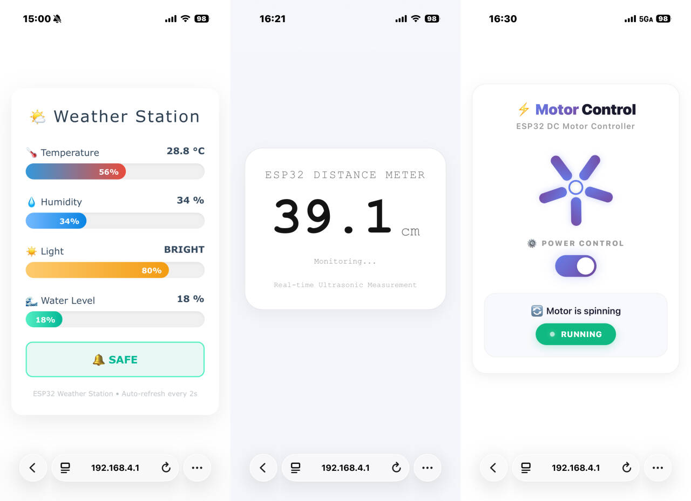
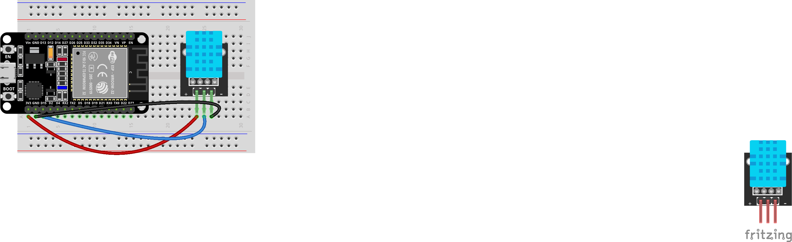
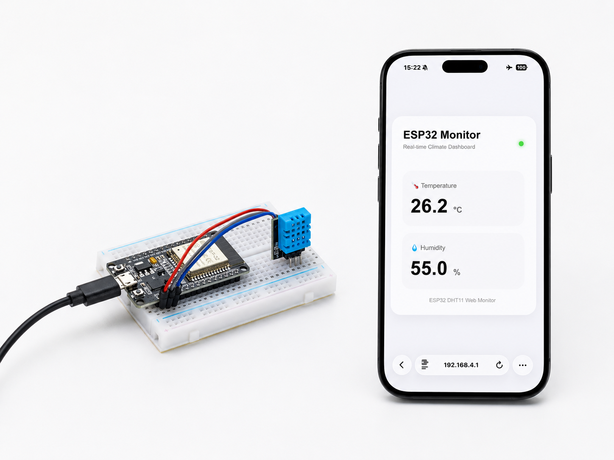
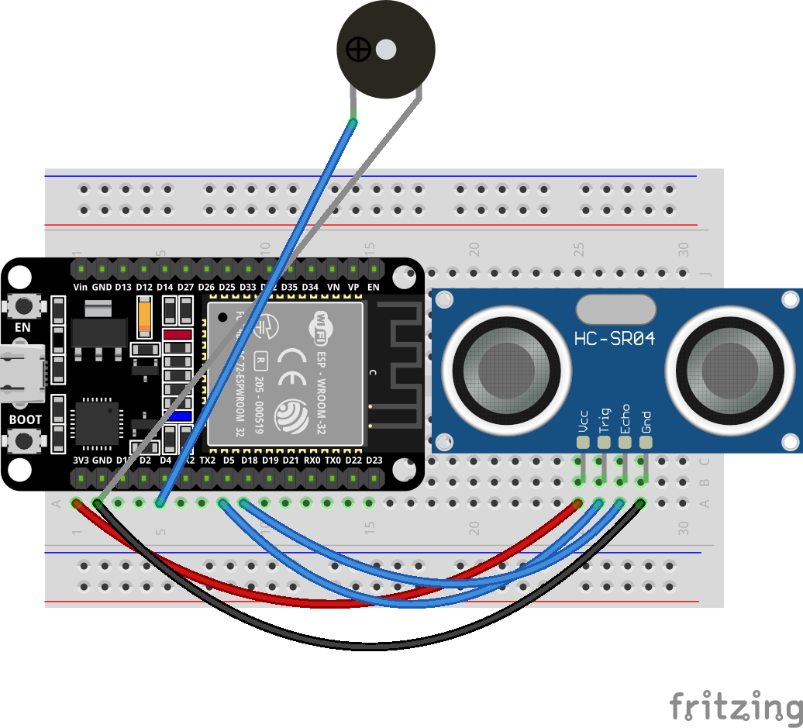
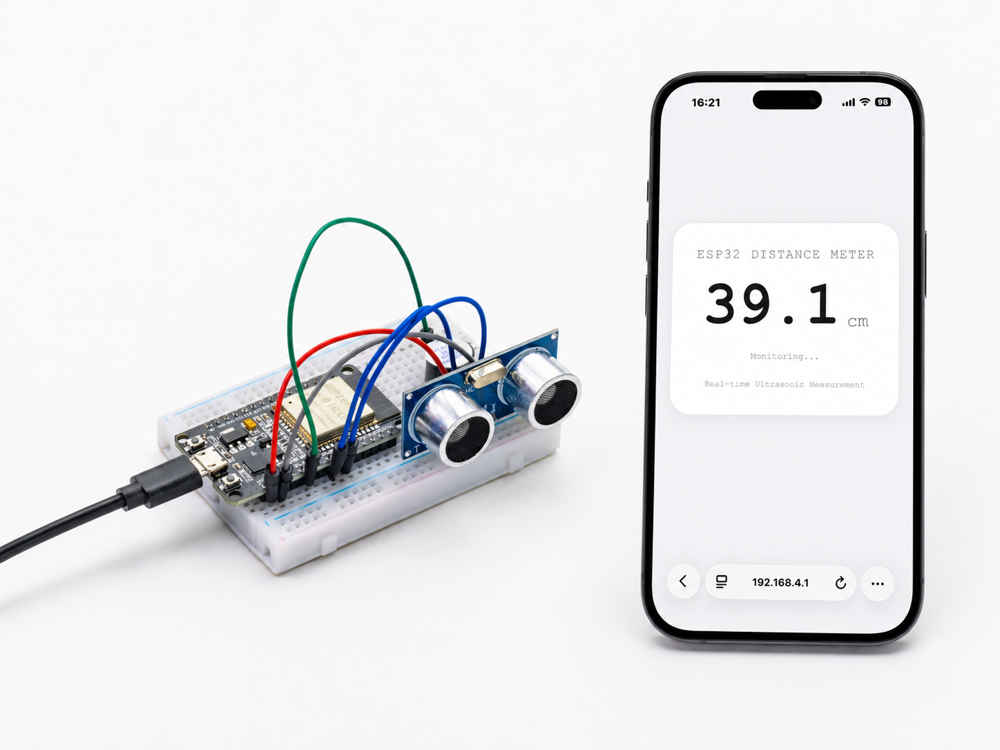

Advanced Experiments
====================

.. raw:: html

   

While foundational experiments taught you the basics of hands-on hardware interaction, this chapter introduces you to network connectivity. Centered on the Internet of Things (IoT), we will guide you in equipping your development board with Wi-Fi capabilities and implementing remote control via a web interface. Covering everything from TCP/IP fundamentals and HTTP request parsing to HTML page design and real-time status feedback, you will build a complete web-based control system—enabling your sensors and actuators to transcend physical distance and advance to a new level of smart connectivity.

----

1. TEMP And HUMI Meter
----------------------

This experiment is a core project in our introductory practical course on the Internet of Things (IoT). It aims to teach you how to set up an ESP32 as a Wi-Fi hotspot (AP mode) and build an embedded web server to display sensor data in real time on a webpage. You will master the following key skills:

 - DHT11 Temperature and Humidity Sensor Driver and Data Reading.

 - ESP32 Soft-AP Mode Configuration: Direct Device Connection Without Router.

 - WebServer Library for HTTP Server Construction and GET Request Handling.

 - JSON Data Assembly and Parsing for Front-End and Back-End Data Interaction.

 - AJAX Asynchronous Refresh Technology **(fetch + setInterval)** : Automatic Webpage Data Updates Without Manual Page Refresh.

 - Front-End UI Design: Responsive Card-Style Dashboard Adapted for Mobile and Desktop Screens.

**Materials Needed:**

 - ESP32 Development Board
 - DHT11
 - Breadboard and Jumper Wires

**Wiring Diagram:**

.. raw:: html

   

**Wiring Table**

.. list-table:: 
   :header-rows: 1
   :widths: 10 20 20 25

   * - No.
     - Component
     - Pin
     - Connect to
   * - 1
     - DHT11 Sensor
     - VCC
     - 3.3V
   * - 1
     - DHT11 Sensor
     - GND
     - GND
   * - 1
     - DHT11 Sensor
     - DATA
     - GPIO 15

**Example code:**

.. raw:: html

   

   

.. code-block:: cpp

 #include <WiFi.h>
 #include <WebServer.h>
 #include <DHT.h>
 #define DHTPIN 15
 #define DHTTYPE DHT11

 DHT dht(DHTPIN, DHTTYPE);

 const char* ap_ssid = "ESP32-DHT11";

 WebServer server(80);

 String getHTML()
 {
     String html = R"rawliteral(

 <!DOCTYPE html>
 <html lang="en">

 <head>

 <meta charset="UTF-8">

 <meta name="viewport"
 content="width=device-width, initial-scale=1.0">

 <title>ESP32 Climate Monitor</title>

 

 </head>

 <body>

 

 

 

 

 ESP32 Monitor
 

 

 Real-time Climate Dashboard
 

 

 

 

 

 

 🌡 Temperature
 

 

 --
 °C
 

 

 

 

 💧 Humidity
 

 

 --
 %
 

 

 

 ESP32 DHT11 Web Monitor
 

 

 
 </body>
 </html>

 )rawliteral";

     return html;
 }

 // Main page
 void handleRoot()
 {
     server.send(200, "text/html", getHTML());
 }

 // Sensor data API
 void handleData()
 {
     float humidity = dht.readHumidity();

     float temperature = dht.readTemperature();

     if (isnan(humidity) || isnan(temperature))
     {
         server.send(
             200,
             "application/json",
             "{\"temperature\":\"--\",\"humidity\":\"--\"}"
         );

         return;
     }

     String json = "{";

     json += "\"temperature\":\"" +
             String(temperature,1) + "\",";

     json += "\"humidity\":\"" +
             String(humidity,1) + "\"";

     json += "}";

     server.send(200, "application/json", json);
 }

 void setup()
 {
     Serial.begin(115200);

     dht.begin();

     // Start WiFi hotspot
     WiFi.softAP(ap_ssid);

     IPAddress IP = WiFi.softAPIP();

     Serial.println();
     Serial.println("ESP32 Hotspot Started");

     Serial.print("SSID: ");
     Serial.println(ap_ssid);

     Serial.print("IP Address: ");
     Serial.println(IP);

     // Web routes
     server.on("/", handleRoot);

     server.on("/data", handleData);

     // Start web server
     server.begin();

     Serial.println("Web Server Started");
 }

 void loop()
 {
     server.handleClient();
 }

.. raw:: html

   

   

     <button id="expand-btn-dht" onclick="toggleCode('code-container-dht', 'expand-btn-dht')" style="flex: 1; padding: 10px 16px; background: #2980B9; color: white; border: none; border-radius: 4px; cursor: pointer; font-weight: bold;">▼ Expand All Code</button>
   

   

   

   

.. raw:: html

   

**Display Effect:**

.. raw:: html

   

- The system will automatically create a Wi-Fi hotspot named **ESP32-DHT11**. 

- After connecting to this Wi-Fi network using your mobile phone or computer, enter the IP address **192.168.4.1** in your browser 

- To open a beautifully designed temperature and humidity monitoring panel to view real-time temperature and humidity data.

----

2. Ultrasonic Distance Meter
----------------------------

This experiment is an advanced project for IoT sensor applications, aiming to learn how to combine an ultrasonic ranging module (HC-SR04) with an ESP32 web server to build a real-time wireless ranging and monitoring system. You will master the following key skills:

- Driving principle and ranging implementation of the HC-SR04 ultrasonic sensor ( **pulseIn()** for precise echo time measurement) .

- Temperature-compensated ranging algorithm: Calculates the actual distance using the speed of sound (0.0343 cm/μs) and handles invalid data (out of range, no echo, etc.)

- Timed sampling mechanism: Uses a **millis()** non-blocking timer to collect data at fixed intervals (100ms) to maintain smooth system response

- Web server and JSON API design: Returns structured data through the /data interface, achieving complete separation of front-end and back-end

- AJAX real-time data refresh: The front-end automatically requests the latest data every 300ms, updating the page without page refresh

- Responsive UI design and visual feedback: Distance value animation, status prompts, threshold alarms (buzzer trigger + page warning for <20cm)

- Buzzer linkage control: The buzzer automatically sounds an alarm when an object gets too close, achieving a closed loop of "perception-judgment-execution".

**Materials Needed:**

 - ESP32 Development Board
 - HC-SR04 Ultrasonic Sensor
 - Active Buzzer
 - Breadboard and Jumper Wires

**Wiring Diagram:**

.. raw:: html

   

**Wiring Table**

.. list-table:: 
   :header-rows: 1
   :widths: 10 20 20 25

   * - No.
     - Component
     - Pin
     - Connect to
   * - 1
     - HC-SR04 Ultrasonic
     - VCC
     - 5V
   * - 1
     - HC-SR04 Ultrasonic
     - GND
     - GND
   * - 1
     - HC-SR04 Ultrasonic
     - TRIG
     - GPIO 5
   * - 1
     - HC-SR04 Ultrasonic
     - ECHO
     - GPIO 18
   * - 2
     - Buzzer
     - Positive (+)
     - GPIO 4
   * - 2
     - Buzzer
     - Negative (-)
     - GND

**Example code:**

.. raw:: html

   

   

.. code-block:: cpp

 #include <WiFi.h>
 #include <WebServer.h>

 // WiFi hotspot
 const char* ssid = "ESP32-Distance-Meter";

 // Ultrasonic pins
 #define TRIG_PIN 5
 #define ECHO_PIN 18

 // Buzzer pin
 #define BUZZER_PIN 4

 WebServer server(80);

 // Distance variables
 float distance_cm = 0.0;

 unsigned long lastMeasurement = 0;

 const unsigned long MEASURE_INTERVAL = 100;

 bool measurementError = false;

 // Measure distance
 float measureDistance()
 {
     digitalWrite(TRIG_PIN, LOW);
     delayMicroseconds(2);

     digitalWrite(TRIG_PIN, HIGH);
     delayMicroseconds(10);

     digitalWrite(TRIG_PIN, LOW);

     unsigned long duration =
     pulseIn(ECHO_PIN, HIGH, 30000);

     if(duration == 0)
     {
         return -1.0;
     }

     float distance =
     duration * 0.0343 / 2;

     if(distance > 400.0 || distance < 2.0)
     {
         return -1.0;
     }

     return distance;
 }

 // HTML page
 const char* htmlPage = R"rawliteral(

 <!DOCTYPE html>
 <html lang="en">

 <head>

 <meta charset="UTF-8">

 <meta name="viewport"
 content="width=device-width, initial-scale=1.0">

 <title>Distance Meter</title>

 

 </head>

 <body>

 

 

 ESP32 DISTANCE METER
 

 

 0.0

 cm

 

 

 Monitoring...
 

 

 Real-time Ultrasonic Measurement
 

 

 
 </body>
 </html>

 )rawliteral";

 // Main page
 void handleRoot()
 {
     server.send(200,
     "text/html",
     htmlPage);
 }

 // JSON API
 void handleData()
 {
     String json = "{";

     if(measurementError || distance_cm < 0)
     {
         json += "\"error\":\"Out of range\"";
         json += ",\"distance\":0";
     }
     else
     {
         json += "\"error\":null";

         json += ",\"distance\":" +
         String(distance_cm, 2);
     }

     json += "}";

     server.send(200,
     "application/json",
     json);
 }

 // 404
 void handleNotFound()
 {
     server.send(404,
     "text/plain",
     "404: Not Found");
 }

 void setup()
 {
     Serial.begin(115200);

     // Pin setup
     pinMode(TRIG_PIN, OUTPUT);

     pinMode(ECHO_PIN, INPUT);

     pinMode(BUZZER_PIN, OUTPUT);

     digitalWrite(TRIG_PIN, LOW);

     digitalWrite(BUZZER_PIN, LOW);

     // AP mode
     WiFi.mode(WIFI_AP);

     IPAddress local_ip(192,168,4,1);

     IPAddress gateway(192,168,4,1);

     IPAddress subnet(255,255,255,0);

     WiFi.softAPConfig(
         local_ip,
         gateway,
         subnet
     );

     // Start hotspot
     WiFi.softAP(ssid);

     Serial.println();
     Serial.println("ESP32 Hotspot Started");

     Serial.print("SSID: ");
     Serial.println(ssid);

     Serial.print("IP Address: ");
     Serial.println(WiFi.softAPIP());

     // Web routes
     server.on("/", handleRoot);

     server.on("/data", handleData);

     server.onNotFound(handleNotFound);

     // Start server
     server.begin();

     Serial.println("Web Server Started");
 }

 void loop()
 {
     server.handleClient();

     unsigned long currentMillis =
     millis();

     if(currentMillis - lastMeasurement
        >= MEASURE_INTERVAL)
     {
         float measuredDistance =
         measureDistance();

         if(measuredDistance > 0)
         {
             distance_cm =
             measuredDistance;

             measurementError = false;

             // Buzzer alert
             if(distance_cm < 20)
             {
                 digitalWrite(BUZZER_PIN, HIGH);
             }
             else
             {
                 digitalWrite(BUZZER_PIN, LOW);
             }
         }
         else
         {
             measurementError = true;

             digitalWrite(BUZZER_PIN, LOW);
         }

         lastMeasurement =
         currentMillis;
     }

     delay(10);
 }

.. raw:: html

   

   

     <button id="expand-btn-hcsr04" onclick="toggleCode('code-container-hcsr04', 'expand-btn-hcsr04')" style="flex: 1; padding: 10px 16px; background: #2980B9; color: white; border: none; border-radius: 4px; cursor: pointer; font-weight: bold;">▼ Expand All Code</button>
   

   

   

   

.. raw:: html

   

**Display Effect:**

.. raw:: html

   

- After flashing the program, the ESP32 will automatically create a Wi-Fi hotspot named **ESP32-Distance-Meter** .

- After connecting to this Wi-Fi network using your mobile phone or computer, enter **192.168.4.1** in your browser to open a minimalist real-time distance measurement dashboard:

- The buzzer will sound an alarm when the distance is less than 20cm, and a notification will be displayed on the page.

----

