Basic Experiments
=================

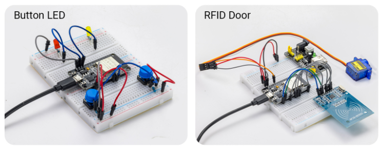

.. raw:: html

   

This introductory chapter guides you through the process of building fun, interactive devices—capable of visual, physical, and auditory responses—using a carefully selected range of common and engaging components such as LEDs, buzzers, buttons, and sensors. Through a series of hands-on experiments that progress from simple to complex, you will quickly familiarize yourself with hardware wiring, programming logic, and debugging techniques, rapidly transforming from a mere observer into a maker.

----

1. LED Blinking 
----------------

- In this experiment, you will learn how to control an LED using the ESP32 microcontroller. You will write a simple program to make the LED blink at regular intervals, introducing you to basic programming concepts and GPIO pin control.

**Materials Needed:**

 - ESP32 Development Board
 - LED
 - Resistor (220Ω)
 - Breadboard and Jumper Wires

**Wiring Diagram:**

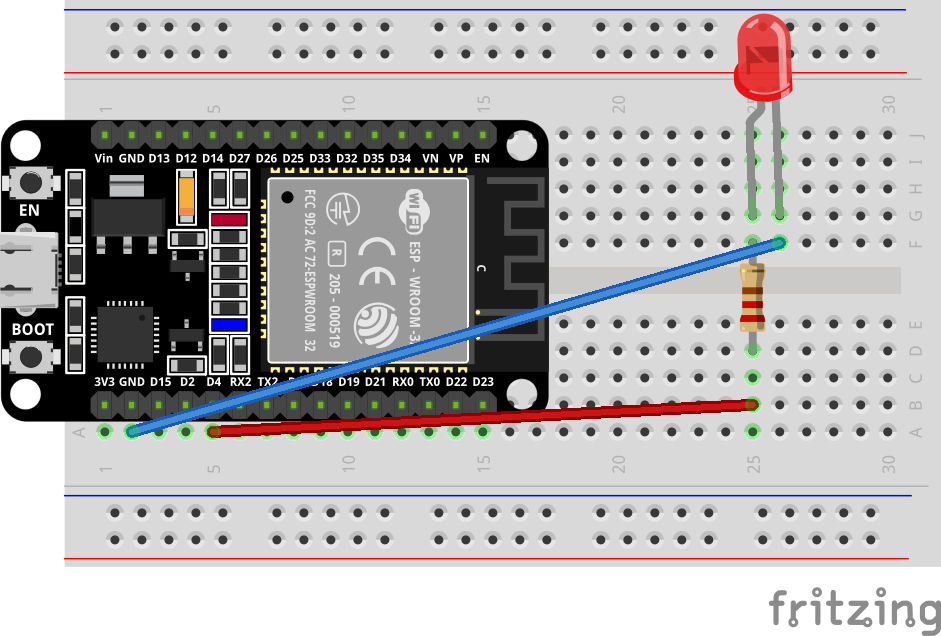

.. raw:: html

   

**Wiring Table**

.. list-table:: 
   :header-rows: 1
   :widths: 10 20 20 25 25

   * - No.
     - Component
     - Pin
     - Connect to
     - Note
   * - 1
     - LED
     - Anode (long leg)
     - GPIO 4
     - series 220Ω
   * - 1
     - LED
     - Cathode (short leg)
     - GND
     -

**Example code:**

.. code-block:: cpp

 // Define the LED connection pin
 #define LED_PIN 2

 void setup()
 {
 // Set GPIO2 to output mode
 pinMode(LED_PIN, OUTPUT);
 }

 void loop()
 {
 // Turn on the LED
 digitalWrite(LED_PIN, HIGH);

 // Delay for 1 second
 delay(1000);

 // Turn off the LED
 digitalWrite(LED_PIN, LOW);

 // Delay for 1 second
 delay(1000);
 }

**Display Effect:**

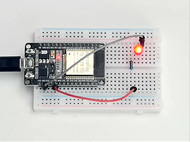

.. raw:: html

   

- The LED light will continuously turn on and off at one-second intervals—lighting up, dimming, lighting up again, dimming again—creating a ceaseless breathing or flashing rhythm.

----

2. PWM LED
----------

- This experiment is a classic introductory project on analog signal acquisition and PWM output control. It aims to teach how to combine the ESP32's ADC analog input with PWM pulse width modulation output to achieve stepless adjustment of light brightness using a physical knob.

**Materials Needed:**

 - ESP32 Development Board
 - LED
 - potentiometer 10k 
 - Breadboard and Jumper Wires

**Wiring Diagram:**

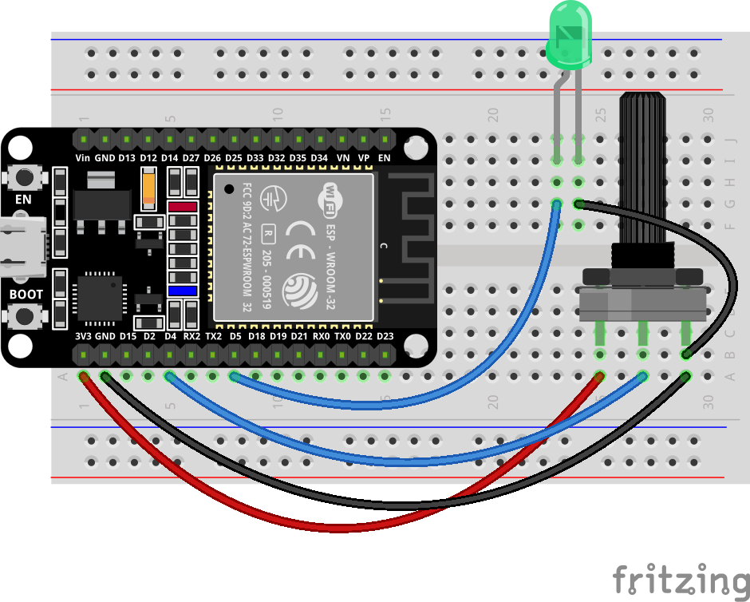

.. raw:: html

   

**Wiring Table**

.. list-table:: 
   :header-rows: 1
   :widths: 10 20 20 25

   * - No.
     - Component
     - Pin
     - Connect to
   * - 1
     - Potentiometer
     - Right
     - GND
   * - 1
     - Potentiometer
     - Middle (Wiper)
     - GPIO 4
   * - 1
     - Potentiometer
     - Left
     - 3.3V
   * - 2
     - LED
     - Anode (long leg)
     - GPIO 5
   * - 2
     - LED
     - Cathode (short leg)
     - GND

**Example code:**

.. code-block:: cpp

 // Potentiometer is connected to GPIO 4 (Analog ADC2_CH0)
 const int potPin = 4;
 // LED is connected to GPIO 5 (PWM capable)
 const int ledPin = 5;

 // variable for storing the potentiometer value
 int potValue = 0;
 // variable for storing the LED brightness
 int brightness = 0;

 void setup() {
   Serial.begin(115200);
   // Set LED pin as output
   pinMode(ledPin, OUTPUT);
   delay(1000);
 }

 void loop() {
   // Reading potentiometer value (0 - 4095 for ESP32 ADC)
   potValue = analogRead(potPin);
   
   // Map potentiometer value to LED brightness range (0 - 255)
   // PWM uses 8-bit resolution (0 = off, 255 = fully on)
   brightness = map(potValue, 0, 4095, 0, 255);
   
   // Set LED brightness via PWM
   analogWrite(ledPin, brightness);
   
   // Print both values to serial monitor
   Serial.print("Potentiometer: ");
   Serial.print(potValue);
   Serial.print(" -> LED Brightness: ");
   Serial.println(brightness);
   
   delay(50);  // Small delay for stable reading
 }

**Display Effect:**

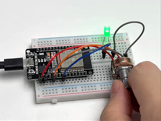

.. raw:: html

   

- Rotating the potentiometer clockwise gradually brightens the LED until it reaches its brightest point.

- Rotating the potentiometer counter-clockwise gradually dims the LED until it goes completely off.

----

3. Button LED
-------------

- This experiment aims to teach two core programming techniques: key debouncing and state toggling. Two independent keys will control the on/off state of red and yellow LEDs respectively. 

- You will learn how to use **`digitalRead()`** to capture the rising edge trigger of a key **(i.e., the instant it's pressed)** , and how to implement the logic of "state toggling once per press" using a state flag **(bool variable)** . 

- Simultaneously, simple software delay debouncing is incorporated into the code, allowing you to understand the signal jitter problem caused by mechanical keys at the instant they are pressed and its solution.

**Materials Needed:**

 - ESP32 Development Board
 - Button (2 PCS)
 - LED (Yellow、Red)
 - Resistor (220Ω)
 - Breadboard and Jumper Wires

**Wiring Diagram:**

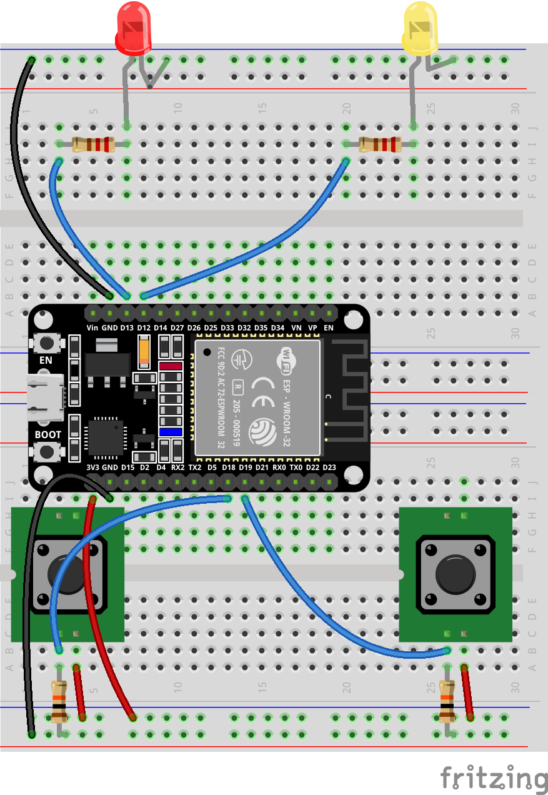

.. raw:: html

   

**Wiring Table**

.. list-table:: 
   :header-rows: 1
   :widths: 10 20 20 25 25

   * - No.
     - Component
     - Pin
     - Connect to
     - Note
   * - 1
     - Red LED
     - Anode (long leg)
     - GPIO 13
     - series 220Ω
   * - 1
     - Red LED
     - Cathode (short leg)
     - GND
     -
   * - 2
     - Yellow LED
     - Anode (long leg)
     - GPIO 12
     - series 220Ω
   * - 2
     - Yellow LED
     - Cathode (short leg)
     - GND
     -
   * - 3
     - Button 1
     - Either pin
     - 3.3V
     -
   * - 3
     - Button 1
     - Other pin
     - GPIO 18
     - with 10kΩ to GND
   * - 4
     - Button 2
     - Either pin
     - 3.3V
     -
   * - 4
     - Button 2
     - Other pin
     - GPIO 19
     - with 10kΩ to GND

**Example code:**

.. raw:: html

   

   

.. code-block:: cpp

 // LED pins
 #define RED_LED     13
 #define YELLOW_LED  12

 // Button pins
 #define BUTTON1     18
 #define BUTTON2     19

 // LED state variables
 bool redState = false;
 bool yellowState = false;

 // Save previous button states
 bool lastButton1 = LOW;
 bool lastButton2 = LOW;

 void setup()
 {
    pinMode(RED_LED, OUTPUT);
    pinMode(YELLOW_LED, OUTPUT);
    pinMode(BUTTON1, INPUT);
    pinMode(BUTTON2, INPUT);
 }

 void loop()
 {
    // Read current button states
    bool currentButton1 = digitalRead(BUTTON1);
    bool currentButton2 = digitalRead(BUTTON2);

    // ===== Button 1: Control red LED =====
    // Detect rising edge (LOW to HIGH: button pressed)
    if (lastButton1 == LOW && currentButton1 == HIGH)
    {
        redState = !redState;
        digitalWrite(RED_LED, redState);
        delay(200);  // Simple debounce
    }

    // ===== Button 2: Control yellow LED =====
    if (lastButton2 == LOW && currentButton2 == HIGH)
    {
        yellowState = !yellowState;
        digitalWrite(YELLOW_LED, yellowState);
        delay(200);  // Simple debounce
    }

    // Save current states
    lastButton1 = currentButton1;
    lastButton2 = currentButton2;
 }

.. raw:: html

   

   

     <button id="expand-btn-dht" onclick="toggleCode('code-container-dht', 'expand-btn-dht')" style="flex: 1; padding: 10px 16px; background: #2980B9; color: white; border: none; border-radius: 4px; cursor: pointer; font-weight: bold;">▼ Expand All Code</button>
   

   

   

   

.. raw:: html

   

**Display Effect:**

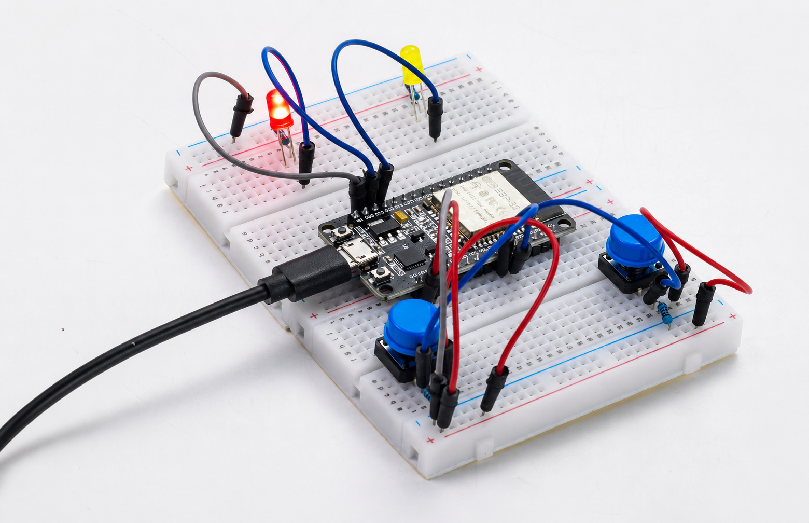

.. raw:: html

   

- Pressing button 1 (GPIO18): The red LED's state toggles—it turns on if currently off, and off if currently on, toggling each time it's pressed.

- Pressing button 2 (GPIO19): The yellow LED follows the same toggling logic, without interfering with each other.

----

4. TEMP And HUMI Detection
--------------------------

This experiment is an introductory project on digital sensor driving and data acquisition, aiming to teach how to use ESP32 to read DHT11 temperature and humidity sensors and view environmental data in real time through a serial monitor.

**Materials Needed:**

 - ESP32 Development Board
 - DHT11 Sensor
 - Breadboard and Jumper Wires

**Wiring Diagram:**

.. image:: _static/project/IOT/1.DHT11.png
   :width: 700
   :align: center

.. raw:: html

   

**Wiring Table**

.. list-table:: 
   :header-rows: 1
   :widths: 10 20 20 25

   * - No.
     - Component
     - Pin
     - Connect to
   * - 1
     - DHT11 Sensor
     - VCC
     - 3.3V
   * - 1
     - DHT11 Sensor
     - GND
     - GND
   * - 1
     - DHT11 Sensor
     - DATA
     - GPIO 15

**Example code:**

.. raw:: html

   

   

.. code-block:: cpp

 #include <DHT.h>

 #define DHTPIN 15      // GPIO pin
 #define DHTTYPE DHT11  // Sensor type

 DHT dht(DHTPIN, DHTTYPE);

 void setup() {
   Serial.begin(115200);
   dht.begin();
   Serial.println("DHT11 Temperature & Humidity Sensor Started");
 }

 void loop() {
   delay(2000);  // Read every 2 seconds
   
   float humidity = dht.readHumidity();
   float temperature = dht.readTemperature();  // Celsius
   
   // Check if reading is successful
   if (isnan(humidity) || isnan(temperature)) {
     Serial.println("Sensor read failed!");
     return;
   }
   
   // Serial output
   Serial.println("====================");
   Serial.print("Temperature: ");
   Serial.print(temperature);
   Serial.println(" °C");
   
   Serial.print("Humidity: ");
   Serial.print(humidity);
   Serial.println(" %");
   Serial.println("====================");
 }

.. raw:: html

   

   

     <button id="expand-btn-dht" onclick="toggleCode('code-container-dht', 'expand-btn-dht')" style="flex: 1; padding: 10px 16px; background: #2980B9; color: white; border: none; border-radius: 4px; cursor: pointer; font-weight: bold;">▼ Expand All Code</button>
   

   

   

   

.. raw:: html

   

**Display Effect:**

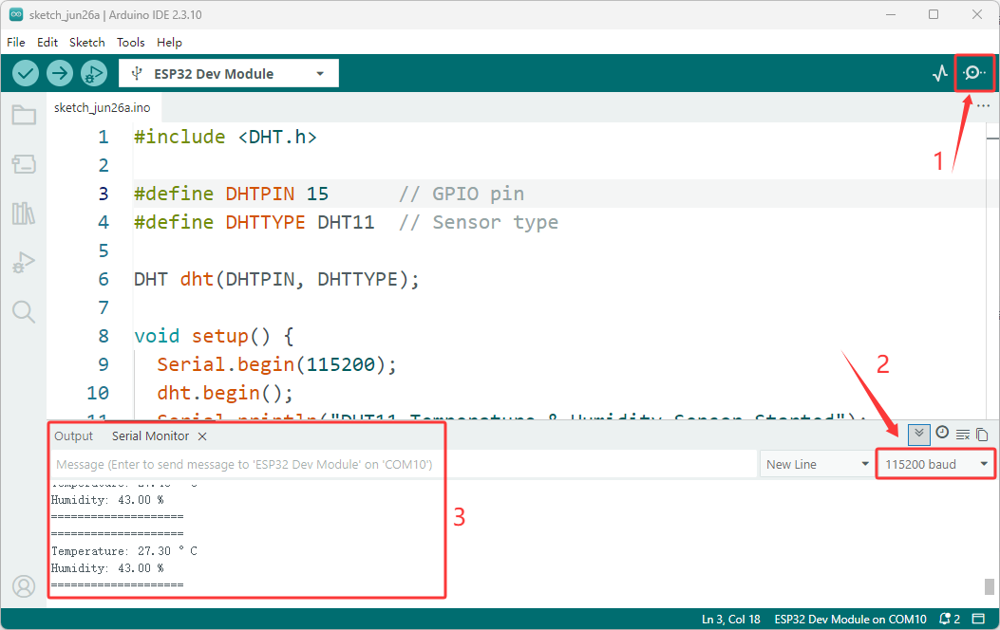

.. raw:: html

   

- After programming, open the serial monitor **(baud rate 115200)**. The system will automatically collect the current ambient temperature and humidity data every 2 seconds and print it out in a clear, separated format. 

- If the sensor connection is normal and the reading is successful, the current temperature and humidity values ​​will be displayed.

----

5. Scan RFID
-------------

This experiment is an introductory project to RFID (Radio Frequency Identification) technology, aiming to teach you how to use the ESP32 and RC522 modules to read the unique identifier (UID) of RFID cards/tags. You will master the following core skills:

- SPI Communication Protocol: Implement high-speed serial communication between the ESP32 and RC522 modules using the SPI.h library, and understand the collaborative operation of the SCK, MOSI, MISO, and SS pins.

- MFRC522 Library Usage: Master the driving methods of RFID reader chips, including the complete process of initialization, card search, card reading, and sleep mode.

- UID Data Parsing: Read the 4-byte (or 7-byte) unique identifier of the card and output it in hexadecimal format.

**Materials Needed:**

 - ESP32 Development Board
 - DHT11 Sensor
 - Breadboard and Jumper Wires

**Wiring Diagram:**

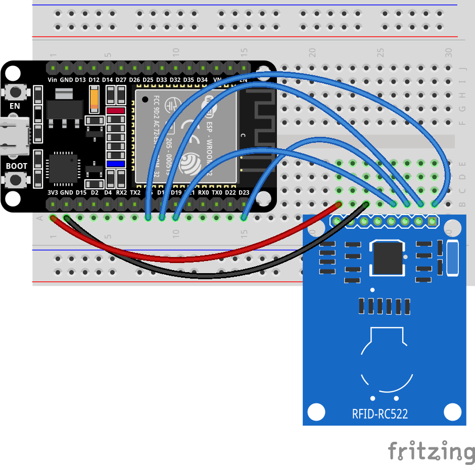

.. raw:: html

   

**Wiring Table**

.. list-table:: 
   :header-rows: 1
   :widths: 10 20 20 25

   * - No.
     - Component
     - Pin
     - Connect to
   * - 1
     - RC522 RFID Module
     - VCC
     - 3.3V
   * - 1
     - RC522 RFID Module
     - GND
     - GND
   * - 1
     - RC522 RFID Module
     - RST
     - GPIO 4
   * - 1
     - RC522 RFID Module
     - MISO
     - GPIO 19
   * - 1
     - RC522 RFID Module
     - MOSI
     - GPIO 23
   * - 1
     - RC522 RFID Module
     - SCK
     - GPIO 18
   * - 1
     - RC522 RFID Module
     - SDA (SS)
     - GPIO 5

**Example code:**

.. raw:: html

   

   

.. code-block:: cpp

 /*
  * ESP32 RC522 RFID Module Test Program
  * 
  * Wiring:
  * - RC522 VCC  -> ESP32 3.3V
  * - RC522 GND  -> ESP32 GND
  * - RC522 RST  -> GPIO 4
  * - RC522 MISO -> GPIO 19
  * - RC522 MOSI -> GPIO 23
  * - RC522 SCK  -> GPIO 18
  * - RC522 SDA  -> GPIO 5
  * 
  * Function:
  * - Scan RFID cards/tags and output UID to Serial Monitor
  */

 #include <SPI.h>
 #include <MFRC522.h>

 // ==================== Pin Definitions ====================
 #define SS_PIN   5   // SDA (SS) pin
 #define RST_PIN  4   // Reset pin

 // ==================== Create Instance ====================
 MFRC522 rfid(SS_PIN, RST_PIN);

 // ==================== Setup ====================
 void setup() {
   // Initialize Serial communication
   Serial.begin(115200);
   Serial.println("=================================");
   Serial.println("ESP32 RC522 RFID Test Program");
   Serial.println("=================================");
   
   // Initialize SPI bus
   SPI.begin();
   
   // Initialize RC522 module
   rfid.PCD_Init();
   
   // Optional: Adjust antenna gain for better range
   // rfid.PCD_SetAntennaGain(rfid.RxGain_max);
   
   Serial.println("RFID reader initialized.");
   Serial.println("Place an RFID card/tag near the reader...");
   Serial.println("=================================");
 }

 // ==================== Main Loop ====================
 void loop() {
   // Check if a new card is present
   if (!rfid.PICC_IsNewCardPresent()) {
     return;
   }
   
   // Check if the card's UID can be read
   if (!rfid.PICC_ReadCardSerial()) {
     return;
   }
   
   // Card detected! Output UID
   Serial.print("Card detected! UID: ");
   
   // Print each byte of the UID in hexadecimal format
   for (byte i = 0; i < rfid.uid.size; i++) {
     // Print with leading zero for single-digit hex values
     if (rfid.uid.uidByte[i] < 0x10) {
       Serial.print("0");
     }
     Serial.print(rfid.uid.uidByte[i], HEX);
     Serial.print(" ");
   }
   Serial.println();
   
   rfid.PICC_HaltA();
   
   // Stop encryption (not needed for basic reading)
   rfid.PCD_StopCrypto1();
 }

.. raw:: html

   

   

     <button id="expand-btn-dht" onclick="toggleCode('code-container-dht', 'expand-btn-dht')" style="flex: 1; padding: 10px 16px; background: #2980B9; color: white; border: none; border-radius: 4px; cursor: pointer; font-weight: bold;">▼ Expand All Code</button>
   

   

   

   

.. raw:: html

   

**Display Effect:**

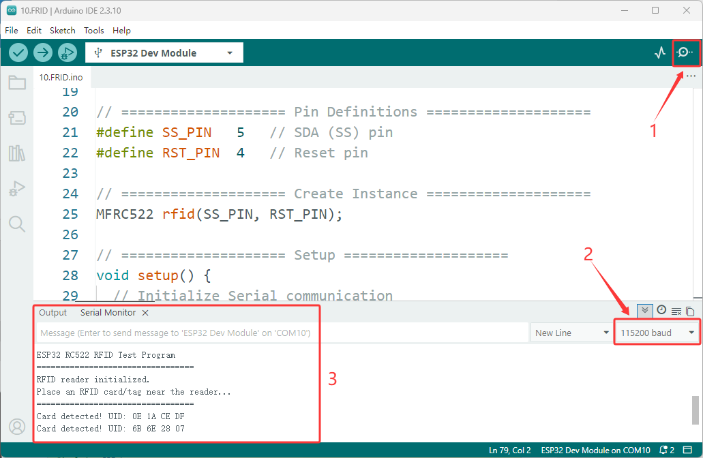

.. raw:: html

   

- After programming and correctly connecting the RC522 module, open the serial monitor **(baud rate 115200)**. The system will display a successful initialization message and wait for a card to approach.

- When any RFID card or tag approaches the reader, the serial port will immediately output the card's unique UID (hexadecimal format). After the card is removed, the system continues to wait for the next card to arrive, achieving continuous scanning and identification.

----

6. Tilt alarm
--------------

This experiment is a practical project applying embedded state machines. It aims to teach you how to detect device displacement using a tilt switch (ball switch) and build a complete security alarm system. You will master the following core skills:

**Materials Needed:**

 - ESP32 Development Board
 - Tilt switch
 - Button (1 PCS) 
 - Active Buzzer
 - LED
 - Breadboard and Jumper Wires

**Wiring Diagram:**

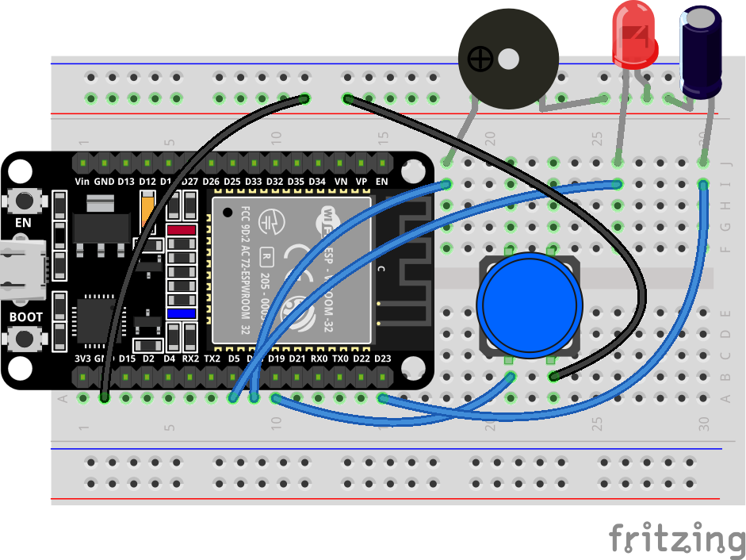

.. raw:: html

   

**Wiring Table**

.. list-table:: 
   :header-rows: 1
   :widths: 10 20 20 25

   * - No.
     - Component
     - Pin
     - Connect to
   * - 1
     - Tilt Switch
     - One pin
     - GPIO 23
   * - 1
     - Tilt Switch
     - Other pin
     - GND
   * - 2
     - LED
     - Anode (long leg)
     - GPIO 5
   * - 2
     - LED
     - Cathode (short leg)
     - GND
   * - 3
     - Active Buzzer
     - Positive (+)
     - GPIO 18
   * - 3
     - Active Buzzer
     - Negative (-)
     - GND
   * - 4
     - Reset Button
     - One pin
     - GPIO 19
   * - 4
     - Reset Button
     - Other pin
     - GND

**Example code:**

.. raw:: html

   

   

.. code-block:: cpp

 // Pin definitions
 const int tiltPin = 23;      // Tilt switch (LOW when tilted)
 const int ledPin = 5;        // LED indicator
 const int buzzerPin = 18;    // Active buzzer
 const int resetPin = 19;     // Reset button

 // State variables
 bool isArmed = false;
 bool alarmTriggered = false;
 unsigned long armStartTime = 0;
 unsigned long alarmStartTime = 0;
 int lastTiltState = HIGH;

 // Timing constants
 const int ARM_DELAY = 5000;           // 5 seconds arming delay
 const int TILT_DEBOUNCE = 50;         // Debounce time for tilt switch
 const int LED_BLINK_INTERVAL = 200;   // LED blink interval when alarm triggered

 void setup() {
   Serial.begin(115200);
   
   pinMode(tiltPin, INPUT_PULLUP);
   pinMode(resetPin, INPUT_PULLUP);
   pinMode(ledPin, OUTPUT);
   pinMode(buzzerPin, OUTPUT);
   
   digitalWrite(ledPin, LOW);
   digitalWrite(buzzerPin, LOW);
   
   startArming();
   
   Serial.println("=== Simple Burglar Alarm Started ===");
   Serial.println("Arming in 5 seconds. Please place the device properly!");
 }

 void loop() {
   // Check reset button anytime
   if (digitalRead(resetPin) == LOW) {
     resetAlarm();
     delay(300);
   }
   
   // If alarm is triggered, handle it first
   if (alarmTriggered) {
     handleAlarm();
     return;
   }
   
   // Handle arming countdown
   if (!isArmed && !alarmTriggered && (armStartTime > 0)) {
     handleArmingCountdown();
     return;
   }
   
   // When armed, monitor the tilt switch
   if (isArmed && !alarmTriggered) {
     checkTiltAndTrigger();
   }
 }

 // Start the arming sequence
 void startArming() {
   isArmed = false;
   alarmTriggered = false;
   armStartTime = millis();
   digitalWrite(ledPin, LOW);
   digitalWrite(buzzerPin, LOW);
 }

 // Handle the 5-second countdown before arming
 void handleArmingCountdown() {
   unsigned long elapsed = millis() - armStartTime;
   
   if (elapsed >= ARM_DELAY) {
     // Countdown finished, system armed
     isArmed = true;
     digitalWrite(ledPin, LOW);
     Serial.println(">>> System Armed <<<");
     Serial.println("Do not move the device!");
   } else {
     // Blink LED during countdown
     if ((elapsed / 250) % 2 == 0) {
       digitalWrite(ledPin, HIGH);
     } else {
       digitalWrite(ledPin, LOW);
     }
     
     // Print remaining time every second
     static int lastPrintedSecond = -1;
     int remaining = (ARM_DELAY - elapsed) / 1000 + 1;
     int currentSecond = remaining;
     if (currentSecond != lastPrintedSecond) {
       Serial.print("Arming countdown: ");
       Serial.print(currentSecond);
       Serial.println(" seconds");
       lastPrintedSecond = currentSecond;
     }
   }
 }

 // Check tilt switch state change with debouncing
 void checkTiltAndTrigger() {
   int currentState = digitalRead(tiltPin);
   
   if (currentState != lastTiltState) {
     delay(TILT_DEBOUNCE);
     currentState = digitalRead(tiltPin);
     
     if (currentState != lastTiltState) {
       // State changed: LOW means tilted/moved
       if (currentState == LOW) {
         Serial.println("*** Movement detected! Triggering alarm! ***");
         triggerAlarm();
       }
       lastTiltState = currentState;
     }
   }
 }

 // Trigger the alarm
 void triggerAlarm() {
   alarmTriggered = true;
   isArmed = false;
   alarmStartTime = millis();
   
   Serial.print("Alarm triggered at: ");
   Serial.print(millis() / 1000);
   Serial.println(" seconds");
 }

 // Handle alarm actions: LED blinking and buzzer sounding
 void handleAlarm() {
   unsigned long now = millis();
   
   // Rapid LED blinking
   if ((now / LED_BLINK_INTERVAL) % 2 == 0) {
     digitalWrite(ledPin, HIGH);
   } else {
     digitalWrite(ledPin, LOW);
   }
   
   // Continuous buzzer sound
   digitalWrite(buzzerPin, HIGH);
 }

 // Reset the alarm and re-arm the system
 void resetAlarm() {
   if (alarmTriggered) {
     Serial.println(">>> Alarm Reset <<<");
     digitalWrite(buzzerPin, LOW);
     digitalWrite(ledPin, LOW);
   }
   
   Serial.println("Re-arming...");
   startArming();
 }

.. raw:: html

   

   

     <button id="expand-btn-dht" onclick="toggleCode('code-container-dht', 'expand-btn-dht')" style="flex: 1; padding: 10px 16px; background: #2980B9; color: white; border: none; border-radius: 4px; cursor: pointer; font-weight: bold;">▼ Expand All Code</button>
   

   

   

   

.. raw:: html

   

**Display Effect:**

.. raw:: html

   

- After the program is burned, the system automatically enters a 5-second arming countdown, during which the LED flashes rapidly. After the countdown ends, the system enters an alert state, the LED turns off, and the device remains stationary.

- If the device tilts or moves, an alarm is immediately triggered. The LED flashes rapidly, the buzzer sounds continuously, and the alarm time is output via the serial port. Pressing the reset button clears the alarm, and the system re-enters the 5-second arming countdown.

----
