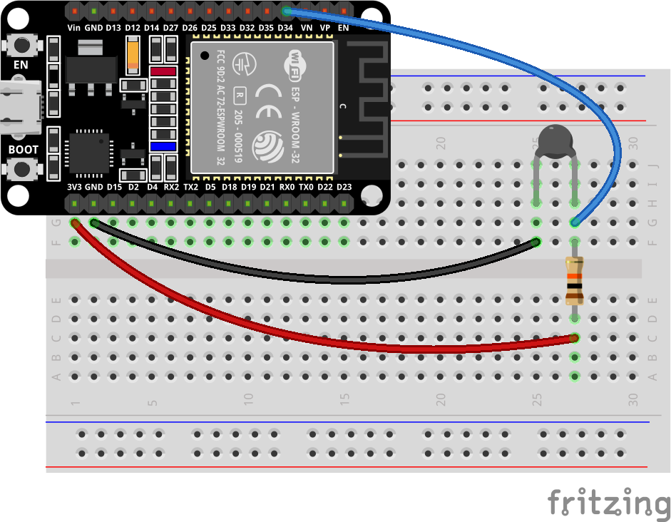
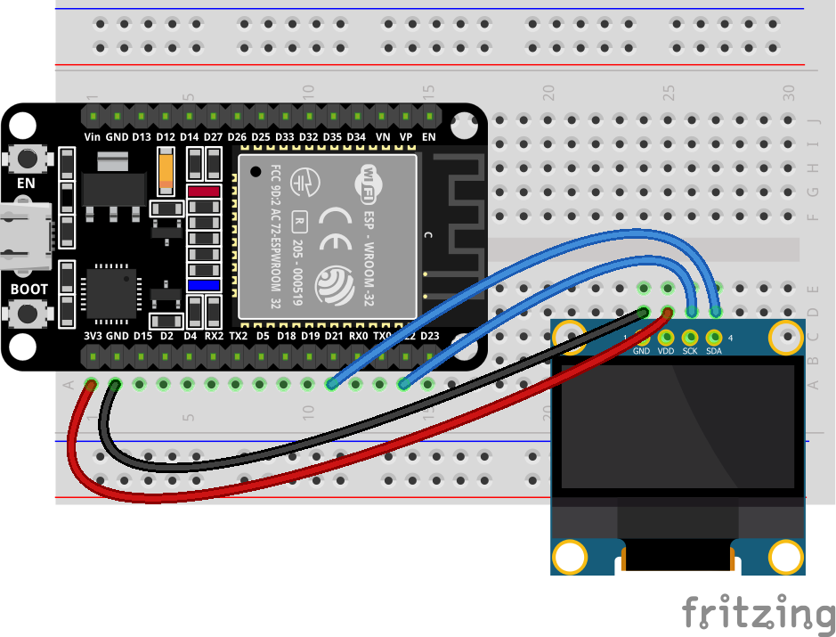
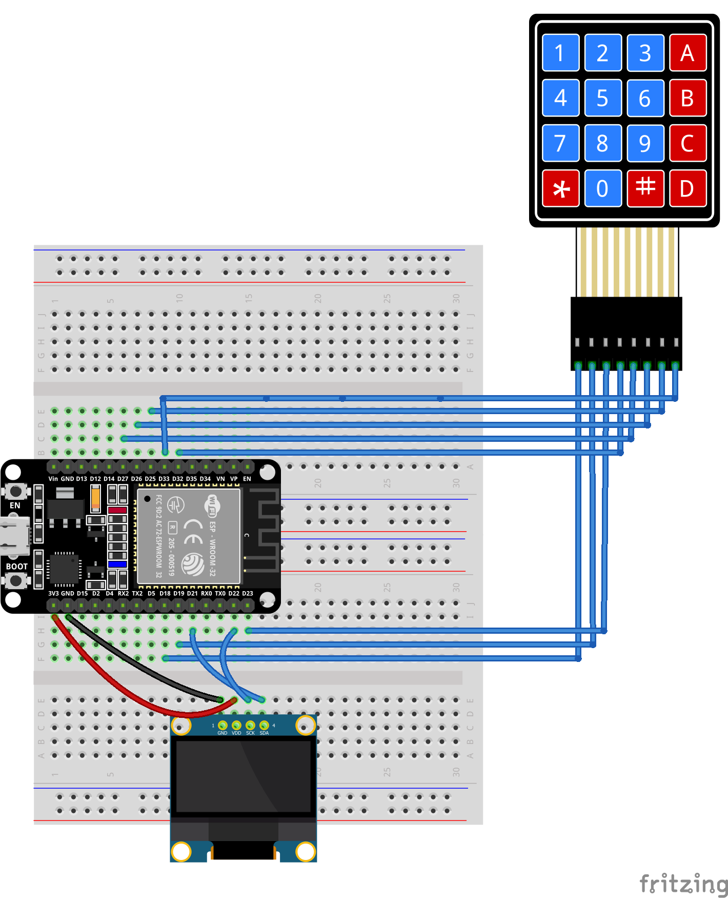
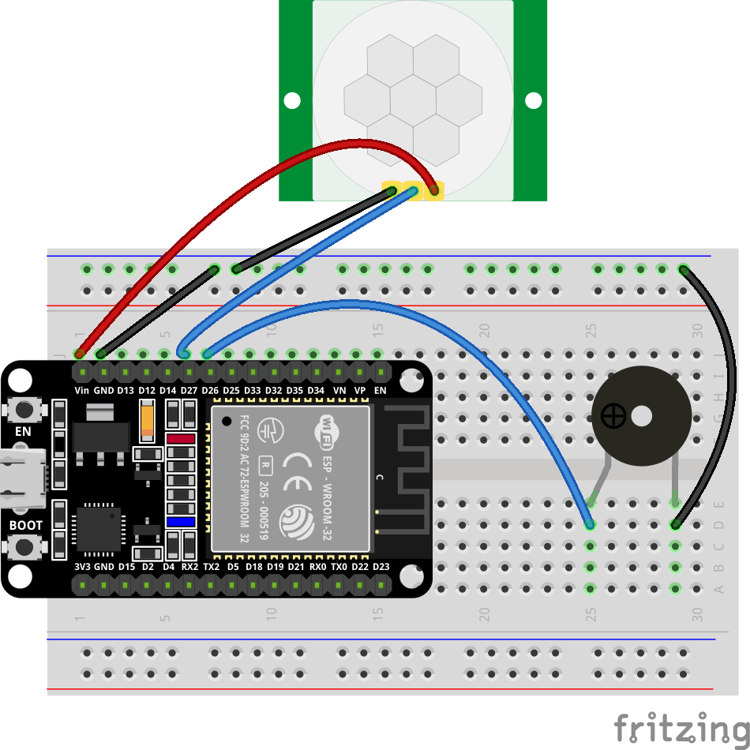
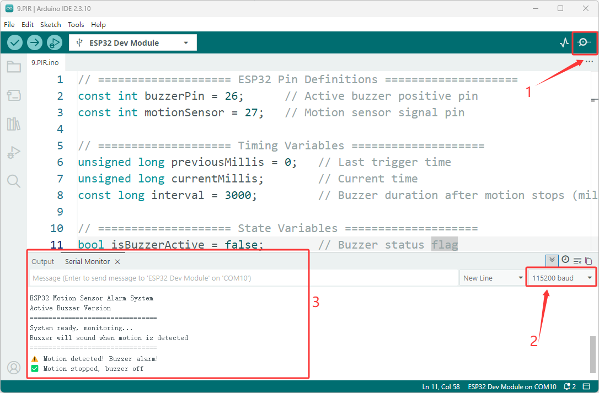

Basic Experiments
=================

.. image:: _static/project/BASIC/0.basic.png
   :width: 800
   :align: center

.. raw:: html

   

This introductory chapter guides you through the process of building fun, interactive devices—capable of visual, physical, and auditory responses—using a carefully selected range of common and engaging components such as LEDs, buzzers, buttons, and sensors. Through a series of hands-on experiments that progress from simple to complex, you will quickly familiarize yourself with hardware wiring, programming logic, and debugging techniques, rapidly transforming from a mere observer into a maker.

----

1. LED Blinking 
----------------

- In this experiment, you will learn how to control an LED using the ESP32 microcontroller. You will write a simple program to make the LED blink at regular intervals, introducing you to basic programming concepts and GPIO pin control.

**Materials Needed:**

 - ESP32 Development Board
 - LED
 - Resistor (220Ω)
 - Breadboard and Jumper Wires

**Wiring Diagram:**

.. image:: _static/project/BASIC/1.BLINK_LED.png
   :width: 700
   :align: center

.. raw:: html

   

**Wiring Table**

.. list-table:: 
   :header-rows: 1
   :widths: 10 20 20 25 25

   * - No.
     - Component
     - Pin
     - Connect to
     - Note
   * - 1
     - LED
     - Anode (long leg)
     - GPIO 4
     - series 220Ω
   * - 1
     - LED
     - Cathode (short leg)
     - GND
     -

**Example code:**

.. code-block:: cpp

 // Define the LED connection pin
 #define LED_PIN 2

 void setup()
 {
 // Set GPIO2 to output mode
 pinMode(LED_PIN, OUTPUT);
 }

 void loop()
 {
 // Turn on the LED
 digitalWrite(LED_PIN, HIGH);

 // Delay for 1 second
 delay(1000);

 // Turn off the LED
 digitalWrite(LED_PIN, LOW);

 // Delay for 1 second
 delay(1000);
 }

**Display Effect:**

.. image:: _static/project/BASIC/1.blinking.gif
   :width: 500
   :align: center

.. raw:: html

   

- The LED light will continuously turn on and off at one-second intervals—lighting up, dimming, lighting up again, dimming again—creating a ceaseless breathing or flashing rhythm.

----

2. PWM LED
----------

- This experiment is a classic introductory project on analog signal acquisition and PWM output control. It aims to teach how to combine the ESP32's ADC analog input with PWM pulse width modulation output to achieve stepless adjustment of light brightness using a physical knob.

**Materials Needed:**

 - ESP32 Development Board
 - LED
 - Potentiometer 10k 
 - Breadboard and Jumper Wires

**Wiring Diagram:**

.. image:: _static/project/BASIC/3.PWM_LED.png
   :width: 700
   :align: center

.. raw:: html

   

**Wiring Table**

.. list-table:: 
   :header-rows: 1
   :widths: 10 20 20 25

   * - No.
     - Component
     - Pin
     - Connect to
   * - 1
     - Potentiometer
     - Right
     - GND
   * - 1
     - Potentiometer
     - Middle (Wiper)
     - GPIO 4
   * - 1
     - Potentiometer
     - Left
     - 3.3V
   * - 2
     - LED
     - Anode (long leg)
     - GPIO 5
   * - 2
     - LED
     - Cathode (short leg)
     - GND

**Example code:**

.. code-block:: cpp

 // Potentiometer is connected to GPIO 4 (Analog ADC2_CH0)
 const int potPin = 4;
 // LED is connected to GPIO 5 (PWM capable)
 const int ledPin = 5;

 // variable for storing the potentiometer value
 int potValue = 0;
 // variable for storing the LED brightness
 int brightness = 0;

 void setup() {
   Serial.begin(115200);
   // Set LED pin as output
   pinMode(ledPin, OUTPUT);
   delay(1000);
 }

 void loop() {
   // Reading potentiometer value (0 - 4095 for ESP32 ADC)
   potValue = analogRead(potPin);
   
   // Map potentiometer value to LED brightness range (0 - 255)
   // PWM uses 8-bit resolution (0 = off, 255 = fully on)
   brightness = map(potValue, 0, 4095, 0, 255);
   
   // Set LED brightness via PWM
   analogWrite(ledPin, brightness);
   
   // Print both values to serial monitor
   Serial.print("Potentiometer: ");
   Serial.print(potValue);
   Serial.print(" -> LED Brightness: ");
   Serial.println(brightness);
   
   delay(50);  // Small delay for stable reading
 }

**Display Effect:**

.. image:: _static/project/BASIC/3.PWM_LED.gif
   :width: 500
   :align: center

.. raw:: html

   

- Rotating the potentiometer clockwise gradually brightens the LED until it reaches its brightest point.

- Rotating the potentiometer counter-clockwise gradually dims the LED until it goes completely off.

----

3. Button LED
-------------

- This experiment aims to teach two core programming techniques: key debouncing and state toggling. Two independent keys will control the on/off state of red and yellow LEDs respectively. 

- You will learn how to use **`digitalRead()`** to capture the rising edge trigger of a key **(i.e., the instant it's pressed)** , and how to implement the logic of "state toggling once per press" using a state flag **(bool variable)** . 

- Simultaneously, simple software delay debouncing is incorporated into the code, allowing you to understand the signal jitter problem caused by mechanical keys at the instant they are pressed and its solution.

**Materials Needed:**

 - ESP32 Development Board
 - Button (2 PCS)
 - LED (Yellow、Red)
 - Resistor (220Ω、10KΩ)
 - Breadboard and Jumper Wires

**Wiring Diagram:**

.. image:: _static/project/BASIC/2.buttonled.png
   :width: 500
   :align: center

.. raw:: html

   

**Wiring Table**

.. list-table:: 
   :header-rows: 1
   :widths: 10 20 20 25 25

   * - No.
     - Component
     - Pin
     - Connect to
     - Note
   * - 1
     - Red LED
     - Anode (long leg)
     - GPIO 13
     - series 220Ω
   * - 1
     - Red LED
     - Cathode (short leg)
     - GND
     -
   * - 2
     - Yellow LED
     - Anode (long leg)
     - GPIO 12
     - series 220Ω
   * - 2
     - Yellow LED
     - Cathode (short leg)
     - GND
     -
   * - 3
     - Button 1
     - Either pin
     - 3.3V
     -
   * - 3
     - Button 1
     - Other pin
     - GPIO 18
     - with 10kΩ to GND
   * - 4
     - Button 2
     - Either pin
     - 3.3V
     -
   * - 4
     - Button 2
     - Other pin
     - GPIO 19
     - with 10kΩ to GND

**Example code:**

.. raw:: html

   

   

.. code-block:: cpp

 // LED pins
 #define RED_LED     13
 #define YELLOW_LED  12

 // Button pins
 #define BUTTON1     18
 #define BUTTON2     19

 // LED state variables
 bool redState = false;
 bool yellowState = false;

 // Save previous button states
 bool lastButton1 = LOW;
 bool lastButton2 = LOW;

 void setup()
 {
    pinMode(RED_LED, OUTPUT);
    pinMode(YELLOW_LED, OUTPUT);
    pinMode(BUTTON1, INPUT);
    pinMode(BUTTON2, INPUT);
 }

 void loop()
 {
    // Read current button states
    bool currentButton1 = digitalRead(BUTTON1);
    bool currentButton2 = digitalRead(BUTTON2);

    // ===== Button 1: Control red LED =====
    // Detect rising edge (LOW to HIGH: button pressed)
    if (lastButton1 == LOW && currentButton1 == HIGH)
    {
        redState = !redState;
        digitalWrite(RED_LED, redState);
        delay(200);  // Simple debounce
    }

    // ===== Button 2: Control yellow LED =====
    if (lastButton2 == LOW && currentButton2 == HIGH)
    {
        yellowState = !yellowState;
        digitalWrite(YELLOW_LED, yellowState);
        delay(200);  // Simple debounce
    }

    // Save current states
    lastButton1 = currentButton1;
    lastButton2 = currentButton2;
 }

.. raw:: html

   

   

     <button id="expand-btn-dht" onclick="toggleCode('code-container-dht', 'expand-btn-dht')" style="flex: 1; padding: 10px 16px; background: #2980B9; color: white; border: none; border-radius: 4px; cursor: pointer; font-weight: bold;">▼ Expand All Code</button>
   

   

   

   

.. raw:: html

   

**Display Effect:**

.. image:: _static/project/BASIC/2.buttonled2.png
   :width: 500
   :align: center

.. raw:: html

   

- Pressing button 1 (GPIO18): The red LED's state toggles—it turns on if currently off, and off if currently on, toggling each time it's pressed.

- Pressing button 2 (GPIO19): The yellow LED follows the same toggling logic, without interfering with each other.

----

4. Thermometer
--------------

This experiment is an advanced project on analog sensor signal acquisition and mathematical modeling. It aims to learn how to use the ESP32's ADC to read the resistance changes of the NTC thermistor and accurately calculate the ambient temperature through a simplified version of the Steinhart-Hart equation (B value formula). You will master the following core skills: 

- Principle of NTC thermistor: Understand the characteristics of negative temperature coefficient resistance decreasing with increasing temperature, and master the application of B value formula 

- ADC high-precision sampling: using 12-bit resolution (0~4095) and 11dB attenuation, read the voltage value of the voltage divider circuit 

- Software filtering technology: Reduce noise interference and improve measurement stability through multiple sampling averages (20 times) 

- Voltage dividing circuit calculation: According to the series voltage dividing principle, the NTC current resistance value is deduced from the ADC voltage value.

**Materials Needed:**

 - ESP32 Development Board
 - Thermistor
 - Resistor (10K)
 - Breadboard and Jumper Wires

**Wiring Diagram:**

.. raw:: html

   

**Wiring Table**

.. list-table:: 
   :header-rows: 1
   :widths: 10 20 20 25

   * - No.
     - Component
     - Pin
     - Connect to
   * - 1
     - NTC Thermistor
     - One pin
     - GPIO 34 (ADC)
   * - 1
     - NTC Thermistor
     - Other pin
     - GND
   * - 2
     - 10kΩ Resistor
     - One pin
     - 3.3V
   * - 2
     - 10kΩ Resistor
     - Other pin
     - GPIO 34 (ADC)

**Example code:**

.. raw:: html

   

   

.. code-block:: cpp

 #include <Arduino.h>

 // Pin definition
 #define NTC_ADC_PIN    34

 // NTC parameters
 #define SERIES_RESISTOR 10000.0
 #define NTC_B_VALUE     3435.0
 #define NTC_T0          298.15
 #define NTC_R0          10000.0

 // ADC parameters
 #define ADC_MAX         4095.0
 #define ADC_REF_VOLTAGE 3.3

 // Sampling parameters
 #define SAMPLES         20
 #define SAMPLE_DELAY    10

 // Calibration offset 
 #define TEMP_CALIBRATION -2.0

 // Temperature unit: C, F, or K
 #define TEMP_UNIT_C     0
 #define TEMP_UNIT_F     1
 #define TEMP_UNIT_K     2
 #define TEMP_UNIT       TEMP_UNIT_C

 // Function declarations
 float readNTCResistance();
 float calcTemperature(float resistance);

 void setup() {
     Serial.begin(115200);
     delay(1000);
     
     analogReadResolution(12);
     analogSetAttenuation(ADC_11db);
     
     Serial.println("\n==========================================");
     Serial.println("   ESP32 NTC Thermistor Test Program");
     Serial.println("==========================================");
     Serial.print("  Series Resistor: "); Serial.print(SERIES_RESISTOR/1000); Serial.println(" kΩ");
     Serial.print("  NTC B-Value: "); Serial.print(NTC_B_VALUE); Serial.println(" K");
     Serial.print("  Calibration: "); Serial.print(TEMP_CALIBRATION); Serial.println(" °C");
     Serial.print("  Samples: "); Serial.println(SAMPLES);
     Serial.println("==========================================");
     Serial.println("  Time(s)\tResistance(Ω)\tTemp(°C)");
     Serial.println("------------------------------------------");
 }

 void loop() {
     static unsigned long lastPrintTime = 0;
     unsigned long currentTime = millis();
     
     if (currentTime - lastPrintTime >= 1000) {
         float resistance = readNTCResistance();
         float temperature = calcTemperature(resistance);
         
         Serial.print(currentTime / 1000);
         Serial.print("\t\t");
         Serial.print(resistance, 1);
         Serial.print("\t\t");
         
         #if TEMP_UNIT == TEMP_UNIT_C
             Serial.print(temperature, 1);
             Serial.println(" °C");
         #elif TEMP_UNIT == TEMP_UNIT_F
             Serial.print(temperature * 1.8 + 32.0, 1);
             Serial.println(" °F");
         #elif TEMP_UNIT == TEMP_UNIT_K
             Serial.print(temperature + 273.15, 2);
             Serial.println(" K");
         #endif
         
         lastPrintTime = currentTime;
     }
 }

 float readNTCResistance() {
     uint32_t adcSum = 0;
     
     for (int i = 0; i < SAMPLES; i++) {
         adcSum += analogRead(NTC_ADC_PIN);
         delay(SAMPLE_DELAY);
     }
     
     float adcValue = (float)adcSum / SAMPLES;
     
     if (adcValue <= 0) adcValue = 1;
     if (adcValue >= ADC_MAX) adcValue = ADC_MAX - 1;
     
     float vNtc = (adcValue / ADC_MAX) * ADC_REF_VOLTAGE;
     float resistance = SERIES_RESISTOR * vNtc / (ADC_REF_VOLTAGE - vNtc);
     
     return resistance;
 }

 float calcTemperature(float resistance) {
     if (resistance <= 0) return -273.15;
     
     float lnRatio = log(resistance / NTC_R0);
     float invTemp = (1.0 / NTC_T0) + (1.0 / NTC_B_VALUE) * lnRatio;
     float tempK = 1.0 / invTemp;
     float tempC = tempK - 273.15 + TEMP_CALIBRATION;
     
     return tempC;
 } 

.. raw:: html

   

   

     <button id="expand-btn-the" onclick="toggleCode('code-container-the', 'expand-btn-the')" style="flex: 1; padding: 10px 16px; background: #2980B9; color: white; border: none; border-radius: 4px; cursor: pointer; font-weight: bold;">▼ Expand All Code</button>
   

   

   

   

.. raw:: html

   

**Display Effect:**

.. raw:: html

   

- After burning the program, open the serial monitor (baud rate 115200), the system will display the NTC parameter information and header, and then automatically print the current time (seconds), NTC real-time resistance value (Ω) and temperature value every 1 second. 

- Pinch the NTC probe with your fingers or get close to the heat source, the resistance value will drop rapidly, the temperature value will rise simultaneously, and the response will be sensitive.

----

5. TEMP And HUMI Detection
--------------------------

This experiment is an introductory project on digital sensor driving and data acquisition, aiming to teach how to use ESP32 to read DHT11 temperature and humidity sensors and view environmental data in real time through a serial monitor.

**Materials Needed:**

 - ESP32 Development Board
 - DHT11 Sensor
 - Breadboard and Jumper Wires

**Wiring Diagram:**

.. image:: _static/project/IOT/1.DHT11.png
   :width: 700
   :align: center

.. raw:: html

   

**Wiring Table**

.. list-table:: 
   :header-rows: 1
   :widths: 10 20 20 25

   * - No.
     - Component
     - Pin
     - Connect to
   * - 1
     - DHT11 Sensor
     - VCC
     - 3.3V
   * - 1
     - DHT11 Sensor
     - GND
     - GND
   * - 1
     - DHT11 Sensor
     - DATA
     - GPIO 15

**Example code:**

.. raw:: html

   

   

.. code-block:: cpp

 #include <DHT.h>

 #define DHTPIN 15      // GPIO pin
 #define DHTTYPE DHT11  // Sensor type

 DHT dht(DHTPIN, DHTTYPE);

 void setup() {
   Serial.begin(115200);
   dht.begin();
   Serial.println("DHT11 Temperature & Humidity Sensor Started");
 }

 void loop() {
   delay(2000);  // Read every 2 seconds
   
   float humidity = dht.readHumidity();
   float temperature = dht.readTemperature();  // Celsius
   
   // Check if reading is successful
   if (isnan(humidity) || isnan(temperature)) {
     Serial.println("Sensor read failed!");
     return;
   }
   
   // Serial output
   Serial.println("====================");
   Serial.print("Temperature: ");
   Serial.print(temperature);
   Serial.println(" °C");
   
   Serial.print("Humidity: ");
   Serial.print(humidity);
   Serial.println(" %");
   Serial.println("====================");
 }

.. raw:: html

   

   

     <button id="expand-btn-temp" onclick="toggleCode('code-container-temp', 'expand-btn-temp')" style="flex: 1; padding: 10px 16px; background: #2980B9; color: white; border: none; border-radius: 4px; cursor: pointer; font-weight: bold;">▼ Expand All Code</button>
   

   

   

   

.. raw:: html

   

**Display Effect:**

.. image:: _static/project/BASIC/5.DHT11.png
   :width: 800
   :align: center

.. raw:: html

   

- After programming, open the serial monitor **(baud rate 115200)**. The system will automatically collect the current ambient temperature and humidity data every 2 seconds and print it out in a clear, separated format. 

- If the sensor connection is normal and the reading is successful, the current temperature and humidity values ​​will be displayed.

----

6. Scan RFID
-------------

This experiment is an introductory project to RFID (Radio Frequency Identification) technology, aiming to teach you how to use the ESP32 and RC522 modules to read the unique identifier (UID) of RFID cards/tags. You will master the following core skills:

- SPI Communication Protocol: Implement high-speed serial communication between the ESP32 and RC522 modules using the SPI.h library, and understand the collaborative operation of the SCK, MOSI, MISO, and SS pins.

- MFRC522 Library Usage: Master the driving methods of RFID reader chips, including the complete process of initialization, card search, card reading, and sleep mode.

- UID Data Parsing: Read the 4-byte (or 7-byte) unique identifier of the card and output it in hexadecimal format.

**Materials Needed:**

 - ESP32 Development Board
 - RC522 RFID Module
 - ID Card
 - Breadboard and Jumper Wires

**Wiring Diagram:**

.. image:: _static/project/BASIC/6.rfid.png
   :width: 700
   :align: center

.. raw:: html

   

**Wiring Table**

.. list-table:: 
   :header-rows: 1
   :widths: 10 20 20 25

   * - No.
     - Component
     - Pin
     - Connect to
   * - 1
     - RC522 RFID Module
     - VCC
     - 3.3V
   * - 1
     - RC522 RFID Module
     - GND
     - GND
   * - 1
     - RC522 RFID Module
     - RST
     - GPIO 4
   * - 1
     - RC522 RFID Module
     - MISO
     - GPIO 19
   * - 1
     - RC522 RFID Module
     - MOSI
     - GPIO 23
   * - 1
     - RC522 RFID Module
     - SCK
     - GPIO 18
   * - 1
     - RC522 RFID Module
     - SDA (SS)
     - GPIO 5

**Example code:**

.. raw:: html

   

   

.. code-block:: cpp

 /*
  * ESP32 RC522 RFID Module Test Program
  * 
  * Wiring:
  * - RC522 VCC  -> ESP32 3.3V
  * - RC522 GND  -> ESP32 GND
  * - RC522 RST  -> GPIO 4
  * - RC522 MISO -> GPIO 19
  * - RC522 MOSI -> GPIO 23
  * - RC522 SCK  -> GPIO 18
  * - RC522 SDA  -> GPIO 5
  * 
  * Function:
  * - Scan RFID cards/tags and output UID to Serial Monitor
  */

 #include <SPI.h>
 #include <MFRC522.h>

 // ==================== Pin Definitions ====================
 #define SS_PIN   5   // SDA (SS) pin
 #define RST_PIN  4   // Reset pin

 // ==================== Create Instance ====================
 MFRC522 rfid(SS_PIN, RST_PIN);

 // ==================== Setup ====================
 void setup() {
   // Initialize Serial communication
   Serial.begin(115200);
   Serial.println("=================================");
   Serial.println("ESP32 RC522 RFID Test Program");
   Serial.println("=================================");
   
   // Initialize SPI bus
   SPI.begin();
   
   // Initialize RC522 module
   rfid.PCD_Init();
   
   // Optional: Adjust antenna gain for better range
   // rfid.PCD_SetAntennaGain(rfid.RxGain_max);
   
   Serial.println("RFID reader initialized.");
   Serial.println("Place an RFID card/tag near the reader...");
   Serial.println("=================================");
 }

 // ==================== Main Loop ====================
 void loop() {
   // Check if a new card is present
   if (!rfid.PICC_IsNewCardPresent()) {
     return;
   }
   
   // Check if the card's UID can be read
   if (!rfid.PICC_ReadCardSerial()) {
     return;
   }
   
   // Card detected! Output UID
   Serial.print("Card detected! UID: ");
   
   // Print each byte of the UID in hexadecimal format
   for (byte i = 0; i < rfid.uid.size; i++) {
     // Print with leading zero for single-digit hex values
     if (rfid.uid.uidByte[i] < 0x10) {
       Serial.print("0");
     }
     Serial.print(rfid.uid.uidByte[i], HEX);
     Serial.print(" ");
   }
   Serial.println();
   
   rfid.PICC_HaltA();
   
   // Stop encryption (not needed for basic reading)
   rfid.PCD_StopCrypto1();
 }

.. raw:: html

   

   

     <button id="expand-btn-rfid" onclick="toggleCode('code-container-rfid', 'expand-btn-dht')" style="flex: 1; padding: 10px 16px; background: #2980B9; color: white; border: none; border-radius: 4px; cursor: pointer; font-weight: bold;">▼ Expand All Code</button>
   

   

   

   

.. raw:: html

   

**Display Effect:**

.. image:: _static/project/BASIC/6.rfid2.png
   :width: 800
   :align: center

.. raw:: html

   

- After programming and correctly connecting the RC522 module, open the serial monitor **(baud rate 115200)**. The system will display a successful initialization message and wait for a card to approach.

- When any RFID card or tag approaches the reader, the serial port will immediately output the card's unique UID (hexadecimal format). After the card is removed, the system continues to wait for the next card to arrive, achieving continuous scanning and identification.

----

7. Passive Buzzer
-----------------

This experiment is an introductory project for audio frequency generation and music programming. It aims to learn how to use the tone() function of ESP32 to drive a passive buzzer to play a melody.

**Materials Needed:**

 - ESP32 Development Board
 - Passive Buzzer
 - PN2222 Transistor
 - Resistor (1K)
 - Breadboard and Jumper Wires

**Wiring Diagram:**

.. image:: _static/project/BASIC/8.Passive Buzzer.png
   :width: 500
   :align: center

.. raw:: html

   

**Wiring Table**

.. list-table:: 
   :header-rows: 1
   :widths: 10 20 20 25

   * - No.
     - Component
     - Pin
     - Connect to
   * - 1
     - Passive Buzzer
     - Positive (+)
     - 3.3V
   * - 1
     - Passive Buzzer
     - Negative (-)
     - PN2222 Collector (C)
   * - 2
     - PN2222 Transistor
     - Emitter (E)
     - GND
   * - 2
     - PN2222 Transistor
     - Base (B)
     - 1kΩ Resistor
   * - 3
     - 1kΩ Resistor
     - One pin
     - PN2222 Base (B)
   * - 3
     - 1kΩ Resistor
     - Other pin
     - GPIO 15

**Example code:**

.. raw:: html

   

   

.. code-block:: cpp

 #define BUZZER_PIN 15
 #define NOTE_C4 262
 #define NOTE_D4 294
 #define NOTE_E4 330
 #define NOTE_F4 349
 #define NOTE_G4 392
 #define NOTE_A4 440

 struct Note {
   int freq;
   int duration;
 };

 Note melody[] = {
   {NOTE_C4, 400}, {NOTE_C4, 400}, {NOTE_G4, 400}, {NOTE_G4, 400},
   {NOTE_A4, 400}, {NOTE_A4, 400}, {NOTE_G4, 800},
   {NOTE_F4, 400}, {NOTE_F4, 400}, {NOTE_E4, 400}, {NOTE_E4, 400},
   {NOTE_D4, 400}, {NOTE_D4, 400}, {NOTE_C4, 800},
   {NOTE_G4, 400}, {NOTE_G4, 400}, {NOTE_F4, 400}, {NOTE_F4, 400},
   {NOTE_E4, 400}, {NOTE_E4, 400}, {NOTE_D4, 800},
   {NOTE_G4, 400}, {NOTE_G4, 400}, {NOTE_F4, 400}, {NOTE_F4, 400},
   {NOTE_E4, 400}, {NOTE_E4, 400}, {NOTE_D4, 800},
   {NOTE_C4, 400}, {NOTE_C4, 400}, {NOTE_G4, 400}, {NOTE_G4, 400},
   {NOTE_A4, 400}, {NOTE_A4, 400}, {NOTE_G4, 800},
   {NOTE_F4, 400}, {NOTE_F4, 400}, {NOTE_E4, 400}, {NOTE_E4, 400},
   {NOTE_D4, 400}, {NOTE_D4, 400}, {NOTE_C4, 800},
 };

 int melodyLength = sizeof(melody) / sizeof(melody[0]);

 void setup() {
   pinMode(BUZZER_PIN, OUTPUT);
 }

 void loop() {
   for (int i = 0; i < melodyLength; i++) {
     tone(BUZZER_PIN, melody[i].freq, melody[i].duration);
     delay(melody[i].duration + 10);  
   }
   delay(2000);  
 }

.. raw:: html

   

   

     <button id="expand-btn-pbu" onclick="toggleCode('code-container-pbu', 'expand-btn-pbu')" style="flex: 1; padding: 10px 16px; background: #2980B9; color: white; border: none; border-radius: 4px; cursor: pointer; font-weight: bold;">▼ Expand All Code</button>
   

   

   

   

.. raw:: html

   

**Display Effect:**

After burning the program, the passive buzzer will automatically play the classic nursery rhyme melody **(Little Star)** in a loop. Each note lasts 400ms, and there is a 10ms interval between notes to prevent sound adhesion. After playing it completely, pause for 2 seconds and then repeat, forming a continuous music loop.

----

8. Tilt Alarm
--------------

This experiment is a practical project applying embedded state machines. It aims to teach you how to detect device displacement using a tilt switch (ball switch) and build a complete security alarm system. You will master the following core skills:

**Materials Needed:**

 - ESP32 Development Board
 - Tilt switch
 - Button (1 PCS) 
 - Active Buzzer
 - LED
 - Breadboard and Jumper Wires

**Wiring Diagram:**

.. image:: _static/project/BASIC/4.tilt.png
   :width: 700
   :align: center

.. raw:: html

   

**Wiring Table**

.. list-table:: 
   :header-rows: 1
   :widths: 10 20 20 25

   * - No.
     - Component
     - Pin
     - Connect to
   * - 1
     - Tilt Switch
     - One pin
     - GPIO 23
   * - 1
     - Tilt Switch
     - Other pin
     - GND
   * - 2
     - LED
     - Anode (long leg)
     - GPIO 5
   * - 2
     - LED
     - Cathode (short leg)
     - GND
   * - 3
     - Active Buzzer
     - Positive (+)
     - GPIO 18
   * - 3
     - Active Buzzer
     - Negative (-)
     - GND
   * - 4
     - Reset Button
     - One pin
     - GPIO 19
   * - 4
     - Reset Button
     - Other pin
     - GND

**Example code:**

.. raw:: html

   

   

.. code-block:: cpp

 // Pin definitions
 const int tiltPin = 23;      // Tilt switch (LOW when tilted)
 const int ledPin = 5;        // LED indicator
 const int buzzerPin = 18;    // Active buzzer
 const int resetPin = 19;     // Reset button

 // State variables
 bool isArmed = false;
 bool alarmTriggered = false;
 unsigned long armStartTime = 0;
 unsigned long alarmStartTime = 0;
 int lastTiltState = HIGH;

 // Timing constants
 const int ARM_DELAY = 5000;           // 5 seconds arming delay
 const int TILT_DEBOUNCE = 50;         // Debounce time for tilt switch
 const int LED_BLINK_INTERVAL = 200;   // LED blink interval when alarm triggered

 void setup() {
   Serial.begin(115200);
   
   pinMode(tiltPin, INPUT_PULLUP);
   pinMode(resetPin, INPUT_PULLUP);
   pinMode(ledPin, OUTPUT);
   pinMode(buzzerPin, OUTPUT);
   
   digitalWrite(ledPin, LOW);
   digitalWrite(buzzerPin, LOW);
   
   startArming();
   
   Serial.println("=== Simple Burglar Alarm Started ===");
   Serial.println("Arming in 5 seconds. Please place the device properly!");
 }

 void loop() {
   // Check reset button anytime
   if (digitalRead(resetPin) == LOW) {
     resetAlarm();
     delay(300);
   }
   
   // If alarm is triggered, handle it first
   if (alarmTriggered) {
     handleAlarm();
     return;
   }
   
   // Handle arming countdown
   if (!isArmed && !alarmTriggered && (armStartTime > 0)) {
     handleArmingCountdown();
     return;
   }
   
   // When armed, monitor the tilt switch
   if (isArmed && !alarmTriggered) {
     checkTiltAndTrigger();
   }
 }

 // Start the arming sequence
 void startArming() {
   isArmed = false;
   alarmTriggered = false;
   armStartTime = millis();
   digitalWrite(ledPin, LOW);
   digitalWrite(buzzerPin, LOW);
 }

 // Handle the 5-second countdown before arming
 void handleArmingCountdown() {
   unsigned long elapsed = millis() - armStartTime;
   
   if (elapsed >= ARM_DELAY) {
     // Countdown finished, system armed
     isArmed = true;
     digitalWrite(ledPin, LOW);
     Serial.println(">>> System Armed <<<");
     Serial.println("Do not move the device!");
   } else {
     // Blink LED during countdown
     if ((elapsed / 250) % 2 == 0) {
       digitalWrite(ledPin, HIGH);
     } else {
       digitalWrite(ledPin, LOW);
     }
     
     // Print remaining time every second
     static int lastPrintedSecond = -1;
     int remaining = (ARM_DELAY - elapsed) / 1000 + 1;
     int currentSecond = remaining;
     if (currentSecond != lastPrintedSecond) {
       Serial.print("Arming countdown: ");
       Serial.print(currentSecond);
       Serial.println(" seconds");
       lastPrintedSecond = currentSecond;
     }
   }
 }

 // Check tilt switch state change with debouncing
 void checkTiltAndTrigger() {
   int currentState = digitalRead(tiltPin);
   
   if (currentState != lastTiltState) {
     delay(TILT_DEBOUNCE);
     currentState = digitalRead(tiltPin);
     
     if (currentState != lastTiltState) {
       // State changed: LOW means tilted/moved
       if (currentState == LOW) {
         Serial.println("*** Movement detected! Triggering alarm! ***");
         triggerAlarm();
       }
       lastTiltState = currentState;
     }
   }
 }

 // Trigger the alarm
 void triggerAlarm() {
   alarmTriggered = true;
   isArmed = false;
   alarmStartTime = millis();
   
   Serial.print("Alarm triggered at: ");
   Serial.print(millis() / 1000);
   Serial.println(" seconds");
 }

 // Handle alarm actions: LED blinking and buzzer sounding
 void handleAlarm() {
   unsigned long now = millis();
   
   // Rapid LED blinking
   if ((now / LED_BLINK_INTERVAL) % 2 == 0) {
     digitalWrite(ledPin, HIGH);
   } else {
     digitalWrite(ledPin, LOW);
   }
   
   // Continuous buzzer sound
   digitalWrite(buzzerPin, HIGH);
 }

 // Reset the alarm and re-arm the system
 void resetAlarm() {
   if (alarmTriggered) {
     Serial.println(">>> Alarm Reset <<<");
     digitalWrite(buzzerPin, LOW);
     digitalWrite(ledPin, LOW);
   }
   
   Serial.println("Re-arming...");
   startArming();
 }

.. raw:: html

   

   

     <button id="expand-btn-tilt" onclick="toggleCode('code-container-tilt', 'expand-btn-tilt')" style="flex: 1; padding: 10px 16px; background: #2980B9; color: white; border: none; border-radius: 4px; cursor: pointer; font-weight: bold;">▼ Expand All Code</button>
   

   

   

   

.. raw:: html

   

**Display Effect:**

.. image:: _static/project/BASIC/4.tilt.png
   :width: 500
   :align: center

.. raw:: html

   

- After the program is burned, the system automatically enters a 5-second arming countdown, during which the LED flashes rapidly. After the countdown ends, the system enters an alert state, the LED turns off, and the device remains stationary.

- If the device tilts or moves, an alarm is immediately triggered. The LED flashes rapidly, the buzzer sounds continuously, and the alarm time is output via the serial port. Pressing the reset button clears the alarm, and the system re-enters the 5-second arming countdown.

----

9. 0.96 Inch Display
--------------------

This experiment is an introductory project for OLED display and scrolling special effects. It aims to learn how to use ESP32 to drive the SSD1306 OLED screen and realize the horizontal scrolling animation effect of text. You will master the following core skills:

 - SSD1306 OLED driver: Initialize the OLED display of the I2C interface through the Adafruit_SSD1306 library and understand the configuration of the I2C address (0x3C/0x3D)

 - Display buffer operation: learn basic display functions such as clearDisplay() to clear the screen, setCursor() to position, println() to output text, etc.

 - Scroll effect control: Use startsscrollright() and startsscrollleft() to achieve smooth left and right scrolling of screen text, and stop scrolling through stopsscroll()

 - Scroll area setting: Understand the meaning of the row address parameters in startsscrollright(0x00, 0x0F) (0x00~0x0F is 16 lines in the full screen), and master the setting of the local scroll area

 - Serial port debugging: Output the initialization status through Serial.println() to facilitate troubleshooting hardware connection problems

**Materials Needed:**

 - ESP32 Development Board
 - 0.96 Inch Display
 - Breadboard and Jumper Wires

**Wiring Diagram:**

.. raw:: html

   

**Wiring Table**

.. list-table:: 
   :header-rows: 1
   :widths: 10 20 20 25

   * - No.
     - Component
     - Pin
     - Connect to
   * - 1
     - 0.96 OLED
     - VCC
     - 3.3V
   * - 1
     - 0.96 OLED
     - GND
     - GND
   * - 1
     - 0.96 OLED
     - SCL
     - GPIO 22
   * - 1
     - 0.96 OLED
     - SDA
     - GPIO 21

**Example code:**

.. raw:: html

   

   

.. code-block:: cpp

  #include <Adafruit_GFX.h>
 #include <Adafruit_SSD1306.h>
 // Declaration for an SSD1306 display connected to I2C (SDA, SCL pins)
 #include <Wire.h>
 #define SCREEN_HEIGHT 64 // OLED display height, in pixels
 #define SCREEN_WIDTH 128 // OLED display width, in pixels
 Adafruit_SSD1306 display(SCREEN_WIDTH, SCREEN_HEIGHT, &Wire, -1);
 void setup() {
   Serial.begin(115200);
   if(!display.begin(SSD1306_SWITCHCAPVCC, 0x3C)) 
   { 
     Serial.println(F("SSD1306 allocation failed"));
     for(;;);
   }
   delay(2000);
   display.clearDisplay();
   display.setTextSize(2);
   display.setTextColor(WHITE);
   display.setCursor(0, 30);
   // Display static text
   display.println("LAFVIN");
   display.display(); 
   delay(100);
 }
 void loop() {
   // Scroll in various directions, pausing in-between:
   display.startscrollright(0x00, 0x0F);
   delay(7000);
   display.stopscroll();
   delay(1000);
   display.startscrollleft(0x00, 0x0F);
   delay(7000);
   display.stopscroll();
   delay(1000);
 }

.. raw:: html

   

   

     <button id="expand-btn-oled" onclick="toggleCode('code-container-oled', 'expand-btn-dht')" style="flex: 1; padding: 10px 16px; background: #2980B9; color: white; border: none; border-radius: 4px; cursor: pointer; font-weight: bold;">▼ Expand All Code</button>
   

   

   

   

.. raw:: html

   

**Display Effect:**

.. raw:: html

   

After the program is burned, the text **LAFVIN** is displayed in the center of the OLED screen (font size 2, approximately in the middle of the screen). After waiting for 2 seconds, the text starts to scroll to the right for 7 seconds, pauses for 1 second, then scrolls to the left for 7 seconds, pauses for 1 second, and so on, forming a dynamic display effect.

----

10. Keyboard Display
--------------------

This experiment is a comprehensive project of human-computer interaction and multi-peripheral collaboration. It aims to learn how to combine a 4x4 matrix keyboard with an OLED display to build a real-time key display system. You will master the following core skills: 

 - Matrix keyboard scanning principle: Understand the row and row scanning mechanism, detect key presses through row and row intersections, and save GPIO pin resources (4+4=8 pins control 16 keys) 

 - Use of Keypad library: Master the configuration and calling of Keypad.h library, including key mapping, row and column pin definition, key detection and anti-shake processing 

 - OLED display driver: Use the Adafruit_SSD1306 library to drive the OLED screen of the I2C interface, and learn operations such as display initialization, screen clearing, and text rendering.

**Materials Needed:**

 - ESP32 Development Board
 - 4X4 Keyboard
 - 0.96 Inch Display
 - Breadboard and Jumper Wires

**Wiring Diagram:**

.. raw:: html

   

**Wiring Table**

.. list-table:: 
   :header-rows: 1
   :widths: 10 20 20 25

   * - No.
     - Component
     - Pin
     - Connect to
   * - 1
     - SSD1306 OLED
     - VCC
     - 3.3V
   * - 1
     - SSD1306 OLED
     - GND
     - GND
   * - 1
     - SSD1306 OLED
     - SCL
     - GPIO 22
   * - 1
     - SSD1306 OLED
     - SDA
     - GPIO 21
   * - 2
     - Keypad Row 1
     - R1
     - GPIO 18
   * - 2
     - Keypad Row 2
     - R2
     - GPIO 19
   * - 2
     - Keypad Row 3
     - R3
     - GPIO 23
   * - 2
     - Keypad Row 4
     - R4
     - GPIO 32
   * - 3
     - Keypad Column 1
     - C1
     - GPIO 27
   * - 3
     - Keypad Column 2
     - C2
     - GPIO 26
   * - 3
     - Keypad Column 3
     - C3
     - GPIO 25
   * - 3
     - Keypad Column 4
     - C4
     - GPIO 33

**Example code:**

.. raw:: html

   

   

.. code-block:: cpp

 #include <Keypad.h>
 #include <Wire.h>
 #include <Adafruit_GFX.h>
 #include <Adafruit_SSD1306.h>

 // ==================== OLED Configuration ====================
 #define SCREEN_WIDTH 128
 #define SCREEN_HEIGHT 64
 #define OLED_RESET    -1  // Not used for I2C
 #define I2C_ADDRESS   0x3C  // Common I2C address for OLED

 // Create OLED display object
 Adafruit_SSD1306 display(SCREEN_WIDTH, SCREEN_HEIGHT, &Wire, OLED_RESET);

 // ==================== Keypad Configuration ====================
 const byte ROWS = 4;  // 4 rows
 const byte COLS = 4;  // 4 columns

 // Key mapping
 char keys[ROWS][COLS] = {
   {'1', '2', '3', 'A'},
   {'4', '5', '6', 'B'},
   {'7', '8', '9', 'C'},
   {'*', '0', '#', 'D'}
 };

 // Pin connections (avoid GPIO 21,22 for keypad to prevent conflict with OLED)
 byte rowPins[ROWS] = {18, 19, 23, 32};  // R1, R2, R3, R4
 byte colPins[COLS] = {27, 26, 25, 33};  // C1, C2, C3, C4

 // Create Keypad object
 Keypad customKeypad = Keypad(makeKeymap(keys), rowPins, colPins, ROWS, COLS);

 // ==================== Variables ====================
 char lastKey = '\0';  // Last pressed key

 // ==================== Setup Function ====================
 void setup() {
   // Initialize I2C for OLED (SDA=GPIO21, SCL=GPIO22)
   Wire.begin(21, 22);
   
   // Initialize OLED display
   if (!display.begin(SSD1306_SWITCHCAPVCC, I2C_ADDRESS)) {
     // If display initialization fails, loop forever
     while (true);
   }
   
   // Clear screen
   display.clearDisplay();
   
   // Set text color (white on black background)
   display.setTextColor(SSD1306_WHITE);
   
   // Display startup message
   display.setTextSize(1);
   display.setCursor(0, 0);
   display.println("Keypad Ready");
   display.println("Press any key");
   display.display();
   
   // Wait 2 seconds then clear
   delay(2000);
   display.clearDisplay();
   display.display();
 }

 // ==================== Main Loop ====================
 void loop() {
   char customKey = customKeypad.getKey();
   
   if (customKey && customKey != lastKey) {
     // Clear screen before displaying new key
     display.clearDisplay();
     
     // Use large font for the key
     display.setTextSize(4);  // Extra large text
     
     // Calculate position to center the key
     String keyStr = String(customKey);
     int16_t x1, y1;
     uint16_t w, h;
     display.getTextBounds(keyStr, 0, 0, &x1, &y1, &w, &h);
     
     // Center the text
     int x = (SCREEN_WIDTH - w) / 2;
     int y = (SCREEN_HEIGHT - h) / 2;
     
     display.setCursor(x, y);
     display.print(customKey);
     display.display();
     
     // Record last key
     lastKey = customKey;
   } else if (!customKey) {
     // Reset last key when no key is pressed
     lastKey = '\0';
   }
   
   // Small delay to debounce
   delay(50);
 }

.. raw:: html

   

   

     <button id="expand-btn-key" onclick="toggleCode('code-container-key', 'expand-btn-key')" style="flex: 1; padding: 10px 16px; background: #2980B9; color: white; border: none; border-radius: 4px; cursor: pointer; font-weight: bold;">▼ Expand All Code</button>
   

   

   

   

.. raw:: html

   

**Display Effect:**

.. raw:: html

   

- The OLED screen first displays the startup prompt "Keypad Ready / Press any key". The screen clears after 2 seconds and enters standby mode.

- When any key of the matrix keyboard is pressed, the character of the key (0-9, A-D, *, #) will be displayed in real time in the center of the OLED screen in a large font (font size 4). The screen will remain unchanged after the key is released, and will be updated to the new character the next time a new key is pressed, achieving clear key visual feedback.

----

11. Human Body Detection
--------------------------

This experiment serves as an introductory project linking motion detection with an audio-visual alarm system. It aims to teach you how to use an ESP32 to read signals from a Passive Infrared (PIR) motion sensor and drive an active buzzer to trigger an alarm. You will master the following core skills:

 - PIR Motion Sensor Interfacing: Learn to read digital signals and understand the sensor's output characteristics—specifically, high-level output (motion detected) versus low-level output (stationary).

 - Active Buzzer Control: Drive the buzzer directly via a digital output pin and understand the distinction between active buzzers (which have a built-in oscillator) and passive buzzers.

 - Non-blocking Timer Design: Use `millis()` for timing control to ensure the buzzer continues sounding for 3 seconds after motion ceases before turning off, thereby preventing false triggers and rapid on/off cycling.

 - State Machine Programming: Manage the buzzer's state using an `isBuzzerActive` flag to implement the complete logic flow: "Trigger → Hold → Delayed Turn-off."

**Materials Needed:**

 - ESP32 Development Board
 - PIR Motion Sensor
 - Active Buzzer
 - Breadboard and Jumper Wires

**Wiring Diagram:**

.. raw:: html

   

**Wiring Table**

.. list-table:: 
   :header-rows: 1
   :widths: 10 20 20 25

   * - No.
     - Component
     - Pin
     - Connect to
   * - 1
     - PIR Motion Sensor
     - VCC
     - 5V
   * - 1
     - PIR Motion Sensor
     - GND
     - GND
   * - 1
     - PIR Motion Sensor
     - OUT (Signal)
     - GPIO 27
   * - 2
     - Active Buzzer
     - Positive (+)
     - GPIO 26
   * - 2
     - Active Buzzer
     - Negative (-)
     - GND

**Example code:**

.. raw:: html

   

   

.. code-block:: cpp

 // ==================== ESP32 Pin Definitions ====================
 const int buzzerPin = 26;      // Active buzzer positive pin
 const int motionSensor = 27;   // Motion sensor signal pin

 // ==================== Timing Variables ====================
 unsigned long previousMillis = 0;   // Last trigger time
 unsigned long currentMillis;        // Current time
 const long interval = 3000;         // Buzzer duration after motion stops (milliseconds)

 // ==================== State Variables ====================
 bool isBuzzerActive = false;        // Buzzer status flag

 // ==================== Setup ====================
 void setup() {
   // Initialize serial communication
   Serial.begin(115200);
   Serial.println("=================================");
   Serial.println("ESP32 Motion Sensor Alarm System");
   Serial.println("Active Buzzer Version");
   Serial.println("=================================");
   Serial.println("System ready, monitoring...");
   Serial.println("Buzzer will sound when motion is detected");
   Serial.println("=================================");
   
   // Set pin modes
   pinMode(buzzerPin, OUTPUT);
   pinMode(motionSensor, INPUT);
   
   // Ensure buzzer is off initially
   digitalWrite(buzzerPin, LOW);
 }

 // ==================== Main Loop ====================
 void loop() {
   // Read current motion detection state
   int reading = digitalRead(motionSensor);
   currentMillis = millis();
   
   // Motion detected (HIGH level)
   if (reading == HIGH) {
     // If buzzer is not active, turn it on
     if (!isBuzzerActive) {
       digitalWrite(buzzerPin, HIGH);
       isBuzzerActive = true;
       Serial.println("⚠️ Motion detected! Buzzer alarm!");
     }
     // Reset timer every time motion is detected
     previousMillis = currentMillis;
   } 
   else {
     // No motion detected, check if buzzer needs to be turned off
     if (isBuzzerActive) {
       // Check if duration has been exceeded
       if (currentMillis - previousMillis >= interval) {
         digitalWrite(buzzerPin, LOW);
         isBuzzerActive = false;
         Serial.println("✅ Motion stopped, buzzer off");
       }
     }
   }
   
   delay(50);
 }

.. raw:: html

   

   

     <button id="expand-btn-pir" onclick="toggleCode('code-container-pir', 'expand-btn-pir')" style="flex: 1; padding: 10px 16px; background: #2980B9; color: white; border: none; border-radius: 4px; cursor: pointer; font-weight: bold;">▼ Expand All Code</button>
   

   

   

   

.. raw:: html

   

**Display Effect:**

.. raw:: html

   

After the program is uploaded, the system enters monitoring mode. 

 - When the PIR sensor detects human motion, the buzzer sounds immediately, and the serial port outputs the warning message "⚠️ Motion detected! Buzzer alarm!". 

 - The buzzer continues to sound as long as the motion persists, while the timer is continuously reset. 
 
 - Once the motion stops, the buzzer remains active for another 3 seconds (to prevent frequent start-stop cycles caused by brief pauses) before automatically turning off; the serial port then outputs the message "✅ Motion stopped, buzzer off," and the system returns to standby mode, awaiting the next trigger.

----

