Components Introduction
=======================

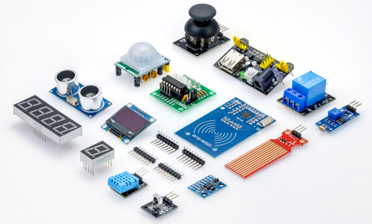

.. raw:: html

   <div style="margin-top: 30px;"></div>

Extensive Components and Smart Modules: The kit includes a variety of popular modules.

such as ultrasonic sensors, RFID modules, servo motors, MPU6050 angle sensors, OLED displays, temperature and humidity sensors, and PIR motion sensors—enabling users to build dozens of creative DIY projects right out of the box.

Below is the introduction to each component, which contains the operating principle of the component.

----


1. ESP32 Development Board
--------------------------

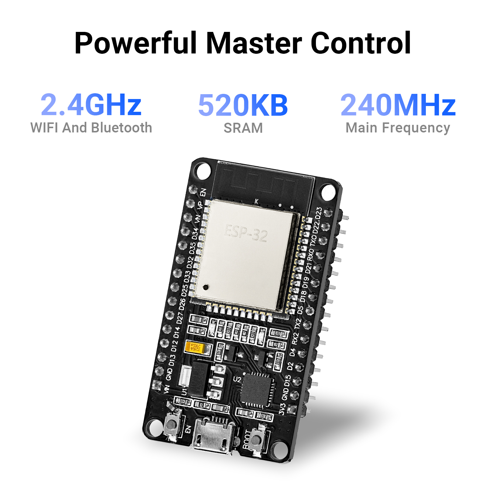

.. raw:: html

   <div style="margin-top: 30px;"></div>

The ESP32 is a series of low-cost and low-power System on a Chip (SoC) microcontrollers developed by Espressif that include Wi-Fi and Bluetooth wireless capabilities and a dual-core processor.

The ESP32 development board included in this kit provides a complete platform for rapid IoT prototyping and embedded learning. Its core features include:

- **CPU:** Dual-core Tensilica LX6 processor, up to 240 MHz.
- **RAM:** 520 KB internal SRAM and external PSRAM support on some modules.
- **Flash:** On-board SPI flash memory, typically 4 MB or 8 MB depending on the module.
- **Wireless:** Integrated 802.11 b/g/n Wi-Fi and Bluetooth v4.2 / BLE.
- **I/O interfaces:** Multiple GPIO pins, ADC, DAC, SPI, I2C, UART, PWM, and touch sensor inputs.
- **Sensors support:** Compatible with temperature/humidity sensors, motion sensors, ultrasonic sensors, and other kit components.
- **Power:** Flexible power input from USB or external supply, with voltage regulator and power management features.
- **Development:** Supports Arduino IDE, ESP-IDF, MicroPython, and other popular firmware frameworks.

This board is the heart of your starter kit. It allows you to connect sensors, drives, displays, and communication modules, while giving you easy access to Wi‑Fi and Bluetooth for wireless control, data logging, and IoT applications.

**ESP32 Pinout**

The ESP32 peripherals include：18 Analog-to-Digital Converter (ADC) channels

 - 3 SPI interfaces
 - 3 UART interfaces
 - 2 I2C interfaces
 - 16 PWM output channels
 - 2 Digital-to-Analog Converters (DAC)
 - 2 I2S interfaces
 - 10 Capacitive sensing GPIOs

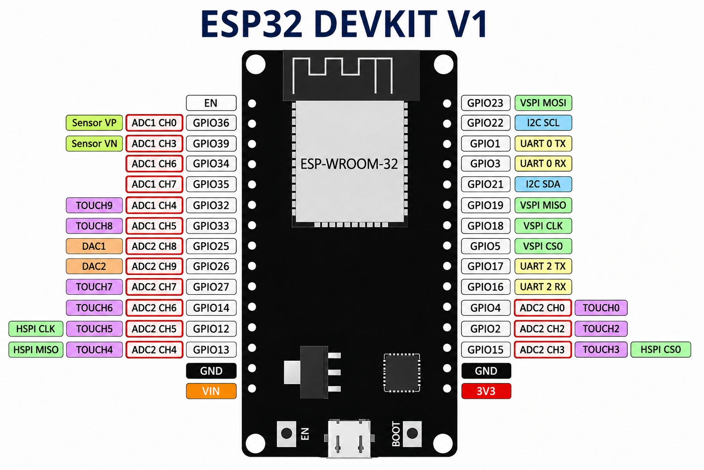

.. raw:: html

   <div style="margin-top: 30px;"></div>

The ADC (analog to digital converter) and DAC (digital to analog converter) features are assigned to specific static pins. However, you can decide which pins
are UART, I2C, SPI, PWM, etc – you just need to assign them in the code. This is possible due to the ESP32 chip’s multiplexing feature. Although you can define the pins properties on the software, there are pins
assigned by default.

- For more information, click here to view the ESP32 datasheet: `ESP32 Datasheet <https://documentation.espressif.com/esp32_datasheet_en.pdf>`_

----

2. MPU6050 Attitude Sensor
--------------------------

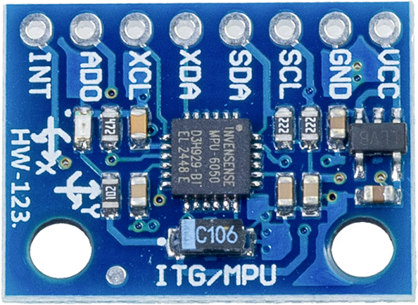

.. raw:: html

   <div style="margin-top: 30px;"></div>

The MPU6050 is an Inertial Measurement Unit (IMU) sensor that combines a 3-axis accelerometer and 3-axis gyroscope on a single chip. It is one of the most popular motion sensors for robotics, drones, motion tracking, and gesture recognition applications.

**Core Features:**

- **Accelerometer:** 3-axis acceleration measurement with selectable ranges (±2g, ±4g, ±8g, ±16g).
- **Gyroscope:** 3-axis angular velocity measurement with selectable ranges (±250°/s, ±500°/s, ±1000°/s, ±2000°/s).
- **Temperature Sensor:** Integrated temperature sensor for thermal compensation.
- **Communication:** I2C interface for easy connection to microcontrollers like ESP32.
- **Resolution:** 16-bit analog-to-digital converters (ADC) for precise measurements.
- **Low Power:** Operating voltage 3.0V to 3.6V, making it ideal for battery-powered applications.
- **Built-in DMP:** Digital Motion Processor (on some models) for computing quaternions and orientation angles.

**Applications:**

- Motion tracking and orientation detection (e.g., smartphone motion sensing)
- Robotics and drone control
- Gesture recognition and hand tracking
- Vibration monitoring and shock detection
- Game controller input and VR applications
- Postural analysis and human activity recognition

**Pinout:**

The MPU6050 uses the I2C protocol with two main pins:

- **SDA (Serial Data):** Data line connected to ESP32's I2C SDA pin
- **SCL (Serial Clock):** Clock line connected to ESP32's I2C SCL pin
- **VCC:** Power supply (3.3V from ESP32)
- **GND:** Ground connection

.. note::

   - The MPU6050 sensor is a powerful tool for measuring motion and orientation, but it can be sensitive to noise and requires proper calibration for accurate readings. It is recommended to use a stable power supply and minimize vibrations during measurements for best performance.       

----

3. DHT11 Sensor
---------------

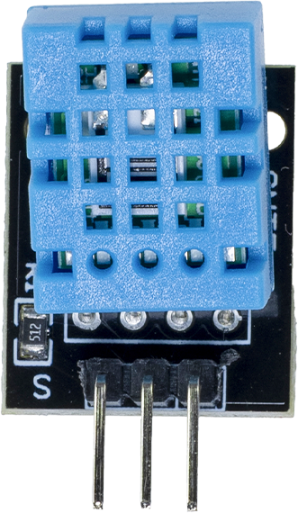

.. raw:: html

   <div style="margin-top: 30px;"></div>

The DHT11 is a basic, low-cost digital temperature and humidity sensor. It uses a capacitive humidity sensor and a thermistor to measure the surrounding air, and outputs a digital signal on the data pin.

**Core Features:**

- **Temperature Range:** 0 to 50°C with ±2°C accuracy
- **Humidity Range:** 20% to 90% RH with ±5% accuracy    
- **Data Output:** Digital signal via a single-wire interface
- **Power Supply:** 3.3V to 5V
- **Low Power Consumption:** Ideal for battery-powered applications
- **Compact Size:** Small form factor for easy integration into projects   

**Applications:**

- Environmental monitoring and weather stations
- Home automation and smart thermostats
- Greenhouse and agricultural monitoring
- HVAC systems and air quality monitoring
- Data logging and IoT sensor networks
- Educational projects and STEM learning

**Pinout:** 

- **VCC:** Power supply (3.3V or 5V)
- **GND:** Ground connection     
- **DATA:** Digital output pin connected to ESP32 GPIO for reading temperature and humidity data

.. note::
   - The DHT11 sensor is suitable for basic temperature and humidity measurements, but it has limited accuracy and a slow response time compared to more advanced sensors. For applications requiring higher precision or faster updates, consider using the DHT22 or other digital sensors.

For more information, click here to view the DHT11 datasheet: `DHT11 Datasheet <https://www.mouser.com/datasheet/2/758/DHT11-Technical-Data-Sheet-Translated-Version-1143054.pdf?srsltid=AfmBOooi92JcYF4XryfVGxzN6rWYdG9Y2aPWRpiw7p7HqvUF11LQB6y_>`_

----

4. PIR Motion Sensor
--------------------

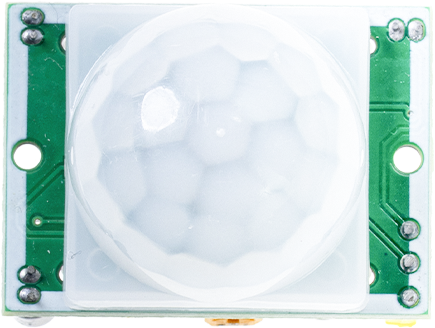

.. raw:: html

   <div style="margin-top: 30px;"></div>

The PIR (Passive Infrared) Motion Sensor is a widely used device for detecting motion in various applications. It works by sensing the infrared radiation emitted by objects in its field of view, particularly the heat signature of humans or animals.

**Core Features:**

- **Motion Detection:** Detects movement within a specified range (typically 3-7 meters)
- **Output Signal:** Provides a digital output signal when motion is detected
- **Power Supply:** Operates on 5V DC power supply
- **Operating Temperature:** Functions within a temperature range of -20°C to +70°C
- **Sensitivity Adjustment:** Allows adjustment of detection sensitivity and delay time

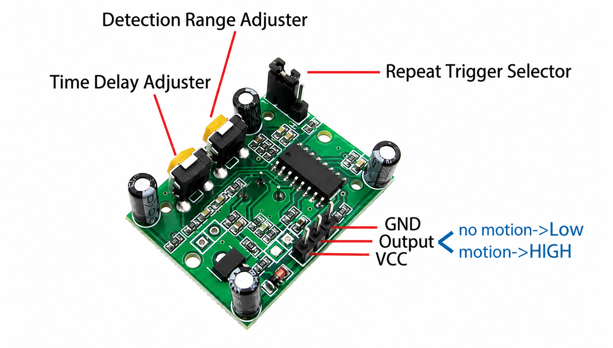

.. raw:: html

   <div style="margin-top: 30px;"></div>

**Applications:**

- Security systems and alarm installations
- Automatic lighting control in residential and commercial buildings
- Energy-efficient lighting solutions
- Surveillance and monitoring systems
- Smart home automation projects
- Industrial automation and safety applications

**Pinout:**

- **VCC:** Power supply (3.3V or 5V DC)
- **GND:** Ground connection
- **OUT:** Digital output pin connected to ESP32 GPIO for reading motion detection status

.. note::

   - The PIR sensor is ideal for detecting human or animal movement but may be affected by environmental factors such as temperature changes or direct sunlight. Proper placement and calibration are essential for optimal performance.

----

5. Light Sensor
----------------

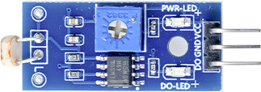

.. raw:: html

   <div style="margin-top: 30px;"></div>

The Light Sensor, often based on a photoresistor (LDR) or photodiode, is a device that detects and measures the intensity of ambient light. It is commonly used in various applications to enable automatic adjustments based on lighting conditions.

**Core Features:**

- **Light Intensity Measurement:** Provides an analog output that varies with the intensity of light
- **Wide Detection Range:** Can detect a broad range of light levels, from dim to bright  
- **Power Supply:** Typically operates on 3.3V or 5V DC power supply
- **Compact Size:** Small form factor for easy integration into projects

**Applications:**

- Automatic lighting control based on ambient light levels
- Light-sensitive alarms and security systems
- Solar tracking systems for optimizing solar panel orientation
- Environmental monitoring and weather stations
- Smart home automation projects
- Educational projects and STEM learning

**Pinout:**

- **VCC:** Power supply (3.3V or 5V DC)
- **GND:** Ground connection
- **AO:** Analog output pin connected to ESP32 ADC for reading light intensity levels

.. note::

  - The sensor board typically features a blue adjustable resistor (potentiometer); turning it with a screwdriver allows you to adjust the trigger threshold:
  
  - Counter-clockwise: More sensitive (triggers even when it is only slightly dark)
  
  - Clockwise: Less sensitive (requires darker conditions to trigger)

----

6. Water Level Sensor
-----------------------

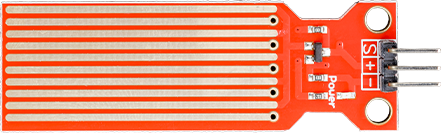

.. raw:: html

   <div style="margin-top: 30px;"></div>

The Water Level Sensor included in this kit is a simple resistive/analog probe-type sensor module that can detect water presence and provide an analog voltage proportional to the conductivity (used as a proxy for level) 

**Working principle:**

- The probe consists of a series of metal traces that change the effective resistance when immersed in water. The sensor board uses this change in resistance as part of a voltage divider to produce an analog voltage at the `S` pin.

**Core features:**

- **Analog output (AO):** Variable voltage proportional to water contact/conductivity (connect to ESP32 ADC)
- **Power:** 3.3V - 5V compatible (use 3.3V with ESP32 to avoid ADC overrange)

**Pinout:**

- **VCC:** 3.3V (or 5V) power input — use 3.3V when reading AO with ESP32 ADC
- **GND:** Ground
- **AO:** Analog output — connect to an ESP32 ADC-capable pin (e.g., `GPIO34`, `GPIO35`, etc.)

.. note::

  - When immersing in water, lower it slowly and vertically; under no circumstances should the end with the circuit board come into contact with the water.

----

7. Ultrasonic Distance Sensor 
-----------------------------

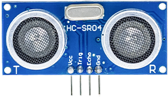

.. raw:: html

   <div style="margin-top: 30px;"></div>

The HC-SR04 is an ultrasonic distance sensor commonly used to measure the distance to an object by sending an ultrasonic pulse and measuring the echo time.

**Working principle:**

- The module transmits a short 40 kHz ultrasonic burst via the `TRIG` pin. The sound wave travels until it hits an object and reflects back. The module's `ECHO` pin goes high for the duration between sending and receiving the pulse. 

**Core features:**

- **Range:** Typically 2 cm to 400 cm (depending on environment)
- **Accuracy:** 3 mm to 1 cm under good conditions
- **Interface:** Digital `TRIG` (input) and `ECHO` (output) pins
- **Operating voltage:** 5V 

**Pinout and connections:**

- **VCC:** 5V power (HC-SR04 requires 5V)
- **GND:** Ground
- **TRIG:** Trigger input (digital output from ESP32)
- **ECHO:** Echo output 

.. note::

 - The HC-SR04 expects a 10 µs HIGH on `TRIG` to start a measurement, then the `ECHO` pin will go HIGH for a time proportional to distance.
 - For stable readings, take multiple samples and average; filter out spikes and timeouts.
 - Avoid using the sensor outdoors in heavy wind, rain, or when surfaces are highly absorbent to ultrasound.


8. IR Receiver Module and Remote Control
----------------------------------------

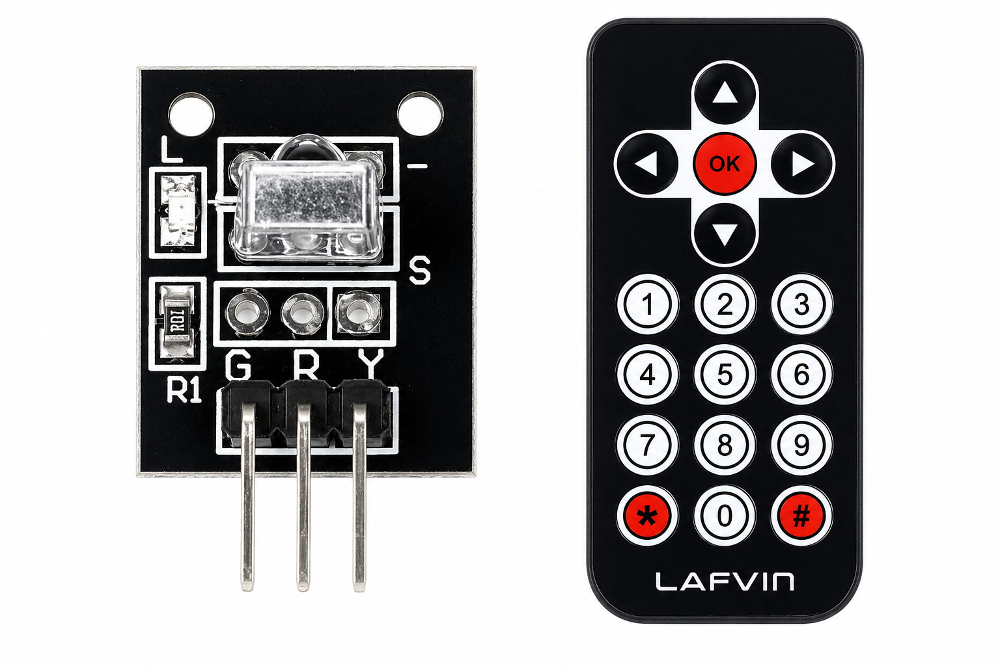

.. raw:: html

   <div style="margin-top: 30px;"></div>

This kit includes an infrared (IR) receiver module  and a simple IR remote. The receiver demodulates the 38 kHz carrier used by most remote controls and outputs a digital pulse train representing the encoded button commands.

**Working principle:**

- The remote sends coded IR signals (commonly NEC, RC5, or other protocols) by modulating a 38 kHz IR carrier. The receiver module filters and demodulates the carrier and outputs the raw pulse timings on its `OUT` pin. A microcontroller decodes these timings into button codes using an IR decoding library.

**Core features:**

- **Interface:** Simple digital `OUT` pin with active-low pulses
- **Carrier:** Typically 38 kHz (module tuned to this frequency)
- **Power:** 3.3V – 5V 

**Pinout and connections:**

- **VCC:** 3.3V or 5V supply
- **GND:** Ground
- **OUT / DATA:** Digital output — connect to an ESP32 GPIO (with interrupt capability) to capture pulse timings

.. note::

 - Use an IR decoding library (e.g., `IRremote` for Arduino/ESP32 or `esp32_ir` ports) to decode protocols like NEC.
 - The output is typically active LOW (pulse when carrier detected); you should capture pulse lengths to decode the command.
 - Avoid pointing multiple remotes at the receiver simultaneously.
 - Infrared works best in line-of-sight; sunlight and strong IR sources can interfere.


9. Joystick Module
------------------

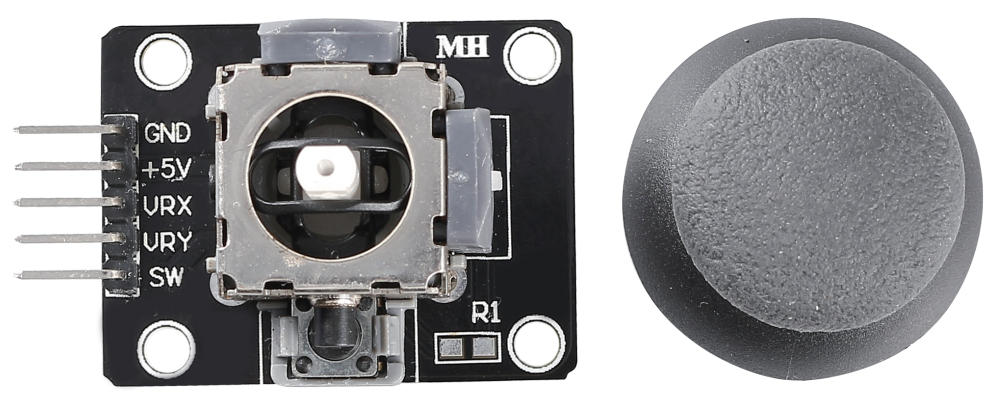

.. raw:: html

   <div style="margin-top: 30px;"></div>

A typical joystick module in the kit provides two potentiometers (X and Y axes) and a push-button (switch) on the joystick knob. It behaves like two analog inputs plus one digital switch.

**Working principle:**

- Each axis is a variable resistor (potentiometer) that outputs a voltage between 0V and VCC proportionally to the joystick position. The button is a simple momentary switch.

**Core features:**

- **Axes:** Two analog outputs (`VRx`, `VRy`) for X and Y
- **Switch:** One digital output (`SW`) activated when the joystick is pressed
- **Power:** 3.3V or 5V compatible 

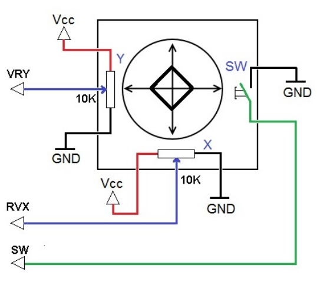

.. raw:: html

   <div style="margin-top: 30px;"></div>

**Pinout and connections:**

- **VCC:** 3.3V
- **GND:** Ground
- **VRx:** Analog output for X-axis → ESP32 ADC pin (e.g., `GPIO32`)
- **VRy:** Analog output for Y-axis → ESP32 ADC pin (e.g., `GPIO33`)
- **SW:** Digital switch output → any GPIO with pull-up (e.g., `GPIO14`)

.. note::

 - Read `VRx` and `VRy` using ADC and map the values to a joystick range (e.g., 0..1023 or 0..4095). Center position often yields a mid-scale value; apply deadzone filtering to ignore small variations.
 - Configure the `SW` pin with an internal pull-up and detect LOW for pressed state.
 - For better stability, apply simple smoothing (moving average) to analog readings.

----

10. RC522 RFID Module
---------------------

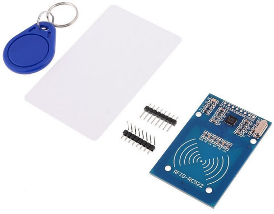

.. raw:: html

   <div style="margin-top: 30px;"></div>

The RC522 is a highly integrated 13.56MHz RFID reader/writer module based on the MFRC522 chip from NXP. It supports ISO/IEC 14443 A/MIFARE communication protocol and is widely used for contactless identification and access control applications. The module communicates with the host controller via SPI interface, enabling fast and reliable data exchange.

**Working principle:**

- The RC522 generates a 13.56MHz electromagnetic field through its antenna coil. When a compatible RFID card or tag enters this field, it draws power from the field and modulates the carrier wave to transmit its unique UID (Unique Identifier) and data. The RC522 demodulates the received signal, decodes the data, and makes it available through the SPI bus.

**Core features:**

- **Frequency:** 13.56MHz industrial, scientific, and medical (ISM) band
- **Supported cards:** MIFARE Classic 1K/4K, MIFARE Ultralight, NTAG series, and other ISO/IEC 14443 A compliant tags
- **Communication:** SPI interface (up to 10 MHz clock speed)
- **Read/Write:** Supports reading UID, reading and writing data blocks, and authentication
- **Operating distance:** Up to 5cm (depending on antenna design and tag type)
- **Power:** 3.3V supply (5V tolerant inputs with proper level shifting)

**Pinout and connections:**

- **SDA (SS):** SPI Slave Select → ESP32 GPIO (e.g., `GPIO5`)
- **SCK:** SPI Clock → ESP32 SCK (e.g., `GPIO18`)
- **MOSI:** SPI Master Out Slave In → ESP32 MOSI (e.g., `GPIO23`)
- **MISO:** SPI Master In Slave Out → ESP32 MISO (e.g., `GPIO19`)
- **IRQ:** Interrupt Request (optional) → ESP32 GPIO (e.g., `GPIO4`)
- **RST:** Reset pin → ESP32 GPIO (e.g., `GPIO22`)
- **3.3V:** 3.3V power supply
- **GND:** Ground

.. note::

 - The RC522 is a 3.3V logic device. While its inputs are 5V tolerant, it is recommended to use a level shifter for the SPI lines when interfacing with 5V logic microcontrollers to ensure reliable communication and long-term stability.
 - The module requires a stable 3.3V supply. Insufficient current (especially when reading/writing) may cause communication failures — ensure your power source can deliver at least 100mA.
 - Always call `PCD_Init()` in your initialization routine. If the `PCD_PerformSelfTest()` fails, check the wiring, especially the antenna connections.
 - When reading multiple cards, implement anti-collision logic (built into the MFRC522 library) to handle situations where multiple tags are in the field simultaneously.
 - The antenna tuning capacitors are pre‑adjusted on most modules — avoid modifying them unless you have proper RF equipment.

----

11. 0.96-inch OLED Display 
--------------------------

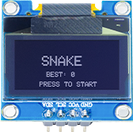

.. raw:: html

   <div style="margin-top: 30px;"></div>

The 0.96-inch OLED display module based on the SSD1306 driver IC is a compact, high-contrast monochrome display widely used in embedded projects. Unlike traditional LCDs, OLED (Organic Light-Emitting Diode) technology emits its own light, eliminating the need for a backlight and enabling deeper blacks, faster response times, and lower power consumption. The module typically supports either I²C or SPI interface, with I²C being the most common variant in hobbyist kits.

**Working principle:**

- The SSD1306 is a single-chip CMOS OLED driver with a built-in controller and 128×64 pixels of SRAM display buffer. It receives pixel data from the host via I²C or SPI, stores it in its internal GDDRAM (Graphic Display Data RAM), and constantly refreshes the OLED panel by driving the individual pixels with the corresponding voltage levels. Each pixel is either ON (emitting light) or OFF, making the display inherently monochrome (usually white, blue, or yellow).

**Core features:**

- **Resolution:** 128 × 64 pixels (some variants are 128 × 32)
- **Display size:** 0.96 inches (diagonal)
- **Interface:** I²C (most common) or 4-wire SPI (4-Wire SPI)
- **Driver IC:** SSD1306
- **Viewing angle:** ~160° (excellent visibility from all directions)
- **Refresh rate:** Can exceed 100Hz (limited by communication speed)
- **Power consumption:** Extremely low — ~20mA during normal operation, less than 10µA in sleep mode
- **Operating voltage:** 3.0V ~ 5.5V (board usually includes a voltage regulator)


**Pinout and connections:**

- **VCC:** 3.3V ~ 5V power supply
- **GND:** Ground
- **SCL:** I²C Clock line → ESP32 SCL (e.g., `GPIO22`)
- **SDA:** I²C Data line → ESP32 SDA (e.g., `GPIO21`)

.. note::

 - I²C address is typically `0x3C` . 
 - For I²C, the maximum clock speed is 400kHz (Fast Mode) — 100kHz is more stable for longer wiring.
 - The display orientation can be changed via software — `setRotation()` or `flipScreenVertically()` functions are available in most libraries.

----


12. 4x4 Keypad
---------------

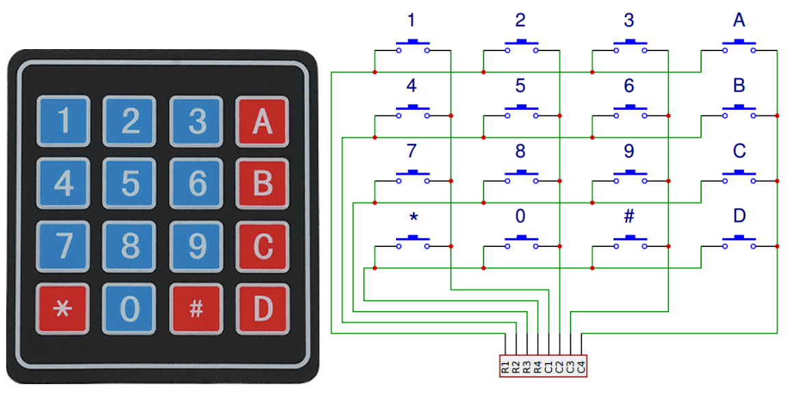

.. raw:: html

   <div style="margin-top: 30px;"></div>

Microcontroller system, if the use of more keys such as electronic code lock, telephone keypad, etc. generally have at least 12 to 16 keys, usually using a matrix keyboard.


Matrix keypad is also called row keypad, it is a keypad with four I/O lines as row lines and four I/O lines as column lines. One key is set at each intersection of the row and column lines. Thus the number of keys on the keyboard is 4*4. This row and column keyboard structure can effectively improve the utilization of I/O ports in a microcontroller system.

Their contacts are accessed via a header suitable for connection with a ribbon cable or insertion into a printed circuit board. 
In some keypads, each button connects with a separate contact in the header, while all the buttons share a common ground.


More often, the buttons are matrix encoded, meaning that each of them bridges a unique pair of conductors in a matrix. 
This configuration is suitable for polling by a microcontroller, which can be programmed to send an output pulse to each of the four horizontal wires in turn. 
During each pulse, it checks the remaining four vertical wires in sequence, to determine which one, if any, is carrying a signal. 
Pullup or pulldown resistors should be added to the input wires to prevent the inputs of the microcontroller from behaving unpredictably when no signal is present.

----

15. Relay
---------

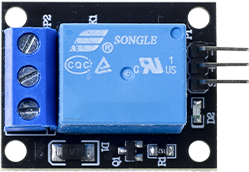

.. raw:: html

   <div style="margin-top: 30px;"></div>

**What is a Relay?**

A relay is like a switch that's controlled by electricity instead of your finger. It has two separate circuits:
- A low-power control circuit (connected to your ESP32)
- A high-power load circuit (for the device you want to control)

This separation is important because it keeps your ESP32 safe while letting you control powerful devices.

**Why Use a Relay?**

Relays are perfect when you need to:
- Control high-voltage devices (like 120V/240V home appliances) with your low-voltage ESP32
- Switch devices that need more current than your Pi can provide
- Isolate your Pi from potentially dangerous voltages
- Turn household devices on and off automatically

**Our Relay Module**

The relay module in this kit is ready to use with your ESP32:
- It includes all necessary components (resistors, diodes, and transistors)
- It can be connected directly to your ESP32 without extra components
- It has clear markings for all connections
- It includes an indicator LED that shows when the relay is activated

**How a Relay Works - The Simple Version**

Inside every relay is an electromagnet that controls a mechanical switch:

1. When you send a signal from your ESP32, the electromagnet is activated
2. The electromagnet pulls a metal arm (the armature) toward it
3. This movement connects or disconnects the electrical contacts
4. When the signal stops, a spring pulls the arm back to its original position

**The Relay's Two States**

A relay has two possible contact states:

- **Normally Open (NO)**: The circuit is disconnected when the relay is off (like a light switch in the off position)
- **Normally Closed (NC)**: The circuit is connected when the relay is off

When you activate the relay, these states flip - NO contacts close and NC contacts open.

**Safety First!**

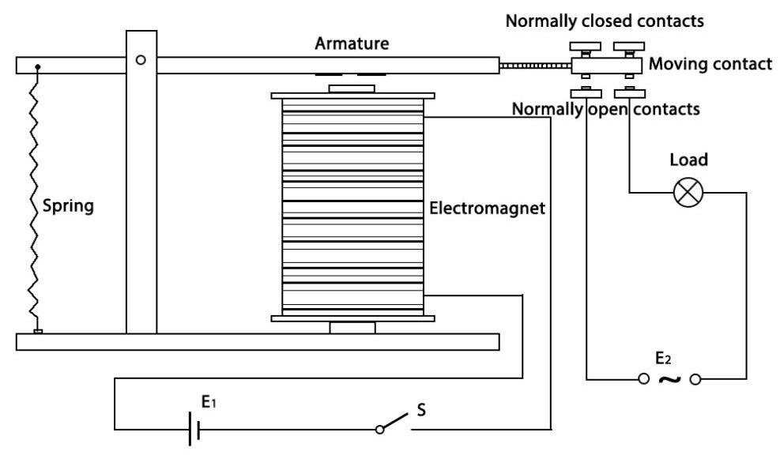

.. raw:: html

   <div style="margin-top: 30px;"></div>

.. warning::
   When working with relays that control household power (120V/240V):
   - NEVER touch the high-voltage terminals when power is connected
   - Make sure all high-voltage wiring is properly insulated
   - If you're not experienced with electrical work, ask for help from someone who is

----

16. 7-segment Display
---------------------

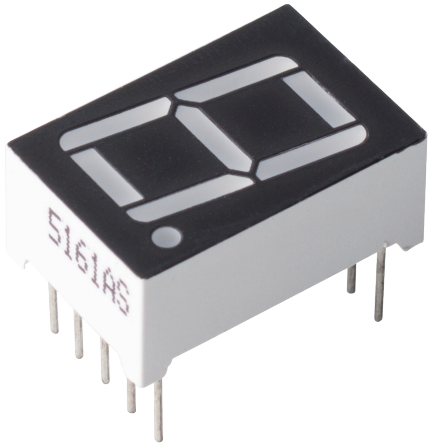

.. raw:: html

   <div style="margin-top: 30px;"></div>

A 7-segment display is an 8-shaped component which packages 7 LEDs. Each LED is called a segment - when energized, one segment forms part of a numeral to be displayed.

There are two types of pin connection: Common Cathode (CC) and Common Anode (CA). As the name suggests, a CC display has all the cathodes of the 7 LEDs connected when a CA display has all the anodes of the 7 segments connected.

In this kit, we use the Common Cathode 7-segment display, here is the electronic symbol.

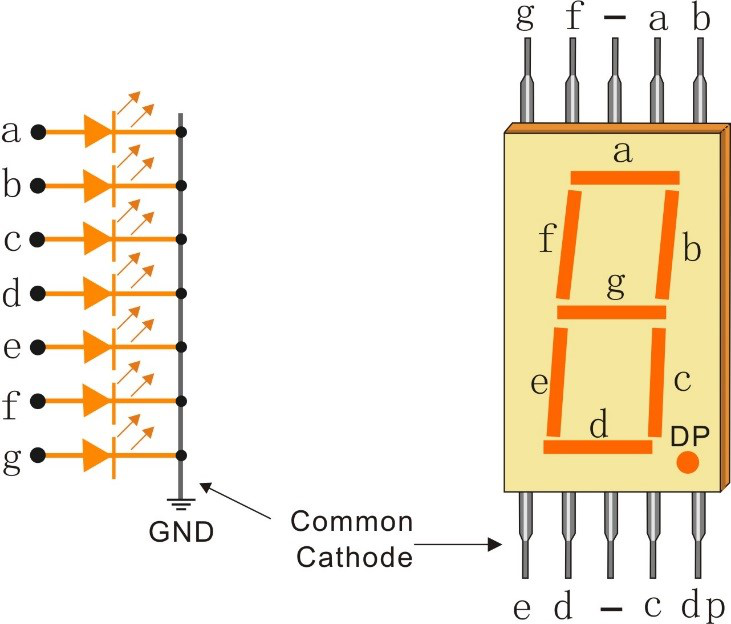

.. raw:: html

   <div style="margin-top: 30px;"></div>

Each of the LEDs in the display is given a positional segment with one of its connection pins led out from the rectangular plastic package. These LED pins are labeled from "a" through to "g" representing each individual LED. The other LED pins are connected together forming a common pin. So by forward biasing the appropriate pins of the LED segments in a particular order, some segments will brighten and others stay dim, thus showing the corresponding character on the display. 


**Display Codes** 

To help you get to know how 7-segment displays(Common Cathode) display Numbers, we have drawn the following table. Numbers are the number 0-F displayed on the 7-segment display; (DP) GFEDCBA refers to the corresponding LED set to 0 or 1, For example, 00111111 means that DP and G are set to 0, while others are set to 1. Therefore, the number 0 is displayed on the 7-segment display, while HEX Code corresponds to hexadecimal number.

.. list-table:: Glyph Code
    :widths: 20 20 20
    :header-rows: 1

    *   - Numbers	
        - Binary Code
        - Hex Code  
    *   - 0	
        - 00111111	
        - 0x3f
    *   - 1	
        - 00000110	
        - 0x06
    *   - 2	
        - 01011011	
        - 0x5b
    *   - 3	
        - 01001111	
        - 0x4f
    *   - 4	
        - 01100110	
        - 0x66
    *   - 5	
        - 01101101	
        - 0x6d
    *   - 6	
        - 01111101	
        - 0x7d
    *   - 7	
        - 00000111	
        - 0x07
    *   - 8	
        - 01111111	
        - 0x7f
    *   - 9	
        - 01101111	
        - 0x6f
    *   - A	
        - 01110111	
        - 0x77
    *   - B
        - 01111100	
        - 0x7c
    *   - C	
        - 00111001	
        - 0x39
    *   - D	
        - 01011110	
        - 0x5e
    *   - E	
        - 01111001	
        - 0x79
    *   - F	
        - 01110001	
        - 0x71

----


17. 4-Digit 7-Segment Display
-----------------------------

4-Digit 7-segment display consists of four 7- segment displays working together.

.. image:: _static/Component/17.DIGIT.png
   :width: 500
   :align: center

.. raw:: html

   <div style="margin-top: 30px;"></div>

The 4-digtal 7-segment display works independently. It uses the principle of human visual persistence to quickly display the characters of each 7-segment in a loop to form continuous strings.

For example, when "1234" is displayed on the display, "1" is displayed on the first 7-segment, and "234" is not displayed. After a period of time, the second 7-segment shows "2", the 1st 3th 4th of 7-segment does not show, and so on, the four digital display show in turn. This process
is very short (typically 5ms), and because of the optical afterglow effect and the principle of visual residue, we can see four characters at the same time.

.. image:: _static/Component/17.DIGIT2.png
   :width: 500
   :align: center

.. raw:: html

   <div style="margin-top: 30px;"></div>

**Display Codes** 

To help you get to know how 7-segment displays(Common Cathode) display Numbers, we have drawn the following table. Numbers are the number 0-F displayed on the 7-segment display; (DP) GFEDCBA refers to the corresponding LED set to 0 or 1, For example, 00111111 means that DP and G are set to 0, while others are set to 1. Therefore, the number 0 is displayed on the 7-segment display, while HEX Code corresponds to hexadecimal number.

.. list-table:: Glyph Code
    :widths: 20 20 20
    :header-rows: 1

    *   - Numbers	
        - Binary Code
        - Hex Code  
    *   - 0	
        - 00111111	
        - 0x3f
    *   - 1	
        - 00000110	
        - 0x06
    *   - 2	
        - 01011011	
        - 0x5b
    *   - 3	
        - 01001111	
        - 0x4f
    *   - 4	
        - 01100110	
        - 0x66
    *   - 5	
        - 01101101	
        - 0x6d
    *   - 6	
        - 01111101	
        - 0x7d
    *   - 7	
        - 00000111	
        - 0x07
    *   - 8	
        - 01111111	
        - 0x7f
    *   - 9	
        - 01101111	
        - 0x6f
    *   - A	
        - 01110111	
        - 0x77
    *   - B
        - 01111100	
        - 0x7c
    *   - C	
        - 00111001	
        - 0x39
    *   - D	
        - 01011110	
        - 0x5e
    *   - E	
        - 01111001	
        - 0x79
    *   - F	
        - 01110001	
        - 0x71

----

18. WS2812 RGB 8 LEDs Strip
-----------------------

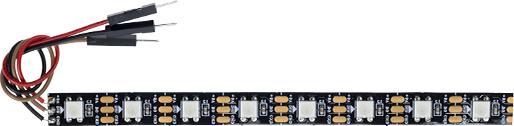

.. raw:: html

   <div style="margin-top: 30px;"></div>

The WS2812 RGB 8 LEDs Strip is composed of 8 RGB LEDs. 
Only one pin is required to control all the LEDs. Each RGB LED has a WS2812 chip, which can be controlled independently. 
It can realize 256-level brightness display and complete true color display of 16,777,216 colors. 
At the same time, the pixel contains an intelligent digital interface data latch signal shaping amplifier drive circuit, 
and a signal shaping circuit is built in to effectively ensure the color height of the pixel point light Consistent.

It is flexible, can be docked, bent, and cut at will, and the back is equipped with adhesive tape, which can be fixed on the uneven surface at will, and can be installed in a narrow space.

**Features**

* Work Voltage: DC5V
* IC: One IC drives one RGB LED
* Consumption: 0.3w each LED
* Working Temperature: -15-50
* Color: Full color RGB
* RGB Type: 5050RGB(Built-in IC WS2812B)
* Light Strip Thickness: 2mm
* Each LED can be controlled individually

**WS2812B Introdction**

* `WS2812B Datasheet <https://cdn-shop.adafruit.com/datasheets/WS2812B.pdf>`_

WS2812B is a intelligent control LED light source that the control circuit and RGB chip are integrated in
a package of 5050 components. It internal include intelligent digital port data latch and signal reshaping amplification drive circuit. Also include a precision internal oscillator and a 12V voltage programmable constant current control part, effectively ensuring the pixel point light color height consistent.

The data transfer protocol use single NZR communication mode. After the pixel power-on reset, the DIN
port receive data from controller, the first pixel collect initial 24bit data then sent to the internal data latch,
the other data which reshaping by the internal signal reshaping amplification circuit sent to the next cascade
pixel through the DO port. After transmission for each pixel, the signal to reduce 24bit. pixel adopt auto resha
-ping transmit technology, making the pixel cascade number is not limited the signal transmission, only depend
on the speed of signal transmission.

LED with low driving voltage, environmental protection and energy saving, high brightness, scattering angle is large, good consistency, low power, long life and other advantages. The control chip integrated in LED
above becoming more simple circuit, small volume, convenient installation.

----

19. Active/Passive Buzzer
------------------------


.. raw:: html

   <div style="margin-top: 30px;"></div>


**What is a Buzzer?**

A buzzer is an electronic device that makes a beeping sound when electricity flows through it. They're used in many everyday devices like alarm clocks, microwaves, and toys to create sounds or alerts.

**Active vs. Passive Buzzers - What's the Difference?**

There are two main types of buzzers:

1. **Active Buzzer** (We're using this one!)
   - Has a built-in circuit that creates sound automatically
   - Just needs simple on/off power to work
   - Produces a single, fixed tone
   - Easy to identify: Usually has black tape covering it

2. **Passive Buzzer**
   - Has no built-in sound generator
   - Requires changing signals (like music notes) to make different sounds
   - Can produce different tones and simple melodies
   - Easy to identify: Usually has a green circuit board visible

**Connecting the Buzzer**

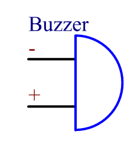

.. raw:: html

   <div style="margin-top: 30px;"></div>

The buzzer has two pins:
- The longer pin is positive (+) called the anode
- The shorter pin is negative (-) called the cathode

.. warning::
   Make sure to connect the pins correctly! If you mix them up, the buzzer won't make any sound.

----


20. Servo Motor
---------------

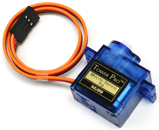

.. raw:: html

   <div style="margin-top: 30px;"></div>

The SG90 is a miniature, lightweight, and cost-effective 9g servo motor widely used in robotics, RC models, and educational projects. It belongs to the class of positional rotation servos, where the output shaft rotates to a specific angular position based on the width of the input PWM (Pulse Width Modulation) signal. With a stall torque of approximately 1.8 kg·cm at 5V and a weight of just 9 grams, it is ideal for small-scale mechanisms like robotic arms, pan/tilt camera mounts, and micro-vehicle steering.

**Working principle:**

- Inside the SG90, there is a DC motor, a potentiometer (feedback potentiometer) attached to the output shaft, a gear reduction train, and a control circuit. The control circuit generates a reference voltage from the potentiometer that corresponds to the current shaft position. It continuously compares this feedback voltage with the target position derived from the incoming PWM signal. If there is a difference, the motor rotates in the appropriate direction until the feedback matches the target, achieving closed-loop position control. The PWM signal has a fixed period of 20ms (50Hz), and the pulse width (typically 0.5ms to 2.5ms) determines the target angle.

**Core features:**

- **Operating voltage:** 4.8V ~ 6.0V (5V recommended)
- **Stall torque:** 1.8 kg·cm @ 5V (approx. 0.18 N·m)
- **Speed:** 0.1 sec/60° @ 5V (no load)
- **Rotation range:** 0° ~ 180° (some variants support 0° ~ 360° continuous rotation)
- **Dead band width:** 5 µs (the minimum pulse width change that produces a response)
- **Weight:** 9g (including cables and connector)
- **Dimensions:** 23 × 12.2 × 29 mm
- **Connector:** 3-pin JR-style female header (compatible with standard servo extensions)
- **Operating temperature:** -10°C ~ +50°C

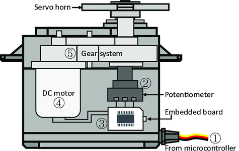

.. raw:: html

   <div style="margin-top: 30px;"></div>


**Pinout and connections:**

- **Brown/Black:** Ground (GND) → ESP32 GND
- **Red:** Power (VCC) → 5V external power supply (do not power from ESP32's 3.3V pin)
- **Orange/Yellow:** Signal (PWM input) → ESP32 GPIO with PWM capability (e.g., `GPIO13`)

.. warning::

 - **Never power the SG90 directly from the ESP32's 3.3V pin!** The servo can draw peak currents of 200~400mA during operation, far exceeding the ESP32's 3.3V regulator capacity (typically 150mA). This can cause voltage drops, resets, or permanent damage to the board. Always use a separate 5V power source with adequate current capability (at least 1A if driving multiple servos). Connect the grounds (ESP32 GND and servo power supply GND) together to ensure a common reference.

**PWM signal specifications:**

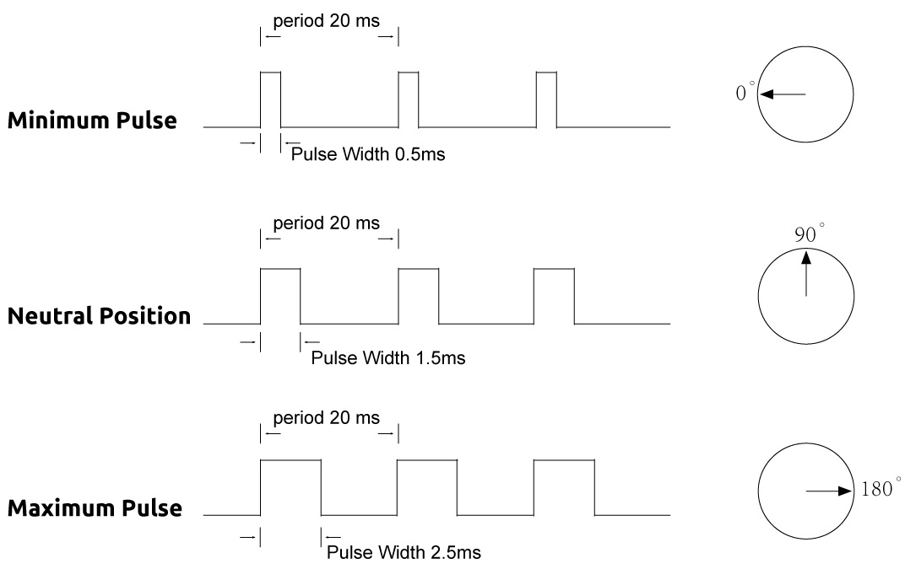

.. raw:: html

   <div style="margin-top: 30px;"></div>

- **Period:** 20ms (50Hz) — standard for analog servos
- **Pulse width range:** 0.5ms ~ 2.5ms (typically maps to 0° ~ 180°)
- **Common mapping (most libraries):**
  - 0° → 0.5ms → duty cycle 2.5% (for 50Hz)
  - 90° → 1.5ms → duty cycle 7.5%
  - 180° → 2.5ms → duty cycle 12.5%
- **Actual range may vary** between individual units — it is recommended to calibrate the minimum and maximum values for each servo.

----

21. DC Motor
------------

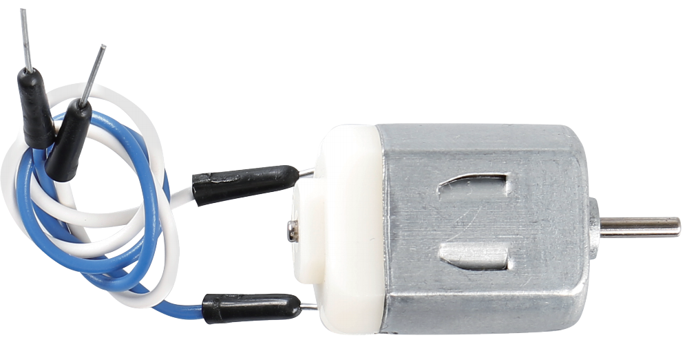

.. raw:: html

   <div style="margin-top: 30px;"></div>


This is a 3V DC motor. When you give a high level and a low level to each of the 2 terminals, it will rotate.

* **Size**: 25*20*15MM
* **Operation Voltage**: 1-6V
* **Free-run Current** (3V): 70m
* **A Free-run Speed** (3V): 13000RPM
* **Stall Current** (3V): 800mA
* **Shaft Diameter**: 2mm

Direct current (DC) motor is a continuous actuator that converts electrical energy into mechanical energy. DC motors make rotary pumps, fans, compressors, impellers, and other devices work by producing continuous angular rotation.

A DC motor consists of two parts, the fixed part of the motor called the **stator** and the internal part of the motor called the **rotor** (or **armature** of a DC motor) that rotates to produce motion.
The key to generating motion is to position the armature within the magnetic field of the permanent magnet (whose field extends from the north pole to the south pole). The interaction of the magnetic field and the moving charged particles (the current-carrying wire generates the magnetic field) produces the torque that rotates the armature.

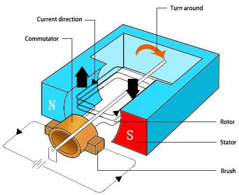

.. raw:: html

   <div style="margin-top: 30px;"></div>

Current flows from the positive terminal of the battery through the circuit, through the copper brushes to the commutator, and then to the armature.
But because of the two gaps in the commutator, this flow reverses halfway through each complete rotation.
This continuous reversal essentially converts the DC power from the battery to AC, allowing the armature to experience torque in the right direction at the right time to maintain rotation.

* `DC Motor - MagLab <https://nationalmaglab.org/education/magnet-academy/watch-play/interactive/dc-motor>`_
* `Fleming's left-hand rule for motors - Wikipedia <https://en.wikipedia.org/wiki/Fleming%27s_left-hand_rule_for_motors>`_

----

22. Stepper Motor And ULN2003 Driver Board
------------------------------------------

**Stepper Motor**

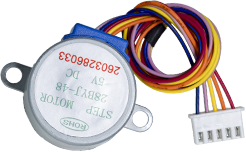

.. raw:: html

   <div style="margin-top: 30px;"></div>

A stepper motor is an electromechanical device which converts electrical pulses into discrete mechanical movements. The shaft or spindle of a stepper motor rotates in discrete step increments when electrical command pulses are applied to it in the proper sequence.

The motors rotation has several direct relationships to these applied input pulses. The sequence of the applied pulses is directly related to the direction of motor shafts rotation.

The speed of the motor shafts rotation is directly related to the frequency of the input pulses and the length of rotation is directly related to the number of input pulses applied.

One of the most significant advantages of a stepper motor is its ability to be accurately controlled in an open loop system. Open loop control means no feedback information about position is needed. This type of control eliminates the need for expensive sensing and feedback devices such as optical encoders.Your position is known simply by keeping track of the input step pulses

**Stepper Motor 28BYJ-48 Parameters**

.. list-table:: 
   :header-rows: 1
   :widths: 30 35 30 35

   * - Parameter
     - Value/Specification
     - Parameter
     - Value/Specification
   * - Model
     - 28BYJ-48
     - In-traction Torque
     - >34.3mN.m (120Hz)
   * - Rated voltage
     - 5VDC
     - Self-positioning Torque
     - >34.3mN.m
   * - Number of Phase
     - 4
     - Friction torque
     - 600–1200 gf.cm
   * - Speed Variation Ratio
     - 1/64
     - Pull in torque
     - 300 gf.cm
   * - Stride Angle
     - 5.625°/64
     - Insulated resistance
     - >10MΩ (500V)
   * - Frequency
     - 100Hz
     - Insulated electricity power
     - 600VAC/1mA/1s
   * - DC resistance
     - 50Ω±7% (25°C)
     - Insulation grade
     - A
   * - Idle In-traction Frequency
     - >600Hz
     - Rise in Temperature
     - <40K (120Hz)
   * - Idle Out-traction Frequency
     - >1000Hz
     - Noise
     - <35dB (120Hz, No load, 10cm)

**Interfacing circuits**

The bipolar stepper motor usually has four wires coming out of it. Unlike unipolar steppers, bipolar steppers have no common center connection. They have two independent sets of coils instead. You can distinguish them from unipolar steppers by measuring the resistance between the wires. You should find two pairs of wires with equal resistance. If you’ve got the leads of your meter connected to two wires that are not connected (i.e. not attached to the same coil), you should see infinite resistance (or no continuity).

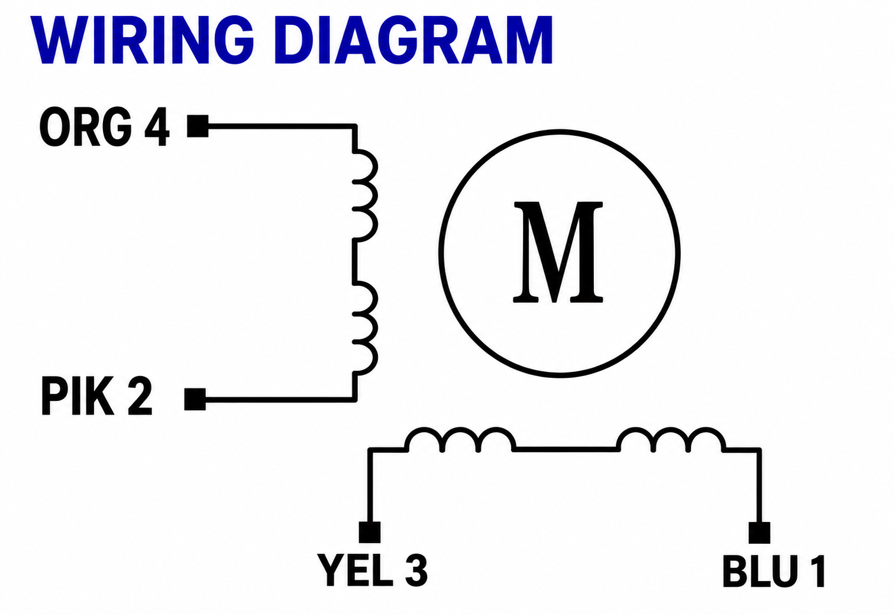

.. raw:: html

   <div style="margin-top: 30px;"></div>


**ULN2003 Driver Board**

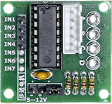

.. raw:: html

   <div style="margin-top: 30px;"></div>

- Size: 42mmx30mm

- Use ULN2003 driver chip, 500mA

- A. B. C. D LED indicating the four phase stepper motor working condition.

- White jack is the four phase stepper motor standard jack.

- Power pins are separated

- We kept the rest pins of the ULN2003 chip for your further prototyping.


The simplest way of interfacing a unipolar stepper to ESP32 is to use a breakout for ULN2003A transistor array chip. The ULN2003A contains seven Darlington transistor drivers and is somewhat like having seven TIP120 transistors all in one package. The ULN2003A can pass up to 500 mA per channel and has an internal voltage drop of about 1V when on. It also contains internal clamp diodes to dissipate voltage spikes when driving inductive loads. To control the stepper, apply voltage to each of the coils in a specific sequence.

**The sequence would go like this:**

.. list-table:: 
   :header-rows: 1
   :widths: 10 10 10 10 10 10 10 10 10

   * - 
     - 1
     - 2
     - 3
     - 4
     - 5
     - 6
     - 7
     - 8
   * - 4 ORG (Orange)
     - -
     - -
     - 
     - 
     - 
     - 
     - 
     - 
   * - 3 YEL (Yellow)
     - 
     - 
     - 
     - -
     - 
     - 
     - 
     - 
   * - 2 PIK (Pink)
     - 
     - 
     - 
     - -
     - -
     - 
     - 
     - 
   * - 1 BLU (Blue)
     - 
     - 
     - 
     - 
     - 
     - -
     - -
     - -

Here are schematics showing how to interface a unipolar stepper motor to four controller pins using a ULN2003A, and showing how to interface using four com.

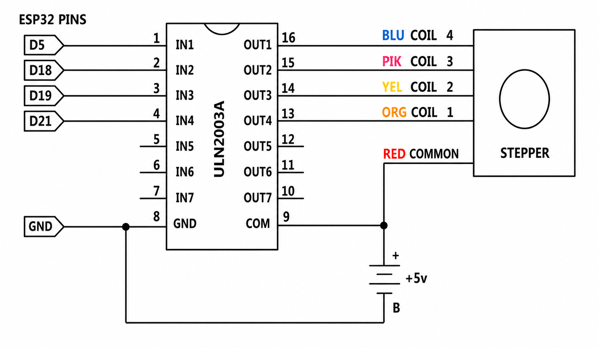

.. raw:: html

   <div style="margin-top: 30px;"></div>

----

23. LED
-------

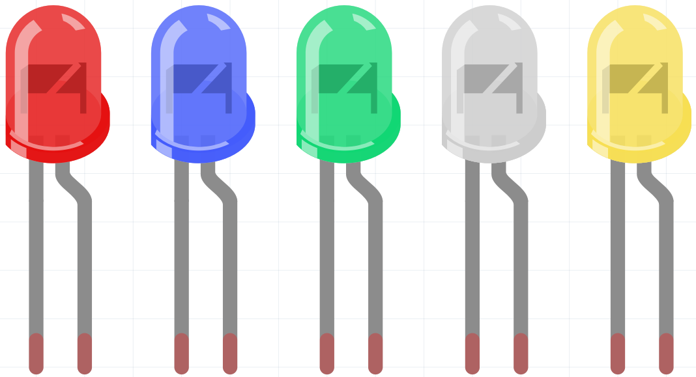

.. raw:: html

   <div style="margin-top: 30px;"></div>

A semiconductor light-emitting diode (LED) is a component that converts electrical energy into light energy through PN junctions. LEDs can be classified by wavelength into laser diodes, infrared LEDs, and visible LEDs, the latter being commonly referred to simply as LEDs.

Due to the diode's unidirectional conductivity, current flows in the direction of the arrow shown in its circuit symbol. To illuminate the LED, you must supply positive voltage to the anode and negative voltage to the cathode.

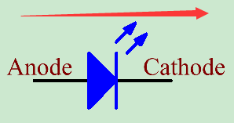

.. raw:: html

   <div style="margin-top: 30px;"></div>

An LED has two pins. The longer one is the anode, and shorter one, the cathode. Pay attention not to connect them inversely. There is fixed forward voltage drop in the LED, so it cannot be connected with the circuit directly because the supply voltage can outweigh this drop and cause the LED to be burnt. The forward voltage of the red, yellow, and green LED is 1.8 V and that of the white one is 2.6 V. Most LEDs can withstand a maximum current of 20 mA, so we need to connect a current limiting resistor in series.                   

The formula of the resistance value is as follows:

    R = (Vsupply – VD)/I

**R** stands for the resistance value of the current limiting resistor.

**Vsupply** for voltage supply.

**VD** for voltage drop.

**I** for the working current of the LED.

Here is the detailed introduction for the LED: `led_wiki <https://en.wikipedia.org/wiki/Light-emitting_diode>`_.

----

24. Button
-----------

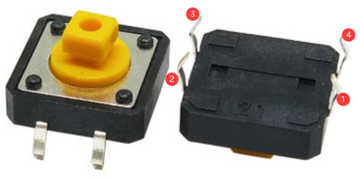

.. raw:: html

   <div style="margin-top: 30px;"></div>

Buttons are essential components used to control electronic devices, typically functioning as switches to either complete or interrupt circuits. Despite their variety in sizes and shapes, the 6mm mini-button depicted in the accompanying images is our focus here. Within this button, pin 1 is connected to pin 2, and pin 3 is connected to pin 4. Therefore, you only need to establish a connection between pin 1 (or pin 2) and pin 3 (or pin 4) to operate it.

The internal structure of such a button is illustrated below. The symbol shown on the right is commonly used to represent a button in circuit diagrams.

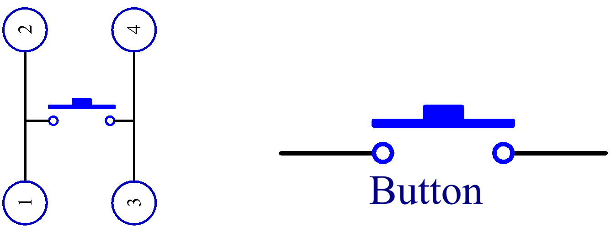

.. raw:: html

   <div style="margin-top: 30px;"></div>

Since the pin 1 is connected to pin 2, and pin 3 to pin 4, when the button is pressed, the 4 pins are connected, thus closing the circuit.

In this kit, we provide two types of buttons. The one mentioned earlier is a small button, and there is also a large button. They have the same principle, only different in size.

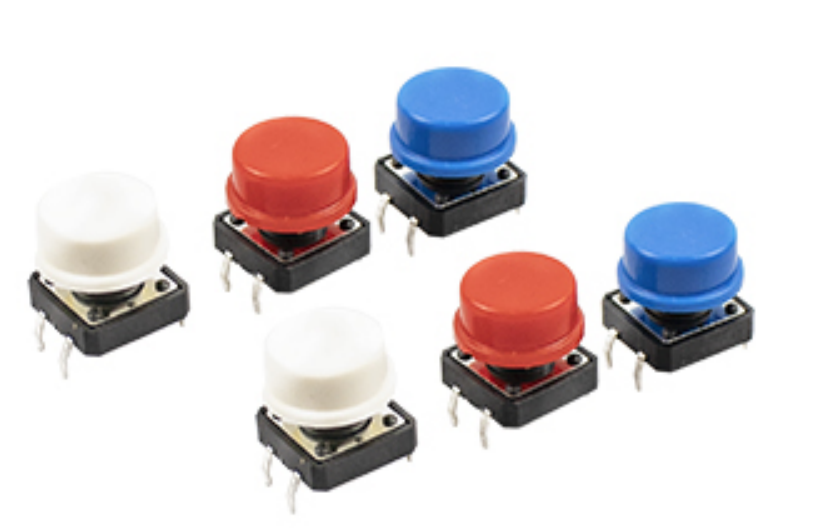

.. raw:: html

   <div style="margin-top: 30px;"></div>

----

.. _cpn_resistor:

25. Resistor
-------------

.. image:: _static/Component/25.res.png
   :width: 300
   :align: center

.. raw:: html

   <div style="margin-top: 30px;"></div>

A resistor is an electronic component that restricts the flow of current in a circuit. A fixed resistor has a set resistance value that cannot be altered, whereas a potentiometer or variable resistor has an adjustable resistance.

There are two commonly used symbols to represent resistors in circuit diagrams. The resistance value is typically indicated on the resistor itself. When you encounter these symbols in a circuit schematic, they denote a resistor.

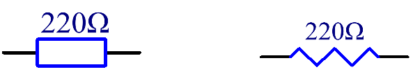

.. raw:: html

   <div style="margin-top: 30px;"></div>

**Ω** is the unit of resistance and the larger units include KΩ, MΩ, etc. 
Their relationship can be shown as follows: 1 MΩ=1000 KΩ, 1 KΩ = 1000 Ω. Normally, the value of resistance is marked on it. 

When using a resistor, we need to know its resistance first. Here are two methods: you can observe the bands on the resistor, or use a multimeter to measure the resistance. You are recommended to use the first method as it is more convenient and faster. 

.. image:: _static/Component/25.res3.png
   :width: 300
   :align: center

.. raw:: html

   <div style="margin-top: 30px;"></div>

As shown in the card, each color stands for a number. 

.. list-table::

   * - Black
     - Brown
     - Red
     - Orange
     - Yellow
     - Green
     - Blue
     - Violet
     - Grey
     - White
     - Gold
     - Silver
   * - 0
     - 1
     - 2
     - 3
     - 4
     - 5
     - 6
     - 7
     - 8
     - 9
     - 0.1
     - 0.01

The 4- and 5-band resistors are frequently used, on which there are 4 and 5 chromatic bands. 

Normally, when you get a resistor, you may find it hard to decide which end to start for reading the color. 
The tip is that the gap between the 4th and 5th band will be comparatively larger.

Therefore, you can observe the gap between the two chromatic bands at one end of the resistor; 
if it's larger than any other band gaps, then you can read from the opposite side. 

Let’s see how to read the resistance value of a 5-band resistor as shown below.

.. image:: _static/Component/25.res4.png
   :width: 300
   :align: center

.. raw:: html

   <div style="margin-top: 30px;"></div>

So for this resistor, the resistance should be read from left to right. 
The value should be in this format: 1st Band 2nd Band 3rd Band x 10^Multiplier (Ω) and the permissible error is ±Tolerance%. 
So the resistance value of this resistor is 2(red) 2(red) 0(black) x 10^0(black) Ω = 220 Ω, 
and the permissible error is ± 1% (brown). 

.. list-table::Common resistor color band
    :header-rows: 1

    * - Resistor 
      - Color Band  
    * - 10Ω   
      - brown black black silver brown
    * - 100Ω   
      - brown black black black brown
    * - 220Ω 
      - red red black black brown
    * - 330Ω 
      - orange orange black black brown
    * - 1kΩ 
      - brown black black brown brown
    * - 2kΩ 
      - red black black brown brown
    * - 5.1kΩ 
      - green brown black brown brown
    * - 10kΩ 
      - brown black black red brown 
    * - 100kΩ 
      - brown black black orange brown 
    * - 1MΩ 
      - brown black black green brown 

You can learn more about resistor from Wiki: `Resistor - Wikipedia <https://en.wikipedia.org/wiki/Resistor>`_.

----

26. potentiometer
------------------

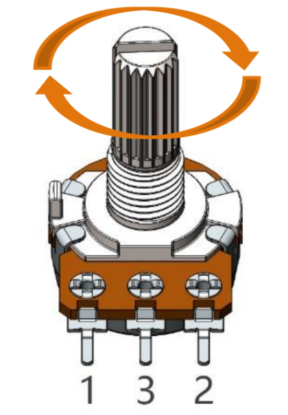

.. raw:: html

   <div style="margin-top: 30px;"></div>

A potentiometer is another type of resistance component featuring three terminals, with an adjustable resistance value that follows a specific pattern of variation.

Regardless of their different shapes, sizes, and resistance values, all potentiometers share the following characteristics:

- They possess three terminals (or connection points).

- They include a knob, screw, or slider that can be adjusted to change the resistance between the middle terminal and either of the outer terminals.

- As the knob, screw, or slider is moved, the resistance between the middle terminal and either outer terminal can vary from 0 Ω to the potentiometer's maximum resistance.

Below is the circuit symbol typically used to represent a potentiometer. 

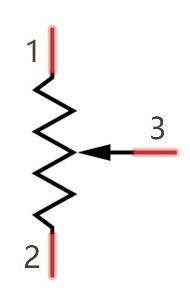

.. raw:: html

   <div style="margin-top: 30px;"></div>

The functions of a potentiometer in a circuit include:

- **Serving as a Voltage Divider**

    A potentiometer acts as a continuously adjustable resistor. When you adjust the shaft or sliding handle, the movable contact slides along the resistor. This allows the output voltage to vary depending on the applied voltage and the position of the movable arm. This function is commonly used to derive a specific voltage from a larger range.

- **Serving as a Rheostat**

    When used as a rheostat, the potentiometer can be connected to the circuit by using the middle pin and one of the other two pins. This configuration enables you to obtain a smoothly and continuously variable resistance value within the range of the moving contact's travel. This function is often used for adjusting current or resistance in a circuit.

- **Serving as a Current Controller**

    For a potentiometer to function as a current controller, the sliding contact terminal must be used as one of the output terminals. This setup allows for the regulation of the current flowing through the circuit by adjusting the position of the sliding contact.
    
    If you want to know more about potentiometer, refer to: `Potentiometer Wiki <https://en.wikipedia.org/wiki/Potentiometer>`_

----

27. Tilt Switch
--------------


.. raw:: html

   <div style="margin-top: 30px;"></div>

The tilt switch used here is a ball-type switch containing a metal ball inside. It is designed to detect slight inclinations.

The operating principle is straightforward. When the switch is tilted at a specific angle, the internal ball rolls and makes contact with the two terminals connected to the external pins, thereby completing the circuit. If the switch is not tilted, the ball stays away from the contacts, breaking the circuit.

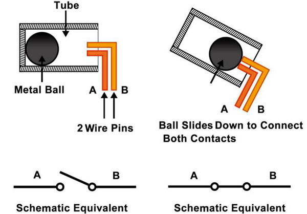

.. raw:: html

   <div style="margin-top: 30px;"></div>

----

28. 74HC595
------------

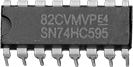

.. raw:: html

   <div style="margin-top: 30px;"></div>

The 74HC595 consists of an 8−bit shift register and a storage register with three−state parallel outputs. It converts serial input into parallel output so you can save IO ports of an MCU.

* When MR (pin10) is high level and OE (pin13) is low level, data is input in the rising edge of SHcp and goes to the memory register through the rising edge of SHcp. 
* If the two clocks are connected together, the shift register is always one pulse earlier than the memory register. 
* There is a serial shift input pin (Ds), a serial output pin (Q) and an asynchronous reset button (low level) in the memory register. 
* The memory register outputs a Bus with a parallel 8-bit and in three states. 
* When OE is enabled (low level), the data in memory register is output to the bus(Q0 ~ Q7).

* `74HC595 Datasheet <https://www.ti.com/lit/ds/symlink/cd74hc595.pdf?ts=1617341564801>`_

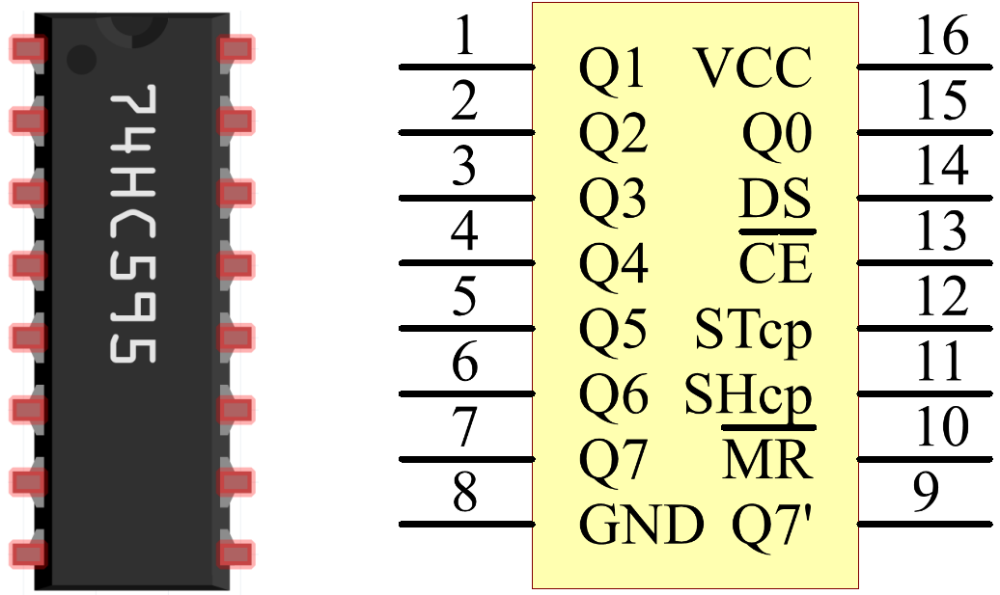

.. raw:: html

   <div style="margin-top: 30px;"></div>

Pins of 74HC595 and their functions:

* **Q0-Q7**: 8-bit parallel data output pins, able to control 8 LEDs or 8 pins of 7-segment display directly.
* **Q7'**: Series output pin, connected to DS of another 74HC595 to connect multiple 74HC595s in series
* **MR**: Reset pin, active at low level; 
* **SHcp**: Time sequence input of shift register. On the rising edge, the data in shift register moves successively one bit, i.e. data in Q1 moves to Q2, and so forth. While on the falling edge, the data in shift register remain unchanged.
* **STcp**: Time sequence input of storage register. On the rising edge, data in the shift register moves into memory register.
* **CE**: Output enable pin, active at low level. 
* **DS**: Serial data input pin
* **VCC**: Positive supply voltage.
* **GND**: Ground.

----

28. L293D
---------

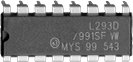

.. raw:: html

   <div style="margin-top: 30px;"></div>

The L293D is a dual H-bridge motor driver chip commonly used with platforms like Arduino and ESP32 to control DC motors and stepper motors.

It integrates two sets of H-bridge driver circuits, allowing it to independently drive two DC motors or one four-phase stepper motor. Featuring built-in flyback protection diodes, it eliminates the need for external protection diodes and offers ease of use, making it a widely adopted motor driver chip in electronics education and robotics projects.

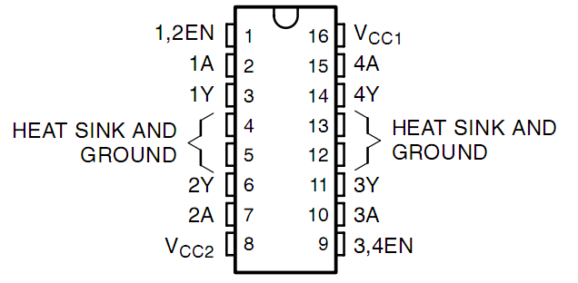

.. raw:: html

   <div style="margin-top: 30px;"></div>

The L293D has three important types of pins: 
- Enable pins (EN): Turn the motor control on/off 
- Input pins (A): Control the direction (forward/reverse) 
- Output pins (Y): Connect to the motor

When EN is HIGH: - If input A is HIGH → output Y is HIGH - If input A is LOW → output Y is LOW.

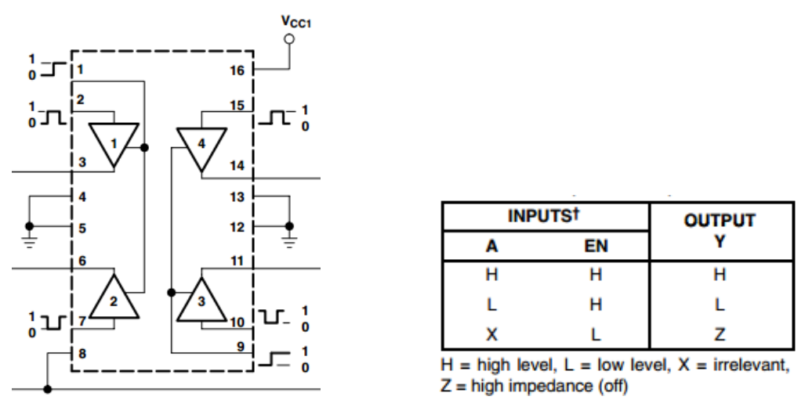

.. raw:: html

   <div style="margin-top: 30px;"></div>

----

29. Thermistor
--------------

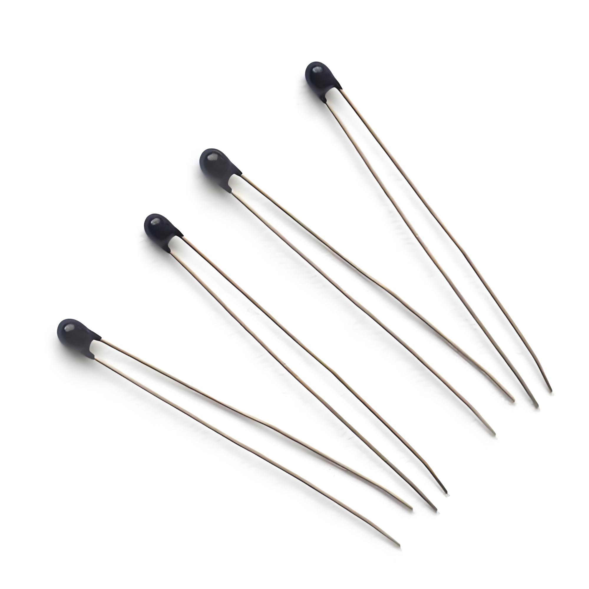

.. raw:: html

   <div style="margin-top: 30px;"></div>

A **thermistor** is a temperature-sensitive resistor whose resistance changes significantly with temperature. The component shown above is a typical **NTC (Negative Temperature Coefficient) thermistor**, which is widely used for temperature measurement and environmental monitoring in embedded systems.

**Features**

- High sensitivity to temperature changes
- Fast response time
- Compact size and lightweight
- Low cost and easy to use
- Compatible with Arduino, ESP32, STM32, and other microcontrollers

**Working Principle**

An NTC thermistor decreases its resistance as the surrounding temperature increases. By measuring the voltage across the thermistor in a voltage divider circuit, a microcontroller can calculate the ambient temperature.

```
Temperature ↑ → Resistance ↓
Temperature ↓ → Resistance ↑
```

The NTC thermistor is one of the most widely used temperature sensors in embedded electronics. It offers a simple, low-cost solution for temperature monitoring and is ideal for projects based on ESP32, Arduino, and other microcontroller platforms.

----

30. PN2222 Transistor
---------------------

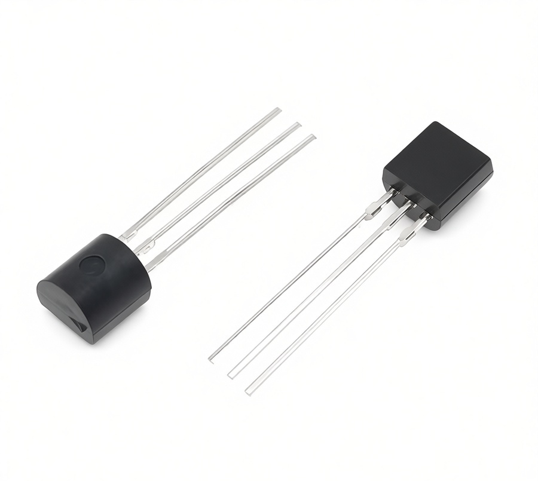

.. raw:: html

   <div style="margin-top: 30px;"></div>

The **PN2222** is a general-purpose **NPN bipolar junction transistor (BJT)** widely used for electronic switching and signal amplification. It can be controlled by a microcontroller such as an ESP32 or Arduino to drive devices that require more current, such as LEDs, relays, buzzers, and small DC motors.

**Features**

- NPN bipolar junction transistor
- Fast switching speed
- Low cost and widely available
- Suitable for switching and amplification
- Compatible with Arduino, ESP32, STM32, and other microcontrollers

**Pin Configuration**

Viewed from the flat side with the leads pointing downward:

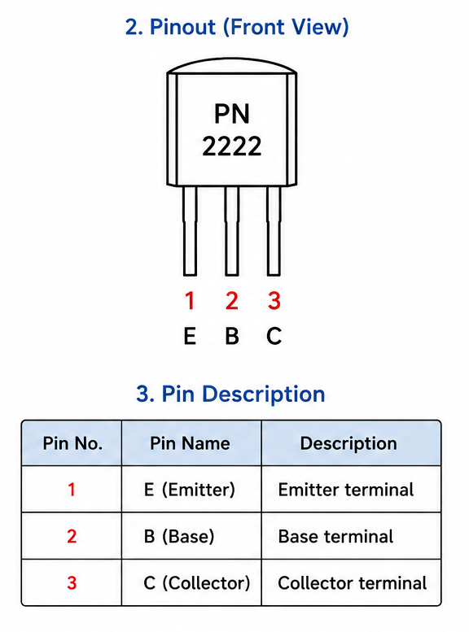

.. raw:: html

   <div style="margin-top: 30px;"></div>


**Working Principle**

A small current applied to the **Base (B)** controls a much larger current flowing from the **Collector (C)** to the **Emitter (E)**, allowing the transistor to operate as an electronic switch or amplifier.

The PN2222 is one of the most popular NPN transistors for embedded electronics. Its simple operation, reliable performance, and ability to control higher-current loads make it an excellent choice for ESP32, Arduino, and other microcontroller-based projects.

----

31. 1N4007 Diode
---------------

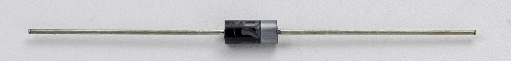

.. raw:: html

   <div style="margin-top: 30px;"></div>

The **1N4007** is a general-purpose **silicon rectifier diode** widely used for converting AC to DC and protecting electronic circuits from reverse voltage. It is one of the most commonly used diodes in power supply and embedded electronics projects.

**Features**

- General-purpose rectifier diode
- Maximum repetitive reverse voltage: **1000 V**
- Maximum average forward current: **1 A**
- Low cost and highly reliable
- Easy to use in power and protection circuits

**Working Principle**

A diode allows current to flow in only one direction.

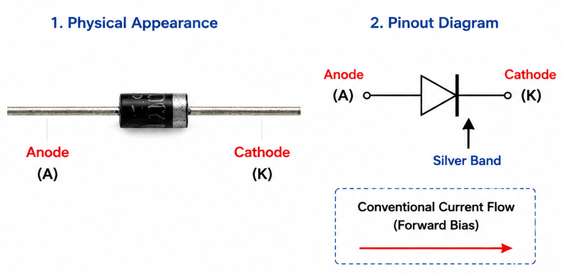

.. raw:: html

   <div style="margin-top: 30px;"></div>

- **Forward Bias:** Conducts current with a forward voltage drop of approximately **0.7 V**.
- **Reverse Bias:** Blocks current until the reverse voltage exceeds its rated limit.


The 1N4007 is a reliable and inexpensive rectifier diode widely used in electronic circuits. Its high reverse voltage rating and simple operation make it an excellent choice for power supplies, circuit protection, and embedded system applications.

----

32. Power Supply Module
-------------------

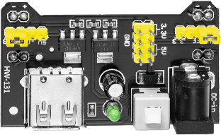

.. raw:: html

   <div style="margin-top: 30px;"></div>

Power Supply Module

Modules such as motors require additional power, especially during startup and shutdown. Using a dedicated power supply module can:

- Protect the ESP32 from voltage spikes

- Provide a stable 5V power supply for the motors

- Enhance the safety and reliability of the project

This power supply module operates using a 9V battery and provides both 3.3V and 5V outputs.


.. raw:: html

   <div style="margin-top: 30px;"></div>

----

33. Battery clip And Battery Box
--------------------------------

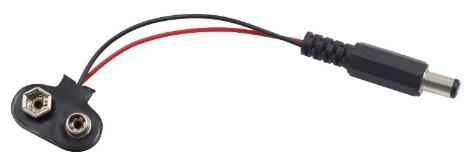

.. raw:: html

   <div style="margin-top: 30px;"></div>

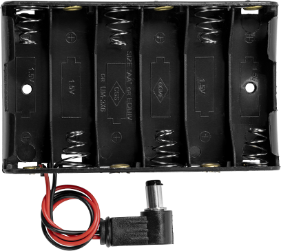

.. raw:: html

   <div style="margin-top: 30px;"></div>


This kit includes **two battery power options** for use with the breadboard power supply module. You can choose the appropriate power source based on your project requirements.

* **9V Battery Clip**: Designed for a standard **9V battery**.
* **6×AA Battery Holder**: Designed for **six AA batteries**.

> **Note:** Batteries are **not included** in this kit and must be purchased separately.

----

34. Breadboard
--------------

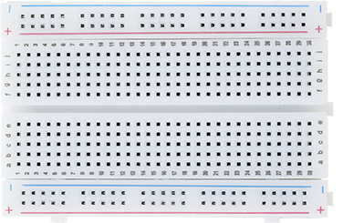

.. raw:: html

   <div style="margin-top: 30px;"></div>

A breadboard is a construction base for prototyping of electronics. Originally the word referred to a literal bread board, a polished piece of wood used for slicing bread. In the 1970s the solderless breadboard (a.k.a. plugboard, a terminal array board) became available and nowadays the term “breadboard” is commonly used to refer to these.

It is used to build and test circuits quickly before finishing any circuit design. And it has many holes into which components mentioned above can be inserted like ICs and resistors as well as jumper wires. The breadboard allows you to plug in and remove components easily.

The picture shows the internal structure of a breadboard. Although these holes on the breadboard appear to be independent of each other, they are actually connected to each other through metal strips internally.

- This kit comes with **two 400-point breadboards**. If a project requires more space for circuit assembly, simply connect the two breadboards together using the side interlocking tabs, as shown below, to create a larger prototyping area.

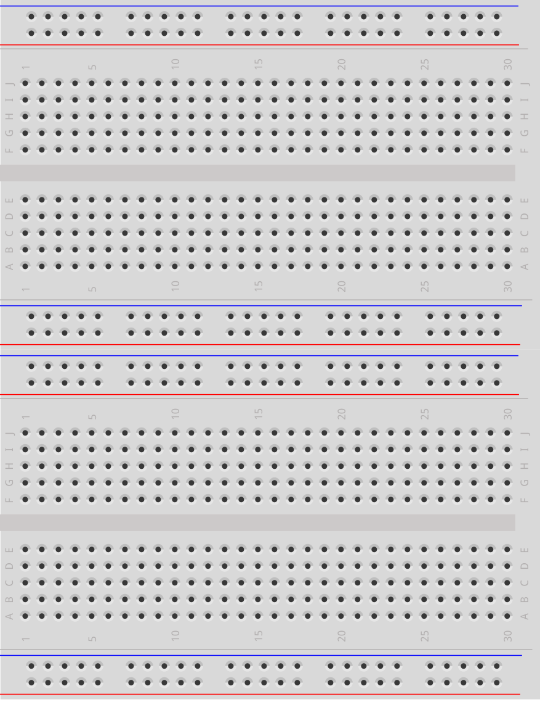

.. raw:: html

   <div style="margin-top: 30px;"></div>

----

35. Jumper Wires
----------------

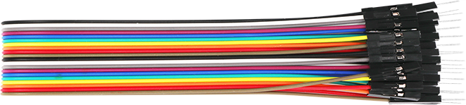

.. raw:: html

   <div style="margin-top: 30px;"></div>

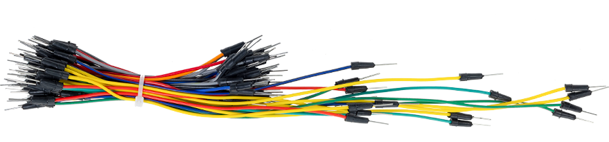

.. raw:: html

   <div style="margin-top: 30px;"></div>

Wires that link two terminals are known as jumper wires. There are various types of jumper wires, but here we will focus on those commonly used with breadboards. They serve to transmit electrical signals from any point on the breadboard to the input/output pins of a microcontroller.

Jumper wires are connected by inserting their “end connectors” into the slots of the breadboard. Underneath the breadboard’s surface, there are sets of parallel plates that connect these slots in groups of rows or columns, depending on the section of the board. The “end connectors” are placed into the desired slots on the breadboard without soldering, making connections as needed for the specific prototype.

There are three main types of jumper wires: Female-to-Female, Male-to-Male, and Male-to-Female. The names describe the connectors on each end. Male-to-Female wires have a protruding pin on one end and a recessed female connector on the other. Male-to-Male wires have pins on both ends, while Female-to-Female wires have sockets on both ends.

----

