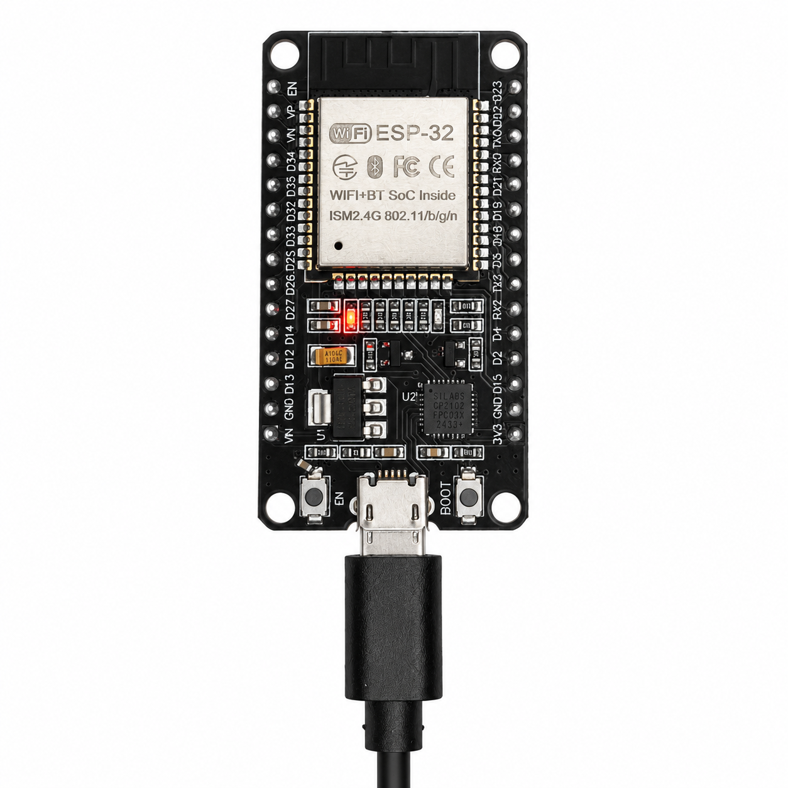
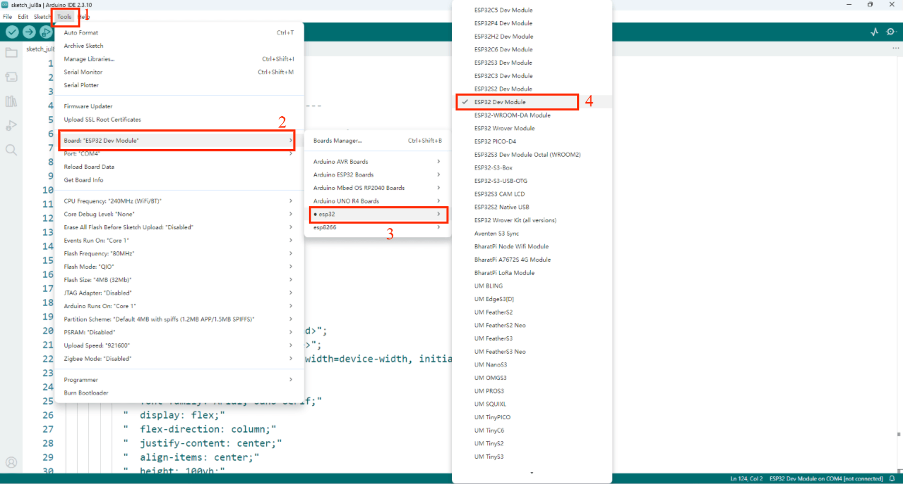
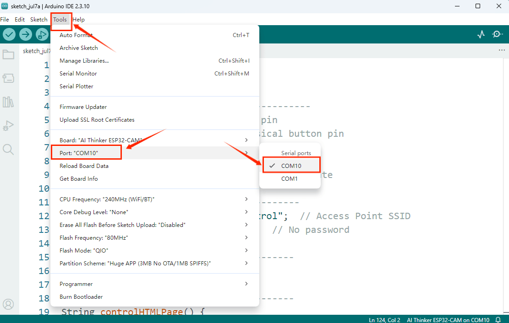
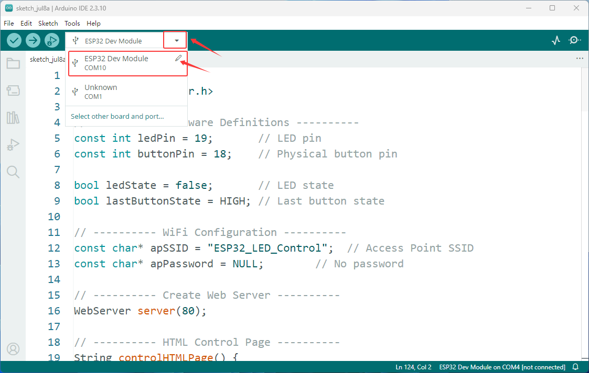
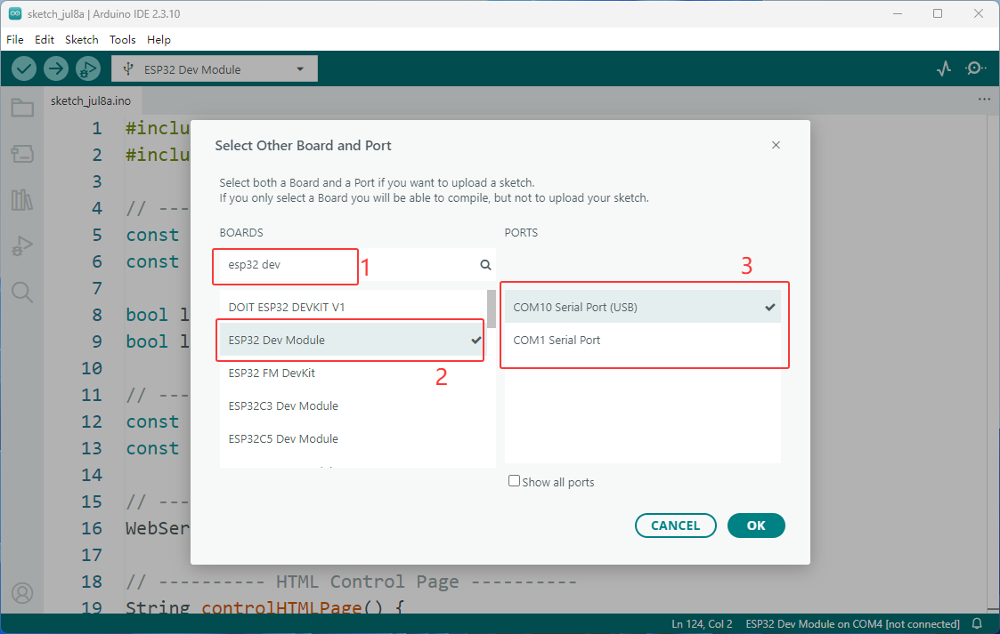
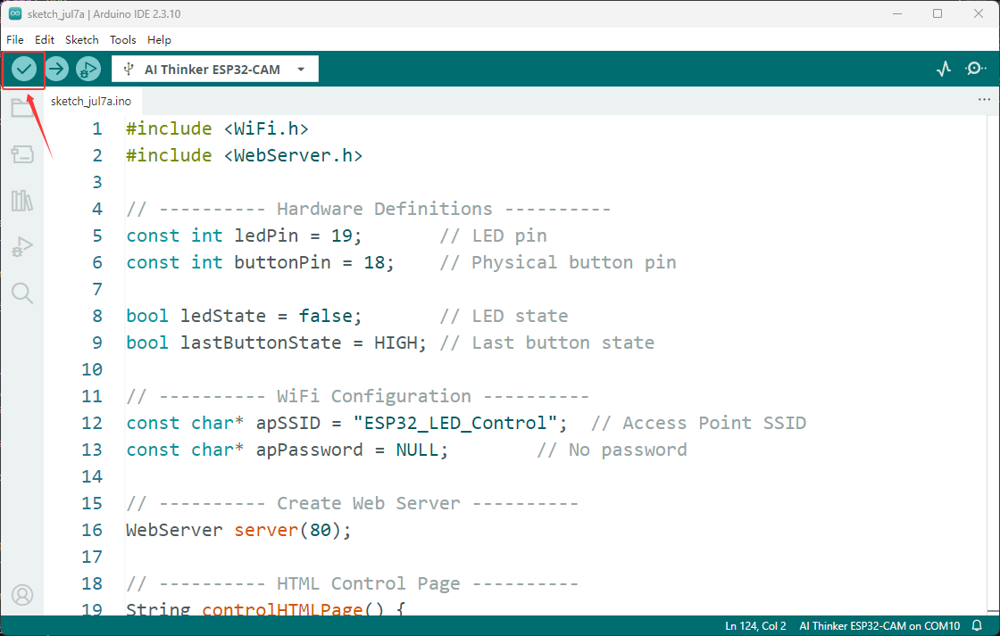
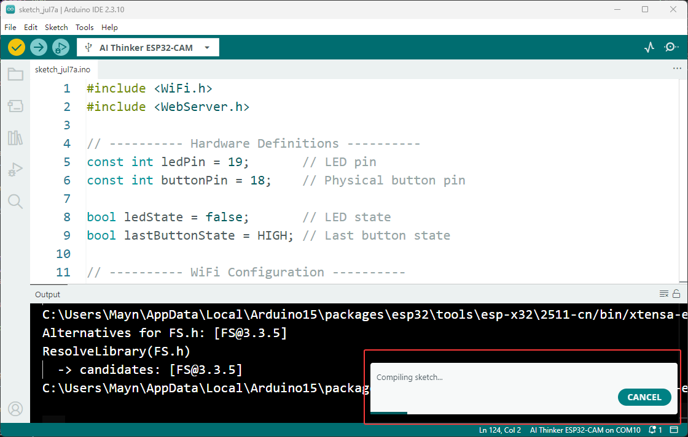

How To Upload Code To ESP32
===========================

This guide explains how to upload a program to the ESP32 development board using the Arduino IDE. The steps below cover hardware connection, driver installation, board configuration, uploading firmware, and serial monitoring.

----

**The video below demonstrates how to upload code to an ESP32 development board using the Arduino IDE：**

.. video:: _static/arduino/driver_ins.mp4
    :width: 100%

----

**Below is a detailed step-by-step tutorial with images：**

1. Prepare the Hardware
-----------------------

Before uploading code, connect the ESP32 board to your computer using a USB cable.

- Connect the ESP32 board to the PC with a USB cable.
- Make sure the board is powered on and the USB cable is not loose.
- If the board is not detected, check the USB cable and the driver installation.

.. raw:: html

   

.. note::

   - ESP32 boards have a BOOT or EN button. If the board is not responding, press and hold BOOT while clicking Upload, then release it when the upload begins.

----

2. Open Arduino IDE and Select the Board
----------------------------------------

- Launch the Arduino IDE.
- Open the example sketch or your own program.
- In the menu bar, click **Tools → Board → esp32** and select the correct **ESP32 Dev Model**.

.. raw:: html

   

- In **Tools → Port**, choose the COM port that belongs to your ESP32 board.

.. raw:: html

   

**You can also select the development board and port in the top-left corner of the interface; the specific steps are shown in the image.**

.. raw:: html

   

.. raw:: html

   

.. note::

   - If you cannot find the development board or the port does not appear, please first check whether the ESP32 core package and the corresponding serial port driver are installed. Click `here <Install Serial Port Tool_>`_ to go to the installation tutorial.

   - If multiple COM ports appear, unplug and reconnect the board to identify the correct one.

----

3. Verify the Program
---------------------

Before uploading, you should verify that the sketch compiles.

- Click **Verify** in the Arduino IDE.
- If there are no errors, the compilation will finish successfully.
- If errors appear, check the code, library version, and board selection.

.. raw:: html

   

.. raw:: html

   

----

4. Upload the Program
----------------------

After the sketch compiles successfully, upload it to the ESP32.

- Click **Upload** in the Arduino IDE.
- Wait until the progress bar reaches the end.
- If upload fails, hold **BOOT** while clicking **Upload**, then release it when the upload starts.

.. image:: _static/arduino/73.upload.png
   :width: 800
   :align: center

.. raw:: html

   

.. note::

   - The upload process may take 30 to 60 seconds depending on the size of the sketch and the board model.

----
