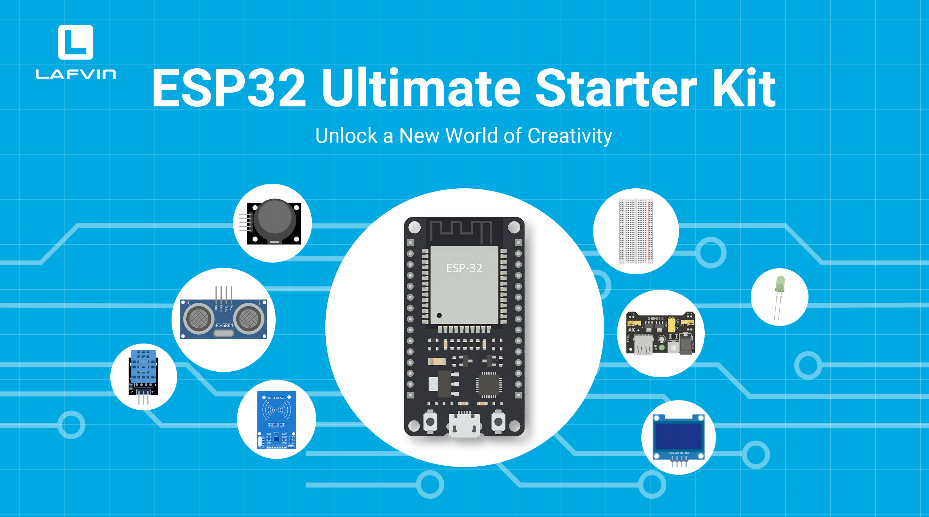
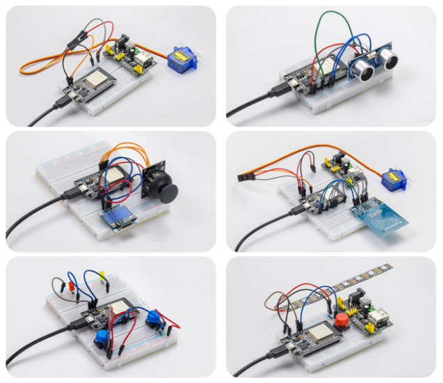
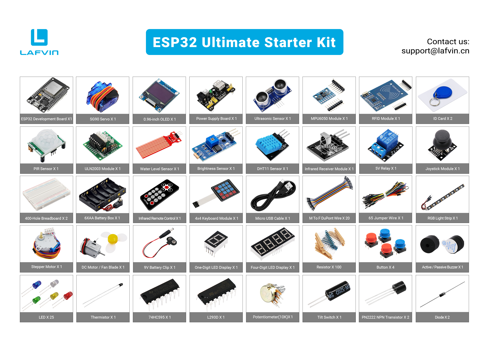

Introduction
============

**Dear friends, welcome to the learning world of the LAFVIN ESP32 Ultimate Starter Kit**

**Please read this documentation carefully. If you encounter any problems during use, please contact our after-sales support team, and we will assist you as soon as possible.**

----

**LAFVIN ESP32 Ultimate Starter Kit**

----

Function Introduction
---------------------

 - This ESP32 Ultimate Learning Kit is designed to provide a simple, enjoyable, and hands-on way to learn electronics, programming, and smart project development.

 - Whether you are a beginner exploring the world of coding for the first time or a maker looking to build creative DIY projects, this kit includes a wide range of carefully selected components, sensors, and modules to support step-by-step learning.

 - Leveraging ESP32 Wi-Fi technology, users can build interactive web-based control systems and monitor real-time sensor data directly via smartphone or computer. Learn genuine IoT development through practical smart home and automation projects.
 
 - Through detailed tutorials and hands-on projects, users gain practical experience in programming, circuit design, automation, robotics, and IoT applications, while fostering problem-solving skills, creativity, and an engineering mindset.
 

**Features：**

 All-in-One STEM Learning Kit: Designed for beginners, students, and makers, this comprehensive starter kit includes a wide range of electronic modules and sensors to help you learn programming, electronics, robotics, and IoT projects step-by-step.

 Includes Beginner-Friendly Tutorials: The kit comes with detailed tutorials, wiring diagrams, sample code, and project lessons to help users quickly get started with open-source platforms and ESP32 development. It is ideal for self-study, school curricula, and STEM education.

 Learn Wi-Fi IoT Development: Unlike traditional starter kits, this kit leverages the powerful Wi-Fi capabilities of the ESP32 microcontroller. Users can build genuine web-based control systems and monitor sensor data in real-time via browsers on smartphones, tablets, or computers. Through progressive projects, users will learn to: create web control interfaces; remotely control modules like LEDs and motors; display real-time sensor data online; build smart home prototypes; and understand the fundamentals of IoT communication.

 Extensive Components and Smart Modules: The kit includes a variety of popular modules—such as ultrasonic sensors, RFID modules, servo motors, MPU6050 angle sensors, OLED displays, temperature and humidity sensors, and PIR motion sensors—enabling users to build dozens of creative DIY projects right out of the box.

**Key Projects：**

.. raw:: html

   

With this kit, users can create a wide range of interactive projects—over twenty in total—including an RFID smart access control system, servo motor control, real-time environmental temperature and humidity monitoring, 3D real-time animation using the MPU6050 sensor, a "Snake" game, a motion-detection alarm system, a smart home system, and various IoT wireless projects.

**Target Audience：**

Electronics beginners, Arduino/ESP32 learners, STEM education participants, school and classroom projects, DIY makers and hobbyists, and robotics enthusiasts.

----

Bill of Materials
-----------------

.. list-table:: Bill of Materials
   :header-rows: 1
   :align: center
   :widths: 75 25

   * - Component
     - Quantity
   * - ESP32 Development Board
     - x1
   * - MPU6050 Module
     - x1
   * - DHT11 Temperature & Humidity Sensor
     - x1
   * - PIR Motion Sensor
     - x1
   * - Light Sensor
     - x1
   * - Water Level Sensor
     - x1
   * - Joystick Module
     - x1
   * - Ultrasonic Distance Sensor
     - x1
   * - 0.96-inch OLED Display
     - x1
   * - RC522 RFID Module
     - x1
   * - IR Receiver Module
     - x1
   * - IR Remote Control
     - x1
   * - 4x4 Keypad Module
     - x1
   * - Single-digit 7-segment Display
     - x1
   * - 4-digit 7-segment Display
     - x1
   * - SG90 Servo Motor
     - x1
   * - DC Motor Module
     - x1
   * - DC Motor Fan Blade
     - x1
   * - Stepper Motor
     - x1
   * - ULN2003 Stepper Motor Driver Module
     - x1
   * - 5V Relay
     - x1
   * - Active Buzzer
     - x1
   * - Passive Buzzer
     - x1
   * - RGB LED Strip
     - x1
   * - Power Supply Module
     - x1
   * - 400-point Breadboard
     - x2
   * - 9V Battery Connector
     - x1
   * - 6xAA Battery Holder
     - x1
   * - Micro USB Cable
     - x1
   * - 10K Potentiometer
     - x1
   * - Thermistor
     - x1
   * - Tilt Switch
     - x1
   * - LED (Red, Yellow, Green, Blue, White)
     - x5
   * - Push-buttons
     - x4
   * - Button Caps
     - x4
   * - 74HC595
     - x1
   * - L293D
     - x1
   * - PN2222 NPN Transistor
     - x1
   * - Jumper Wire Set (65 pcs)
     - x1
   * - Male-to-Female Dupont Wires
     - x20
   * - Through-hole Resistors (10 resistance values)
     - x100

**Upon receiving the kit, please first check all components against the above bill of materials. If you find any missing or damaged items, please contact our technical support team immediately.**

----

Resource Download
-----------------

All the necessary code and library files for this course are provided. You can obtain all the resources through the following link.

`Code and Libraries <https://www.dropbox.com/scl/fo/a6ho5cf95ha65esq2odw6/AJXY-Am6qb03g0PRiQOCCNQ?rlkey=hmndkdpv0zjwaymovmp16hevn&st=n1o5zzxr&dl=1>`_

----

**Next, we will delve into the core content of the course and help you gradually understand the relevant concepts and master the operation procedures.**

----
